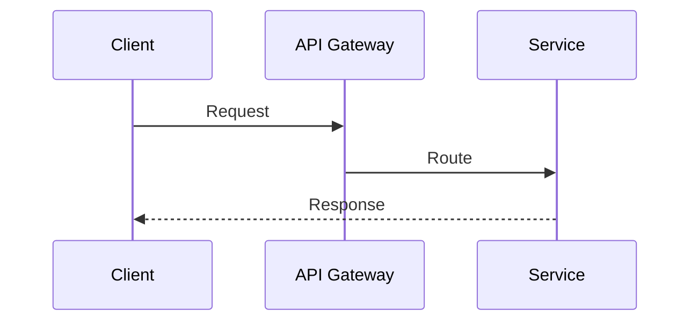

# write-docs

## Stack & Project Structure

Cả `aws-learn` và `microservice-learn` dùng cùng stack:

```
Next.js 15 + Fumadocs + Cloudflare Workers/Pages
```

```
repo/
├── content/docs/          # Toàn bộ .md files
│   ├── {category}/        # Folder theo chủ đề
│   │   ├── meta.json      # { "title": "Category Name" }
│   │   └── *.md           # Các doc files
│   └── meta.json          # Root: định nghĩa thứ tự sidebar
├── package.json
├── wrangler.toml
└── AGENTS.md / CLAUDE.md
```

**Naming convention:**
- Category-based (aws-learn style): `dynamodb.md`, `api-gateway.md`
- Sequential (microservice style): `01-overview.md`, `02-patterns.md`

## Ngôn ngữ

**Tất cả nội dung doc phải viết bằng tiếng Việt.** Chỉ giữ tiếng Anh cho:
- Tên kỹ thuật, service, tool (DynamoDB, Circuit Breaker, gRPC, ...)
- Code, CLI commands, config values
- URL, tên file, biến số

Không dịch sai nghĩa — nếu không có từ tiếng Việt phù hợp, giữ nguyên tiếng Anh kèm giải thích lần đầu xuất hiện.

## Page Ordering — Đảm bảo thứ tự sidebar

**Mọi file mới phải được đăng ký trong `meta.json` ngay khi tạo.** Fumadocs chỉ hiển thị và sắp xếp các page theo `"pages"` array — không tự detect.

### Quy tắc bắt buộc khi thêm doc mới

1. **Category `meta.json`** — thêm tên file (không có `.md`) vào đúng vị trí logic:
```json
{
  "title": "Database",
  "pages": [
    "dynamodb",
    "rds",
    "aurora",
    "elasticache"
  ]
}
```

2. **Root `meta.json`** — thêm category nếu category mới:
```json
{
  "pages": [
    "fundamentals",
    "compute",
    "storage",
    "database"
  ]
}
```

3. **Thứ tự trong `"pages"` = thứ tự trong sidebar** — đặt theo logic học tập (cơ bản trước, nâng cao sau), không phải alphabetical.

4. **Sequential repos** (kiểu microservice): dùng prefix số `01-`, `02-`, ... trong tên file để đảm bảo thứ tự kể cả khi quên update meta.json.

> [!IMPORTANT]
> Nếu file không có trong `"pages"` của `meta.json` → **doc sẽ không xuất hiện trên sidebar**, dù file tồn tại.

## Document Structure Chuẩn

Mọi doc đều theo template sau — xem chi tiết trong [`references/doc-template.md`](references/doc-template.md).

### Frontmatter (bắt buộc)
```yaml
---
title: "Tên Service hoặc Topic"
description: "Mô tả ngắn gọn 1 dòng, ưu tiên keywords quan trọng"
---
```

### Heading Hierarchy
```
# Tên Doc (H1)

## Mục lục (H2) — Table of Contents với anchor links
- [Tổng quan](#tổng-quan)
- [Core Concepts](#core-concepts)
...

---   ← dấu phân cách

## Tổng quan (H2) — major sections
### 1.1 Subsection (H3)
#### Chi tiết (H4) — chỉ dùng khi thực sự cần
```

### Sections bắt buộc theo loại doc
- **Service reference** (kiểu aws-learn): xem [`references/aws-style.md`](references/aws-style.md)
- **Architecture/Pattern** (kiểu microservice): xem [`references/microservice-style.md`](references/microservice-style.md)
- **Case Study**: xem [`references/case-study-style.md`](references/case-study-style.md)

## Độ chi tiết

| Level | Khi nào dùng | Dấu hiệu |
|-------|-------------|----------|
| Overview | Giới thiệu concept | 1-2 paragraphs, 1 diagram |
| Standard | Doc thông thường | 3-5 H2 sections, tables, code examples |
| Deep-dive | Service phức tạp / case study | 10+ H2, multiple diagrams, runbooks |

**Nguyên tắc:**
- Không giải thích cái đã hiển nhiên — đọc giả là engineer
- Mỗi section phải trả lời được câu hỏi: "Tại sao tôi cần biết điều này?"
- Ưu tiên bảng so sánh và diagram hơn prose dài dòng

## Diagrams & Visualization

**ASCII art** — dùng cho architecture tĩnh:
```
┌──────────────┐     ┌──────────────┐
│   Service A  │────▶│   Service B  │
└──────────────┘     └──────────────┘
```

**Mermaid** — dùng cho flow và sequence:
````

````

**Admonitions** (GitHub-style):
```markdown
> [!IMPORTANT]
> Điểm quan trọng cần nhớ

> [!TIP]
> Mẹo thực tế

> [!NOTE]
> Thông tin bổ sung
```

## Setup Repo Mới

Xem hướng dẫn đầy đủ trong [`references/setup-deploy.md`](references/setup-deploy.md) — bao gồm:
- Mermaid diagram support (cài đặt + remark plugin + component)
- Fix route conflict Next.js 15.5+
- Mở rộng content area CSS

**TL;DR:**
```bash
# Clone từ repo mẫu
git clone https://github.com/vanhiep99w/aws-learn my-docs
cd my-docs
npm install
npm run dev    # localhost:3000
npm run deploy  # = next build + wrangler deploy
```

`wrangler.toml` tối thiểu:
```toml
name = "my-docs-site"
compatibility_date = "2026-03-14"

[assets]
directory = "./dist"
```

## Workflow Tạo Doc Mới

1. Chọn category folder phù hợp (hoặc tạo mới + `meta.json`)
2. Copy từ template: [`references/doc-template.md`](references/doc-template.md)
3. Điền frontmatter `title` + `description` — **bằng tiếng Việt**
4. Viết `## Mục lục` trước — outline giúp tránh bỏ sót section
5. Viết từng section bằng tiếng Việt: Tổng quan → Core Concepts → Use Cases → Best Practices
6. **Thêm ngay vào `meta.json`** của category (đúng vị trí thứ tự, không append cuối mù quáng)
7. Nếu category mới: thêm category vào root `meta.json` theo thứ tự logic
8. Chạy `npm run dev` — kiểm tra doc xuất hiện đúng vị trí trên sidebar trước khi commit
