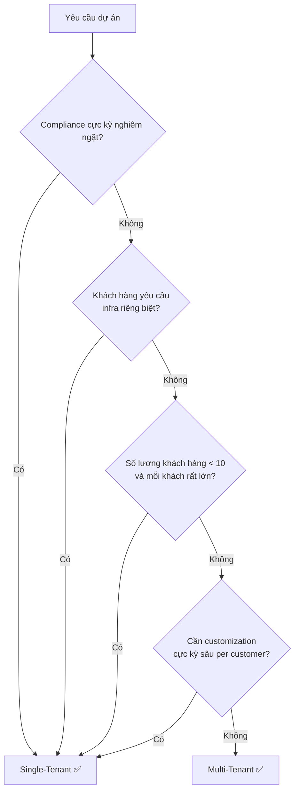
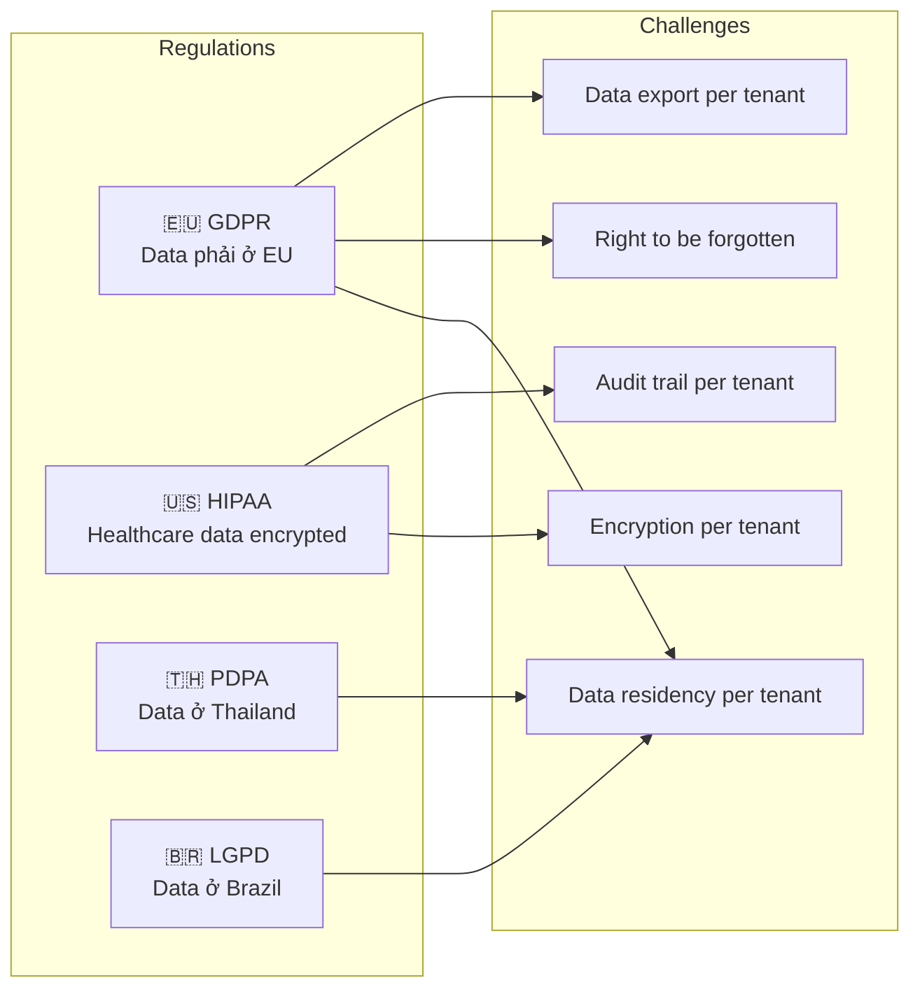

# Tổng quan Multi-Tenancy

## Mục lục

- [Multi-Tenancy là gì?](#multi-tenancy-là-gì)
- [Thuật ngữ cốt lõi](#thuật-ngữ-cốt-lõi)
- [Phân biệt Tenant vs User vs Organization](#phân-biệt-tenant-vs-user-vs-organization)
- [Single-Tenant vs Multi-Tenant](#single-tenant-vs-multi-tenant)
- [Tại sao cần Multi-Tenancy?](#tại-sao-cần-multi-tenancy)
- [Các thách thức chính](#các-thách-thức-chính)
- [Tổng kết — Risk Matrix](#tổng-kết--risk-matrix)

---

## Multi-Tenancy là gì?

**Multi-Tenancy** là một mô hình kiến trúc phần mềm trong đó **một instance duy nhất** của ứng dụng phục vụ **nhiều khách hàng (tenant)** đồng thời. Mỗi tenant chia sẻ cùng hạ tầng, codebase và tài nguyên hệ thống, nhưng dữ liệu và cấu hình của họ được **cách ly logic** với nhau.

```
┌─────────────────────────────────────────────────────────────────────┐
│                    MULTI-TENANT ARCHITECTURE                        │
│                                                                     │
│  ┌──────────┐  ┌──────────┐  ┌──────────┐  ┌──────────┐             │
│  │ Tenant A │  │ Tenant B │  │ Tenant C │  │ Tenant D │             │
│  └────┬─────┘  └────┬─────┘  └────┬─────┘  └────┬─────┘             │
│       │             │             │             │                   │
│  ─────┴─────────────┴─────────────┴─────────────┴──────────         │
│              Shared Infrastructure / Isolated Data                  │
│                                                                     │
│  ┌──────────────────────────────────────────────────────┐           │
│  │  Shared Services │ Shared Compute │ Shared Network   │           │
│  └──────────────────────────────────────────────────────┘           │
└─────────────────────────────────────────────────────────────────────┘
```

> [!IMPORTANT]
> Multi-Tenancy là nền tảng kiến trúc của hầu hết sản phẩm SaaS hiện đại (Slack, Shopify, Salesforce, Jira). Hiểu rõ kiến trúc này là điều kiện tiên quyết để thiết kế hệ thống SaaS có thể scale.

---

## Thuật ngữ cốt lõi

| Thuật ngữ                        | Định nghĩa                                                                                                   | Ví dụ                                              |
| -------------------------------- | ------------------------------------------------------------------------------------------------------------ | -------------------------------------------------- |
| **Tenant**                       | Một đơn vị tổ chức (thường là công ty/tổ chức) sử dụng hệ thống. Một tenant có thể chứa nhiều users          | Công ty ACME đăng ký dùng Slack → ACME là 1 tenant |
| **Tenant ID**                    | Định danh duy nhất (UUID/string) gắn với mỗi tenant, xuyên suốt toàn bộ hệ thống                             | `tenant_id = "acme-corp-uuid-1234"`                |
| **Tenant Context**               | Thông tin tenant hiện tại được truyền qua các layer trong một request                                        | JWT claim, HTTP header, ThreadLocal                |
| **Tenant Isolation**             | Cơ chế đảm bảo tenant A không thể truy cập dữ liệu/tài nguyên của tenant B                                   | Database riêng, Row-Level Security, Network Policy |
| **Tenant Tier**                  | Phân loại tenant theo mức dịch vụ (Free/Pro/Enterprise) — ảnh hưởng đến mức isolation và resource allocation | Free → shared DB; Enterprise → dedicated DB        |
| **Noisy Neighbor**               | Hiện tượng một tenant sử dụng quá nhiều tài nguyên, làm ảnh hưởng hiệu năng của các tenant khác              | Tenant A chạy query nặng → tenant B bị chậm        |
| **Cross-Tenant Data Leak**       | Lỗi bảo mật khi dữ liệu của tenant A bị lộ cho tenant B                                                      | Thiếu `WHERE tenant_id = ?` trong query            |
| **SaaS** (Software as a Service) | Mô hình phân phối phần mềm qua cloud, thường sử dụng multi-tenancy                                           | Slack, Salesforce, Jira, Shopify                   |

---

## Phân biệt Tenant vs User vs Organization

```
┌─────────────────────────────────────────────────────┐
│                    SaaS Platform                    │
│                                                     │
│  ┌───────────────────────┐  ┌─────────────────────┐ │
│  │      Tenant A         │  │     Tenant B        │ │
│  │   (ACME Corp)         │  │   (Beta Inc)        │ │
│  │                       │  │                     │ │
│  │  ┌─────┐  ┌─────┐     │  │  ┌─────┐  ┌─────┐   │ │
│  │  │Admin│  │User │     │  │  │Admin│  │User │   │ │
│  │  │John │  │Jane │     │  │  │Bob  │  │Alice│   │ │
│  │  └─────┘  └─────┘     │  │  └─────┘  └─────┘   │ │
│  │                       │  │                     │ │
│  │  Organization = Tenant│  │  Organization=Tenant│ │
│  │  Users ⊂ Tenant       │  │  Users ⊂ Tenant     │ │
│  └───────────────────────┘  └─────────────────────┘ │
│                                                     │
│  Tenant boundary = ranh giới isolation              │
│  User = cá nhân đăng nhập, thuộc về 1 tenant        │
└─────────────────────────────────────────────────────┘
```

**Quy tắc quan trọng:**

- **Tenant** = ranh giới cách ly dữ liệu và tài nguyên (thường = 1 tổ chức/công ty)
- **User** = cá nhân thuộc về một tenant, có role/permission riêng
- **Organization** = có thể đồng nghĩa với tenant, hoặc là cấp trên/dưới tùy thiết kế
- Một user **chỉ thuộc 1 tenant** (mô hình đơn giản) hoặc **thuộc nhiều tenant** (mô hình phức tạp — Slack, Notion)

---

## Single-Tenant vs Multi-Tenant

### Kiến trúc Single-Tenant

Mỗi khách hàng có **instance riêng** của toàn bộ ứng dụng: codebase, database, infra tách biệt hoàn toàn.

```
┌─────────────────┐  ┌─────────────────┐  ┌─────────────────┐
│   Instance A    │  │   Instance B    │  │   Instance C    │
│  (Customer A)   │  │  (Customer B)   │  │  (Customer C)   │
│                 │  │                 │  │                 │
│  ┌──────────┐   │  │  ┌──────────┐   │  │  ┌──────────┐   │
│  │   App    │   │  │  │   App    │   │  │  │   App    │   │
│  └────┬─────┘   │  │  └────┬─────┘   │  │  └────┬─────┘   │
│  ┌────┴─────┐   │  │  ┌────┴─────┐   │  │  ┌────┴─────┐   │
│  │    DB    │   │  │  │    DB    │   │  │  │    DB    │   │
│  └──────────┘   │  │  └──────────┘   │  │  └──────────┘   │
└─────────────────┘  └─────────────────┘  └─────────────────┘
   Riêng biệt            Riêng biệt           Riêng biệt
```

### Kiến trúc Multi-Tenant

Tất cả khách hàng chia sẻ **cùng một instance** của ứng dụng, dữ liệu được cách ly bằng logic.

```
┌──────────────────────────────────────────────────────┐
│              Shared Application Instance             │
│                                                      │
│  ┌─────────────────────────────────────────────────┐ │
│  │              Application Layer                  │ │
│  │      Tenant Context → Route → Process           │ │
│  └────────────────────┬────────────────────────────┘ │
│                       │                              │
│  ┌────────┬───────────┼───────────┬────────────────┐ │
│  │Tenant A│  Tenant B │  Tenant C │   Tenant D     │ │
│  │ Data   │  Data     │  Data     │   Data         │ │
│  └────────┴───────────┴───────────┴────────────────┘ │
│           Shared Database (logical isolation)        │
└──────────────────────────────────────────────────────┘
```

### Bảng so sánh toàn diện

| Tiêu chí             |                Single-Tenant                |                   Multi-Tenant                   |
| -------------------- | :-----------------------------------------: | :----------------------------------------------: |
| **Kiến trúc**        |           1 instance / 1 customer           |             1 instance / N customers             |
| **Chi phí hạ tầng**  |   🔴 Cao — nhân bản mọi thứ theo số khách   |           🟢 Thấp — chia sẻ tài nguyên           |
| **Chi phí vận hành** |         🔴 Cao — quản lý N hệ thống         |           🟢 Thấp — quản lý 1 hệ thống           |
| **Data Isolation**   |       🟢 Mạnh nhất — vật lý tách biệt       |    🟡 Phụ thuộc chiến lược — logic isolation     |
| **Customization**    |     🟢 Tùy biến thoải mái per customer      | 🟡 Giới hạn — phải thiết kế configuration system |
| **Security Risk**    |         🟢 Thấp — không chia sẻ gì          |      🔴 Cao hơn — rủi ro cross-tenant leak       |
| **Performance**      |      🟢 Ổn định — không noisy neighbor      |          🟡 Cần quản lý noisy neighbor           |
| **Scalability**      |   🔴 Khó scale — phải clone per customer    |      🟢 Dễ scale — thêm tenant = thêm data       |
| **Time-to-Market**   |    🔴 Chậm — mỗi customer = 1 deployment    |     🟢 Nhanh — onboard tenant mới trong phút     |
| **Update/Patch**     |        🔴 Phải update từng instance         |            🟢 Update 1 lần cho tất cả            |
| **Compliance**       |       🟢 Dễ đáp ứng — data riêng biệt       |       🟡 Phức tạp — cần thiết kế cẩn thận        |
| **Phù hợp cho**      | On-premise, Enterprise lớn, ngành regulated |            SaaS, startup, scale nhanh            |

### Khi nào chọn Single-Tenant?



---

## Tại sao cần Multi-Tenancy?

### Business Drivers

**① Hiệu quả chi phí (Cost Efficiency)**

Multi-Tenancy là nền tảng kinh tế của mô hình SaaS:

```
Single-Tenant (100 khách hàng):
┌──────────────────────────────────────────┐
│  100 × Server    = 100 servers           │
│  100 × Database  = 100 DB instances      │
│  100 × Ops team  = huge ops overhead     │
│  Chi phí: $$$$$$$$$$                     │
└──────────────────────────────────────────┘

Multi-Tenant (100 khách hàng):
┌──────────────────────────────────────────┐
│  2-3 × Server cluster = auto-scaled      │
│  1-3 × Database       = shared/pooled    │
│  1 × Ops pipeline     = automated        │
│  Chi phí: $$$                            │
└──────────────────────────────────────────┘

→ Tiết kiệm 60-80% chi phí hạ tầng
```

**② Tốc độ phát triển sản phẩm (Time-to-Market)**

- Onboard tenant mới trong **phút** thay vì **ngày/tuần**
- Một codebase → một CI/CD pipeline → deploy cho tất cả tenant
- Bug fix / feature release đồng thời cho toàn bộ khách hàng
- A/B testing dễ dàng: feature flag per tenant

**③ Khả năng mở rộng (Scalability)**

- Thêm 1000 tenant mới ≠ thêm 1000 server mới
- Horizontal scaling dựa trên tổng load, không phải per-customer
- Resource pooling tối ưu hóa utilization
- Elastic scaling theo actual demand

**④ Operational Excellence**

- Monitoring tập trung — 1 dashboard cho toàn hệ thống
- Schema migration 1 lần cho tất cả (trong shared model)
- Security patching nhanh và đồng nhất
- Giảm DevOps overhead đáng kể

### Ví dụ thực tế

| SaaS Product       | Multi-Tenant Model                                | Số tenant     | Ghi chú                                                  |
| ------------------ | ------------------------------------------------- | ------------- | -------------------------------------------------------- |
| **Salesforce**     | Shared DB + Metadata-driven schema                | 150,000+ orgs | Tenant customization qua metadata, không thay đổi schema |
| **Slack**          | Shared infrastructure, sharded DB                 | 750,000+ orgs | Shard by tenant cho performance                          |
| **Shopify**        | Sharded DB, pod-based isolation                   | 2M+ shops     | Mỗi "pod" chứa ~10K shops, dedicated DB shard            |
| **Jira/Atlassian** | Shared infra (cloud), per-tenant DB (data center) | 200,000+      | Hybrid model tùy deployment                              |
| **AWS Cognito**    | Shared compute, per-tenant User Pool              | Millions      | Pool-based isolation cho identity                        |

---

## Các thách thức chính

Multi-Tenancy mang lại lợi ích lớn nhưng đi kèm **5 nhóm thách thức trọng yếu**:

### Thách thức 1: Data Isolation & Security

```
⚠️ VẤN ĐỀ NGHIÊM TRỌNG NHẤT

Một dòng code thiếu sót có thể lộ data toàn bộ tenant:

  ❌ SELECT * FROM orders;                         → Lộ data mọi tenant
  ✅ SELECT * FROM orders WHERE tenant_id = ?;     → Chỉ data tenant hiện tại

Điều này phải được enforce ở:
  • Application layer (middleware, ORM filter)
  • Database layer (Row-Level Security, schema)
  • Infrastructure layer (network, IAM)
  • API layer (authorization check)
```

**Rủi ro cụ thể:**

- **Cross-tenant data leak**: Query thiếu `tenant_id` filter
- **Cache poisoning**: Cache key không chứa tenant → trả data sai tenant
- **Shared file storage leak**: Upload/download file không validate tenant
- **Log leakage**: Log chứa sensitive data của tenant khác
- **API response leak**: Serialization lỗi trả data cross-tenant

> [!CAUTION]
> Cross-tenant data leak là lỗi **catastrophic** — có thể dẫn đến vi phạm GDPR/HIPAA, mất niềm tin khách hàng, và kiện tụng. Phải được xử lý ở **nhiều layer** (defense in depth).

### Thách thức 2: Noisy Neighbor

```
Tenant A: 10 requests/giây (bình thường)
Tenant B: 10,000 requests/giây (spike đột biến)

Hậu quả (nếu không có isolation):
┌──────────────────────────────────────────┐
│  Shared Resource Pool                    │
│                                          │
│  CPU:  [████████████████████████████░░]  │
│         ↑ Tenant B chiếm 90% CPU         │
│                                          │
│  Tenant A response time: 200ms → 5000ms  │
│  Tenant C response time: 150ms → 3000ms  │
│  Tenant B response time: 100ms → 200ms   │
│                                          │
│  → Tất cả tenant khác bị ảnh hưởng!      │
└──────────────────────────────────────────┘
```

**Giải pháp**: Rate limiting, resource quotas, tenant-aware scaling, circuit breaker per tenant (chi tiết ở [Noisy Neighbor Problem](./07-noisy-neighbor.md))

### Thách thức 3: Tenant Customization

Mỗi tenant có nhu cầu khác nhau nhưng phải chạy trên **cùng một codebase**:

| Nhu cầu                       |    Độ khó     | Giải pháp                                    |
| ----------------------------- | :-----------: | -------------------------------------------- |
| Custom branding (logo, color) |     🟢 Dễ     | Tenant config table                          |
| Custom fields trên entities   | 🟡 Trung bình | EAV pattern / JSON columns / Metadata tables |
| Custom business rules         | 🟡 Trung bình | Rule engine, feature flags                   |
| Custom workflows              |    🔴 Khó     | Workflow engine (Temporal, Camunda)          |
| Custom integrations           |    🔴 Khó     | Webhook system, plugin architecture          |
| Custom schema changes         |  🔴 Rất khó   | Metadata-driven schema (Salesforce approach) |

### Thách thức 4: Compliance & Data Residency



**Vấn đề cụ thể:**

- Tenant ở EU yêu cầu data phải lưu ở EU region → cần **multi-region deployment**
- Tenant healthcare yêu cầu HIPAA → cần **encryption at rest + audit logging**
- GDPR "right to be forgotten" → phải xóa **toàn bộ** data của tenant mà **không ảnh hưởng** tenant khác
- Trong shared database model, việc đảm bảo compliance **cực kỳ phức tạp**

### Thách thức 5: Operational Complexity

| Vấn đề vận hành    | Trong Single-Tenant     | Trong Multi-Tenant                                                     |
| ------------------ | ----------------------- | ---------------------------------------------------------------------- |
| Schema migration   | Migrate 1 DB            | Migrate 1 DB nhưng ảnh hưởng tất cả tenant / hoặc migrate N schemas    |
| Monitoring         | Monitor 1 instance      | Monitor per-tenant metrics trong shared infra                          |
| Debugging          | Log của 1 customer      | Phải filter log theo tenant_id, distributed tracing cần tenant context |
| Backup/Restore     | Backup 1 DB             | Backup shared DB — restore 1 tenant = phức tạp                         |
| Performance tuning | Optimize cho 1 workload | Optimize cho N workloads khác nhau trên shared resources               |
| Tenant onboarding  | Deploy mới hoàn toàn    | Provision resources, seed data, config — cần automation                |
| Rollback           | Rollback 1 instance     | Rollback ảnh hưởng tất cả tenant — cần canary per tenant               |

---

## Tổng kết — Risk Matrix

```
                      Xác suất xảy ra
                    Thấp        Cao
                 ┌──────────┬──────────┐
          Cao    │ Data     │ Noisy    │
Tác động         │ Residency│ Neighbor │
                 │ Violation│ Problem  │
                 ├──────────┼──────────┤
          Thấp   │ Schema   │ Config   │
                 │ Migration│ Drift    │
                 │ Failure  │          │
                 └──────────┴──────────┘

Ưu tiên xử lý:
1. 🔴 Cross-tenant data leak    → Impact: catastrophic, Must fix
2. 🟠 Noisy neighbor            → Impact: high, Should fix
3. 🟡 Compliance violation      → Impact: high, Must plan
4. 🟢 Operational complexity    → Impact: medium, Optimize over time
```

---

## Đọc thêm

- [Tenant Isolation Models](./02-isolation-models.md) — Silo, Pool, Bridge
- [Data Partitioning Strategies](./03-data-partitioning.md) — DB-per-Tenant, Schema-per-Tenant, RLS
- [Security & Compliance](./09-security-compliance.md) — Phòng chống data leak, GDPR, HIPAA
