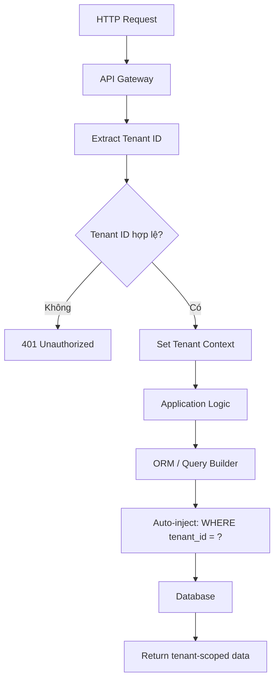
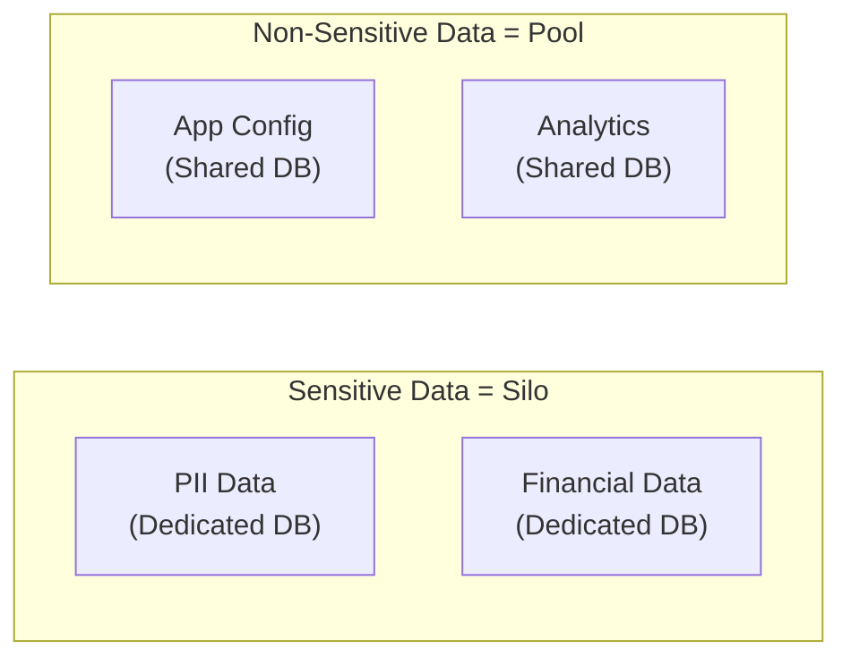
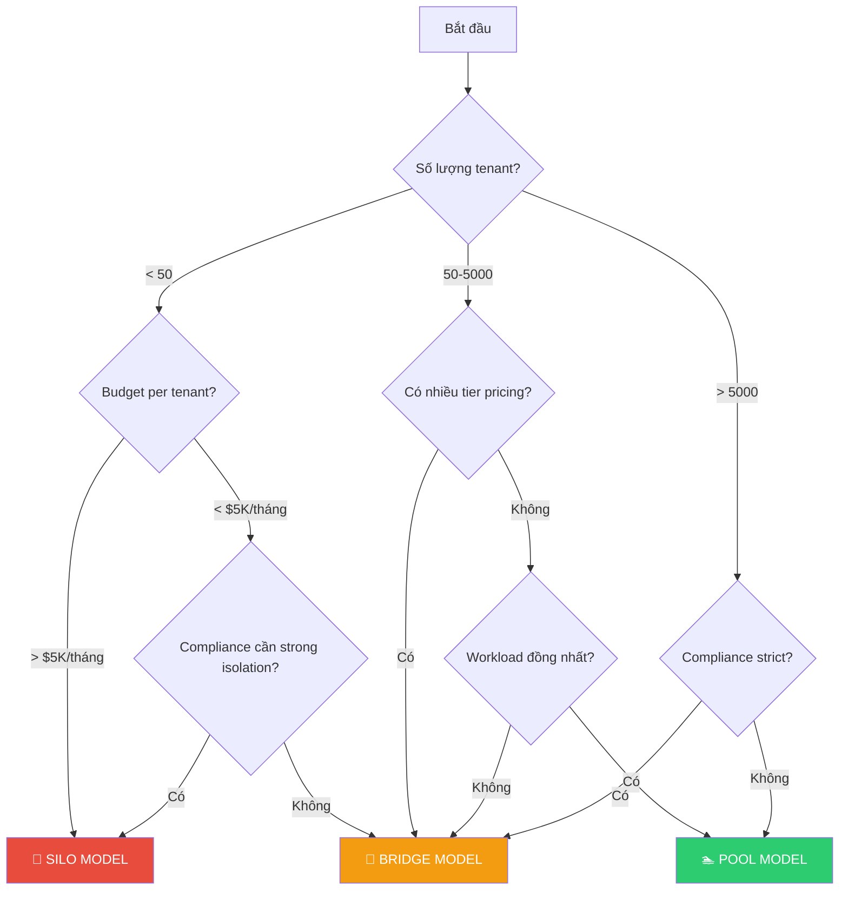

# Tenant Isolation Models

## Mục lục

- [Tổng quan Isolation Spectrum](#tổng-quan-isolation-spectrum)
- [1. Silo Model (Dedicated)](#1-silo-model-dedicated)
- [2. Pool Model (Shared)](#2-pool-model-shared)
- [3. Bridge Model (Hybrid)](#3-bridge-model-hybrid)
- [4. So sánh và Decision Matrix](#4-so-sánh-và-decision-matrix)
- [Anti-patterns cần tránh](#anti-patterns-cần-tránh)

---

## Tổng quan Isolation Spectrum

Việc chọn đúng mô hình isolation ảnh hưởng trực tiếp đến **chi phí, bảo mật, hiệu năng và khả năng scale** của toàn bộ hệ thống. Ba mô hình nằm trên một spectrum:

```
┌──────────────────────────────────────────────────────────────────────┐
│                    ISOLATION SPECTRUM                                │
│                                                                      │
│  Silo                    Bridge                    Pool              │
│  (Dedicated)             (Hybrid)                  (Shared)          │
│  ◄──────────────────────────────────────────────────────────►        │
│                                                                      │
│  🔒 Max Isolation                              💰 Max Cost Savings   │
│  💰 Max Cost                                   🔒 Min Isolation      │
│  🔧 Max Customization                          🔧 Min Customization  │
│  📈 Min Resource Efficiency                    📈 Max Efficiency     │
└──────────────────────────────────────────────────────────────────────┘
```

> [!IMPORTANT]
> Không có model "tốt nhất" — chỉ có model "phù hợp nhất" cho **business requirements** cụ thể. Hầu hết SaaS thành công sử dụng **Bridge Model** kết hợp cả hai.

---

## 1. Silo Model (Dedicated)

**Silo Model** cung cấp cho mỗi tenant **tài nguyên riêng biệt hoàn toàn** — từ compute, database, storage đến network. Mỗi tenant hoạt động như một "hòn đảo" độc lập.

### Kiến trúc

```
┌─────────────────────────────────────────────────────────────────┐
│                      SILO MODEL                                 │
│                                                                 │
│  ┌──────────────────┐   ┌──────────────────┐   ┌──────────────┐ │
│  │    Tenant A      │   │    Tenant B      │   │   Tenant C   │ │
│  │                  │   │                  │   │              │ │
│  │  ┌─────────────┐ │   │  ┌─────────────┐ │   │ ┌──────────┐ │ │
│  │  │   App Pod   │ │   │  │   App Pod   │ │   │ │ App Pod  │ │ │
│  │  │  (Private)  │ │   │  │  (Private)  │ │   │ │(Private) │ │ │
│  │  └──────┬──────┘ │   │  └──────┬──────┘ │   │ └─────┬────┘ │ │
│  │  ┌──────┴──────┐ │   │  ┌──────┴──────┐ │   │ ┌─────┴────┐ │ │
│  │  │  Database   │ │   │  │  Database   │ │   │ │ Database │ │ │
│  │  │  (Private)  │ │   │  │  (Private)  │ │   │ │(Private) │ │ │
│  │  └─────────────┘ │   │  └─────────────┘ │   │ └──────────┘ │ │
│  │  ┌─────────────┐ │   │  ┌─────────────┐ │   │ ┌──────────┐ │ │
│  │  │ Cache+Store │ │   │  │ Cache+Store │ │   │ │Cache+Stor│ │ │
│  │  └─────────────┘ │   │  └─────────────┘ │   │ └──────────┘ │ │
│  │  VPC / Namespace │   │  VPC / Namespace │   │VPC/Namespace │ │
│  └──────────────────┘   └──────────────────┘   └──────────────┘ │
│                                                                 │
│  Mọi thứ tách biệt: compute, data, network, storage             │
└─────────────────────────────────────────────────────────────────┘
```

### Các mức Silo

| Mức Silo | Mô tả | Chi phí | Isolation |
|----------|--------|:-------:|:---------:|
| **Account-level** | Mỗi tenant = 1 AWS Account / Azure Subscription | 💰💰💰💰 | 🔒🔒🔒🔒 |
| **VPC-level** | Mỗi tenant = 1 VPC riêng trong cùng account | 💰💰💰 | 🔒🔒🔒 |
| **Cluster-level** | Mỗi tenant = 1 K8s cluster riêng | 💰💰💰 | 🔒🔒🔒 |
| **Namespace-level** | Mỗi tenant = 1 K8s namespace + resource quota | 💰💰 | 🔒🔒 |
| **Container-level** | Mỗi tenant = dedicated containers trong shared cluster | 💰💰 | 🔒🔒 |

### Ưu điểm

- ✅ **Isolation tuyệt đối**: Không có bất kỳ shared resource nào → zero cross-tenant risk
- ✅ **Performance guaranteed**: Không bao giờ bị noisy neighbor
- ✅ **Compliance dễ dàng**: Mỗi tenant có thể đặt ở region riêng, encryption key riêng
- ✅ **Customization tối đa**: Có thể tune DB, scale compute, custom config per tenant
- ✅ **Backup/Restore đơn giản**: Backup/restore per tenant = backup/restore 1 DB
- ✅ **Blast radius nhỏ**: Lỗi 1 tenant không ảnh hưởng tenant khác

### Nhược điểm

- ❌ **Chi phí cao nhất**: Mỗi tenant cần dedicated resources → chi phí tăng tuyến tính theo số tenant
- ❌ **Operational overhead lớn**: Quản lý N databases, N clusters, N pipelines
- ❌ **Schema migration phức tạp**: Phải apply cho từng tenant DB → cần automation mạnh
- ❌ **Onboarding chậm**: Provision infra cho tenant mới mất thời gian
- ❌ **Resource waste**: Tenant nhỏ vẫn cần minimum resources → utilization thấp
- ❌ **Cross-tenant analytics khó**: Data phân tán → cần ETL/data pipeline riêng

### Use Cases phù hợp

```
✅ Silo Model phù hợp khi:
├── Ngành regulated: Healthcare (HIPAA), Finance (PCI-DSS), Government
├── Enterprise khách hàng lớn: Mỗi khách hàng trả $10K+/tháng
├── Yêu cầu SLA riêng: 99.99% uptime guarantee per tenant
├── Data residency bắt buộc: Data phải ở region cụ thể per tenant
├── Số lượng tenant ít: 10-100 tenants (không phải 10,000+)
└── Tenant yêu cầu dedicated resources trong hợp đồng
```

**Ví dụ thực tế:** AWS GovCloud (per agency), Salesforce Shield (Enterprise tier), MongoDB Atlas Dedicated

---

## 2. Pool Model (Shared)

**Pool Model** cho tất cả tenant chia sẻ **toàn bộ tài nguyên**: cùng compute, cùng database, cùng cache. Cách ly bằng **logic trong application** (tenant_id).

### Kiến trúc

```
┌────────────────────────────────────────────────────────────────┐
│                       POOL MODEL                               │
│                                                                │
│  ┌──────────────────────────────────────────────────────────┐  │
│  │                  Shared Compute Layer                    │  │
│  │   Request → Extract Tenant ID → Route → Process          │  │
│  │   ┌────────┐  ┌────────┐  ┌────────┐  ┌────────┐         │  │
│  │   │ Pod 1  │  │ Pod 2  │  │ Pod 3  │  │ Pod N  │         │  │
│  │   │(shared)│  │(shared)│  │(shared)│  │(shared)│         │  │
│  │   └────────┘  └────────┘  └────────┘  └────────┘         │  │
│  └──────────────────────────────────────────────────────────┘  │
│                                                                │
│  ┌──────────────────────────────────────────────────────────┐  │
│  │              Shared Database                             │  │
│  │  ┌──────────┬───────────┬─────────┬──────────┐           │  │
│  │  │tenant_id │ order_id  │ amount  │ status   │           │  │
│  │  ├──────────┼───────────┼─────────┼──────────┤           │  │
│  │  │ acme     │ ORD-001   │ $100    │ paid     │           │  │
│  │  │ beta     │ ORD-003   │ $75     │ paid     │           │  │
│  │  └──────────┴───────────┴─────────┴──────────┘           │  │
│  │  ⚠️ Mọi query PHẢI có WHERE tenant_id = ?                │  │
│  └──────────────────────────────────────────────────────────┘  │
└────────────────────────────────────────────────────────────────┘
```

### Cơ chế cách ly trong Pool



**Các kỹ thuật enforce isolation:**

| Kỹ thuật | Layer | Mô tả | Độ tin cậy |
|---------|-------|--------|:----------:|
| **ORM Global Filter** | Application | Hibernate filter tự động thêm `tenant_id` | 🟡 Trung bình |
| **Row-Level Security (RLS)** | Database | PostgreSQL RLS policy, DB-level enforcement | 🟢 Cao |
| **View-based** | Database | Mỗi tenant có view filter sẵn tenant_id | 🟡 Trung bình |
| **Application middleware** | Application | Interceptor inject tenant context | 🟡 Trung bình |
| **Policy-as-Code** | Infrastructure | OPA/Kyverno enforce tenant boundary | 🟢 Cao |

> [!CAUTION]
> Pool model **hoàn toàn phụ thuộc application logic** để cách ly dữ liệu. Một bug thiếu `WHERE tenant_id = ?` có thể leak data **tất cả tenant**. Nên kết hợp ORM filter + Database RLS (defense in depth).

### Ưu điểm

- ✅ **Chi phí thấp nhất**: Tất cả tenant chia sẻ resources
- ✅ **Onboarding nhanh**: Thêm tenant = insert row → xong trong giây
- ✅ **Schema migration đơn giản**: Migrate 1 database = done cho tất cả
- ✅ **Resource utilization cao**: Pooling maximizes usage
- ✅ **Cross-tenant analytics dễ**: Data ở cùng DB

### Nhược điểm

- ❌ **Isolation yếu nhất**: Phụ thuộc application logic → 1 bug = data leak
- ❌ **Noisy neighbor nghiêm trọng**: 1 tenant heavy → ảnh hưởng tất cả
- ❌ **Compliance khó**: Khó đáp ứng data residency, per-tenant encryption
- ❌ **Backup/Restore per tenant khó**: Không thể restore 1 tenant từ shared DB
- ❌ **Customization giới hạn**: Không thể custom schema per tenant

### Use Cases phù hợp

```
✅ Pool Model phù hợp khi:
├── SaaS B2B nhỏ/vừa: Slack free tier, Trello, Notion
├── Số lượng tenant nhiều: 1,000 - 1,000,000+ tenants
├── Compliance không quá strict
├── Budget hạn chế: Startup, early-stage product
├── Tenant workload tương đồng
└── Cần onboard nhanh: Self-service signup
```

---

## 3. Bridge Model (Hybrid)

**Bridge Model** kết hợp Silo và Pool — **một số thành phần shared, một số dedicated** tùy theo tenant tier hoặc loại resource. Đây là mô hình **phổ biến nhất** trong thực tế.

### Kiến trúc

```
┌──────────────────────────────────────────────────────────────────┐
│                       BRIDGE MODEL                               │
│                                                                  │
│  ┌──────────────────────────────────────────────────────┐        │
│  │              Shared Compute Layer                    │        │
│  │    API Gateway → Tenant Router → Shared Services     │        │
│  └──────────────────────┬───────────────────────────────┘        │
│           ┌─────────────┼─────────────┐                          │
│           ▼             ▼             ▼                          │
│  ┌──────────────┐ ┌──────────┐ ┌────────────────────┐            │
│  │   Free Tier  │ │ Pro Tier │ │  Enterprise Tier   │            │
│  │  Shared DB   │ │ Shared DB│ │  Dedicated DB      │            │
│  │  (Pool)      │ │ (Schema) │ │  (Silo)            │            │
│  │  Rate: 100/m │ │ Rate:1K/m│ │  Rate: Unlimited   │            │
│  └──────────────┘ └──────────┘ └────────────────────┘            │
└──────────────────────────────────────────────────────────────────┘
```

### Các kiểu Bridge phổ biến

**① Tiered by Tenant Plan:**

```
┌──────────────┬───────────────┬────────────────┬──────────────────┐
│              │   Free/Basic  │     Pro        │   Enterprise     │
├──────────────┼───────────────┼────────────────┼──────────────────┤
│ Compute      │ Shared pods   │ Shared pods    │ Dedicated pods   │
│ Database     │ Shared table  │ Schema-per-T   │ Dedicated DB     │
│ Cache        │ Shared Redis  │ Dedicated NS   │ Dedicated Redis  │
│ Storage      │ Shared bucket │ Prefix-based   │ Dedicated bucket │
│ Network      │ Shared VPC    │ Shared VPC     │ Dedicated VPC    │
│ SLA          │ 99.5%         │ 99.9%          │ 99.99%           │
└──────────────┴───────────────┴────────────────┴──────────────────┘
```

**② Tiered by Data Sensitivity:**



### Ưu và Nhược điểm

| | Ưu điểm | Nhược điểm |
|---|---------|-----------|
| 1 | Cân bằng cost vs isolation | Phức tạp nhất để implement |
| 2 | Flexible — nâng cấp tenant khi cần | Routing phức tạp |
| 3 | Revenue-aligned: trả nhiều → isolation tốt hơn | Testing khó: test mọi combination |
| 4 | Progressive isolation: Pool → Silo dần dần | Migration giữa tiers cần plan |

---

## 4. So sánh và Decision Matrix

### Bảng so sánh toàn diện

| Tiêu chí | Silo 🏢 | Pool 🏊 | Bridge 🌉 |
|----------|:-------:|:-------:|:----------:|
| **Data Isolation** | 🟢 Vật lý | 🔴 Logic | 🟡 Tiered |
| **Chi phí per tenant** | 🔴 Cao | 🟢 Thấp | 🟡 Trung bình |
| **Noisy Neighbor** | 🟢 Không có | 🔴 Nghiêm trọng | 🟡 Giảm thiểu |
| **Onboarding speed** | 🔴 Chậm (phút-giờ) | 🟢 Nhanh (giây) | 🟡 Tùy tier |
| **Schema migration** | 🔴 Phức tạp (N lần) | 🟢 Đơn giản (1 lần) | 🟡 Tùy tier |
| **Customization** | 🟢 Tối đa | 🔴 Giới hạn | 🟡 Per tier |
| **Compliance** | 🟢 Dễ | 🔴 Khó | 🟡 Per tier |
| **Max tenants** | 🔴 10-1,000 | 🟢 1,000-1M+ | 🟢 100-100K+ |
| **Operational burden** | 🔴 Cao | 🟢 Thấp | 🟡 Trung bình |
| **Blast radius** | 🟢 1 tenant | 🔴 Tất cả | 🟡 Per group |

### Decision Matrix



### Ví dụ áp dụng thực tế

| Công ty | Model | Chi tiết |
|---------|-------|----------|
| **Shopify** | Bridge | Free → shared pods; Shopify Plus → dedicated infra |
| **Slack** | Bridge | Free/Pro → shared infra; Enterprise Grid → dedicated data plane |
| **Salesforce** | Pool + Bridge | Standard → shared Oracle DB; Shield → dedicated encryption |
| **GitHub** | Bridge | Free/Team → shared; Enterprise Server → full silo |
| **AWS Control Tower** | Silo | Mỗi workload = separate AWS Account |

---

## Anti-patterns cần tránh

```
❌ ANTI-PATTERN 1: "Silo cho mọi thứ ngay từ đầu"
   → Chi phí quá cao cho startup, không scale
   → Nên: Bắt đầu Pool → chuyển Bridge khi cần

❌ ANTI-PATTERN 2: "Pool cho mọi thứ mãi mãi"  
   → Khi có enterprise customer yêu cầu compliance → không đáp ứng được
   → Nên: Plan cho Bridge từ architecture level

❌ ANTI-PATTERN 3: "Chọn model dựa trên tech stack, không phải business"
   → Model phải align với pricing, compliance, customer segment
   → Nên: Business requirements → Model → Tech implementation

❌ ANTI-PATTERN 4: "Không có migration path giữa các tiers"
   → Tenant muốn upgrade nhưng không thể migrate data
   → Nên: Thiết kế tenant migration pipeline từ đầu
```

---

## Đọc thêm

- [Data Partitioning Strategies](./03-data-partitioning.md) — Chi tiết về cách phân tách data theo model
- [Compute & Infrastructure Isolation](./06-compute-isolation.md) — Kubernetes, Serverless multi-tenancy
- [Tenant Lifecycle](./08-tenant-lifecycle.md) — Migration giữa các tiers
