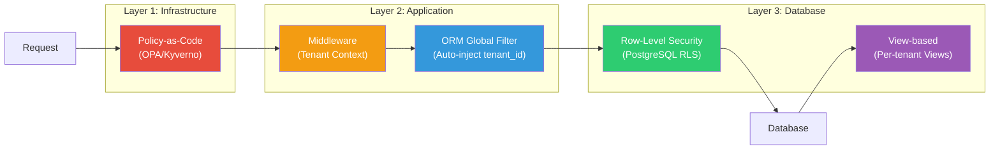
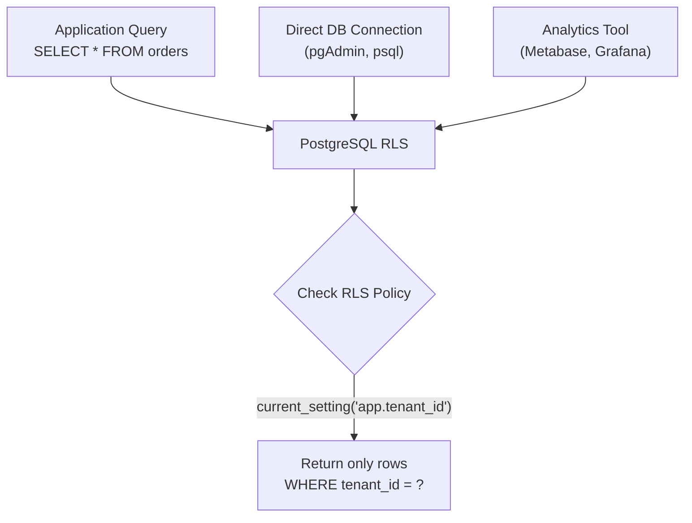
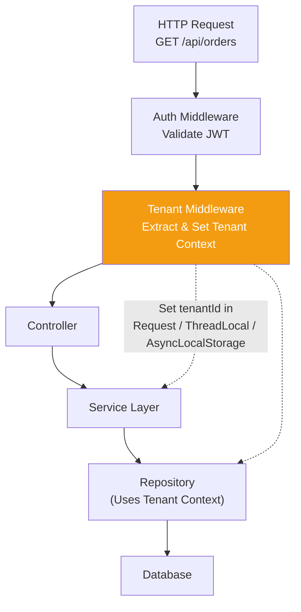
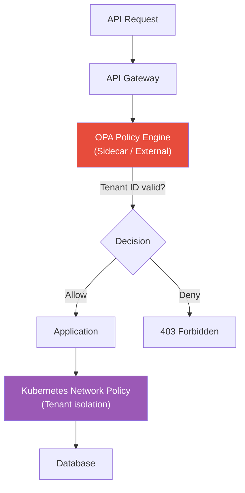
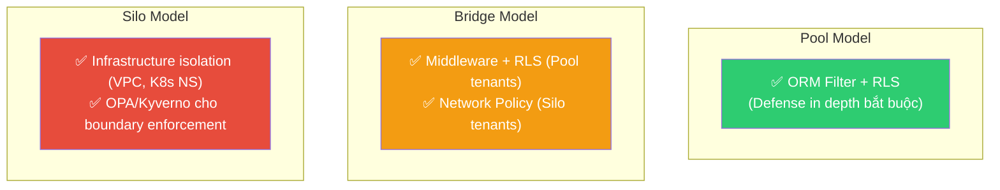

# Các Kỹ thuật Enforce Isolation

## Mục lục

- [Tổng quan Defense in Depth](#tổng-quan-defense-in-depth)
- [1. ORM Global Filter](#1-orm-global-filter)
- [2. Row-Level Security (RLS)](#2-row-level-security-rls)
- [3. View-based Isolation](#3-view-based-isolation)
- [4. Application Middleware](#4-application-middleware)
- [5. Policy-as-Code](#5-policy-as-code)
- [So sánh và kết hợp](#so-sánh-và-kết-hợp)

---

## Tổng quan Defense in Depth

Không nên dựa vào **một lớp bảo vệ duy nhất**. Nguyên tắc **Defense in Depth** yêu cầu kết hợp nhiều kỹ thuật ở nhiều layer khác nhau:



> [!TIP]
> **Best practice**: Kết hợp ít nhất 2 layer — Application (ORM/Middleware) + Database (RLS). Nếu 1 layer fail, layer kia vẫn bảo vệ data.

---

## 1. ORM Global Filter

### Nguyên lý

ORM Global Filter tự động inject `tenant_id` vào **mọi query** mà developer không cần nhớ thêm manually. Query bình thường:

```sql
SELECT * FROM orders WHERE status = 'pending';
```

Sẽ tự động trở thành:

```sql
SELECT * FROM orders WHERE status = 'pending' AND tenant_id = 'acme-corp-uuid';
```

### Ví dụ: Hibernate (Java/Spring)

**Bước 1: Định nghĩa Filter trên Entity**

```java
@Entity
@FilterDef(name = "tenantFilter", parameters = {
    @ParamDef(name = "tenantId", type = String.class)
})
@Filter(name = "tenantFilter", condition = "tenant_id = :tenantId")
@Table(name = "orders")
public class Order {
    @Id
    private UUID id;

    @Column(name = "tenant_id", nullable = false)
    private String tenantId;

    private BigDecimal amount;
    private String status;
}
```

**Bước 2: Enable filter trong Hibernate Interceptor**

```java
@Component
public class TenantInterceptor implements HandlerInterceptor {

    @Override
    public boolean preHandle(HttpServletRequest request, ...) {
        String tenantId = extractTenantId(request);

        Session session = entityManager.unwrap(Session.class);
        session.enableFilter("tenantFilter")
               .setParameter("tenantId", tenantId);

        return true;
    }
}
```

**Bước 3: Mọi query tự động filter**

```java
// Developer viết query bình thường
List<Order> orders = orderRepository.findByStatus("pending");
// Hibernate tự thêm: WHERE tenant_id = 'acme-corp-uuid'
```

### Ví dụ: Prisma (Node.js/TypeScript)

Prisma không có built-in global filter, nhưng dùng **Prisma Middleware** hoặc **Client Extensions** (Prisma 4.16+):

```typescript
import { PrismaClient } from '@prisma/client';

const prisma = new PrismaClient().$extends({
  name: 'tenantFilter',
  query: {
    $allModels: {
      async $allOperations({ args, query, model }) {
        const tenantId = getTenantContext();

        if (!tenantId) {
          throw new Error('Missing tenant context');
        }

        // Inject where clause
        args.where = {
          ...args.where,
          tenantId,
        };

        return query(args);
      },
    },
  },
});
```

### Ví dụ: Django (Python)

```python
# managers.py
class TenantManager(models.Manager):
    def get_queryset(self):
        tenant_id = get_current_tenant_id()
        if tenant_id is None:
            return super().get_queryset()
        return super().get_queryset().filter(tenant_id=tenant_id)

# models.py
class Order(models.Model):
    tenant = models.ForeignKey(Tenant, on_delete=models.CASCADE)
    amount = models.DecimalField(max_digits=10, decimal_places=2)
    status = models.CharField(max_length=20)

    objects = TenantManager()  # Mọi query tự động filter
```

### Ưu và Nhược điểm

| | Chi tiết |
|---|---------|
| ✅ **Transparent** | Developer không cần nhớ thêm `WHERE tenant_id = ?` |
| ✅ **Dễ implement** | Ít code, setup 1 lần cho toàn bộ app |
| ✅ **Flexible** | Có thể disable filter khi cần (admin, cross-tenant ops) |
| ❌ **Bypass được** | Native SQL, raw query không đi qua ORM → không filter |
| ❌ **Application-level** | Nếu kết nối DB trực tiếp (analytics tool) → không bảo vệ |
| ❌ **ORM-specific** | Mỗi ORM khác nhau, migration tốn effort |

> [!CAUTION]
> **Lỗ hổng phổ biến**: Developer viết raw SQL query hoặc dùng ORM `createQuery()` bypass filter. Luôn audit query trong codebase.

---

## 2. Row-Level Security (RLS)

### Nguyên lý

Row-Level Security (RLS) enforce isolation ở **database layer** — kể cả khi ai đó kết nối trực tiếp DB (bypass app), RLS vẫn bảo vệ data.



### Ví dụ: PostgreSQL RLS

**Bước 1: Enable RLS trên table**

```sql
ALTER TABLE orders ENABLE ROW LEVEL SECURITY;
```

**Bước 2: Tạo policy**

```sql
-- Policy: user chỉ thấy data của tenant mình
CREATE POLICY tenant_isolation ON orders
    USING (tenant_id = current_setting('app.current_tenant_id')::VARCHAR);

-- Policy cho service account (admin, migrations)
CREATE POLICY admin_all_access ON orders
    USING (current_setting('app.role') = 'admin')
    WITH CHECK (current_setting('app.role') = 'admin');
```

**Bước 3: Set tenant context trong application**

```sql
-- Mỗi connection/session set tenant context
SET app.current_tenant_id = 'acme-corp-uuid';

-- Mọi query tự động filter
SELECT * FROM orders;
-- PostgreSQL tự thêm: WHERE tenant_id = 'acme-corp-uuid'
```

**Bước 4: Trong application code (Node.js)**

```typescript
async function withTenantContext(tenantId: string, callback: () => Promise<void>) {
  const client = await pool.connect();
  try {
    await client.query(`SET app.current_tenant_id = $1`, [tenantId]);
    await callback();
  } finally {
    await client.query(`RESET app.current_tenant_id`);
    client.release();
  }
}

// Usage
await withTenantContext('acme-corp-uuid', async () => {
  const result = await client.query('SELECT * FROM orders');
  // Chỉ trả về rows của acme-corp
});
```

### Connection Pool consideration

Khi dùng connection pool (PgBouncer, Prisma), cần dùng **session-level** pool mode vì `SET` chỉ hoạt động trong session:

```
⚠️ Transaction mode pool → SET bị reset giữa các query
✅ Session mode pool → SET giữ nguyên trong session
```

**Workaround cho transaction mode**: Dùng `SET LOCAL` trong transaction:

```sql
BEGIN;
SET LOCAL app.current_tenant_id = 'acme-corp-uuid';
SELECT * FROM orders;
COMMIT;
```

### So sánh RLS implementations

| Database | RLS Support | Cách triển khai |
|----------|:-----------:|-----------------|
| **PostgreSQL** | 🟢 Native | `CREATE POLICY` + `current_setting()` |
| **MySQL** | 🟡 Limited | Dùng View + Trigger thay thế |
| **SQL Server** | 🟢 Native | `CREATE SECURITY POLICY` + predicate function |
| **Oracle** | 🟢 Native | Virtual Private Database (VPD) |
| **MongoDB** | 🔴 Không | Không có native RLS, phải dùng app-level |

### Ưu và Nhược điểm

| | Chi tiết |
|---|---------|
| ✅ **Database-level** | Bảo vệ kể cả direct DB access |
| ✅ **Không bypass được** (qua app) | Raw SQL, admin tool vẫn bị filter |
| ✅ **Centralized policy** | Định nghĩa 1 lần, apply cho tất cả connection |
| ✅ **Auditable** | DB audit log thấy policy applied |
| ❌ **Performance overhead** | Mỗi query thêm policy check (~5-10%) |
| ❌ **Connection pool phức tạp** | Phải quản lý tenant context per session |
| ❌ **Debug khó hơn** | Query không thấy `WHERE` clause nhưng bị filter |
| ❌ **Không phải DB nào cũng hỗ trợ** | MongoDB, một số NoSQL không có RLS |

> [!IMPORTANT]
> RLS là **layer bảo vệ mạnh nhất** cho Pool model. Luôn kết hợp với ORM filter (defense in depth).

---

## 3. View-based Isolation

### Nguyên lý

Tạo **SQL View cho mỗi tenant**, view tự động filter `tenant_id`. Application truy cập qua view thay vì table trực tiếp.

```
Table: orders (raw)
┌───────────┬──────────┬────────┐
│ tenant_id │ order_id │ amount │
├───────────┼──────────┼────────┤
│ acme      │ 001      │ $100   │
│ beta      │ 002      │ $200   │
│ acme      │ 003      │ $50    │
└───────────┴──────────┴────────┘

View: tenant_acme_orders
┌──────────┬────────┐
│ order_id │ amount │  ← Chỉ data của acme
├──────────┼────────┤
│ 001      │ $100   │
│ 003      │ $50    │
└──────────┴────────┘
```

### Ví dụ triển khai

**Tạo views per tenant:**

```sql
-- Dynamic view creation khi onboard tenant mới
CREATE OR REPLACE VIEW tenant_acme_orders AS
    SELECT order_id, amount, status
    FROM orders
    WHERE tenant_id = 'acme-corp-uuid';

CREATE OR REPLACE VIEW tenant_beta_orders AS
    SELECT order_id, amount, status
    FROM orders
    WHERE tenant_id = 'beta-corp-uuid';
```

**Automation khi onboard tenant mới:**

```typescript
async function provisionTenantViews(tenantId: string) {
  const safeId = tenantId.replace(/[^a-zA-Z0-9_]/g, '_');

  const views = ['orders', 'products', 'customers'];
  for (const table of views) {
    await pool.query(`
      CREATE OR REPLACE VIEW tenant_${safeId}_${table} AS
      SELECT * FROM ${table}
      WHERE tenant_id = $1
    `, [tenantId]);
  }
}
```

**Grant permission per role:**

```sql
-- Tenant user chỉ access view của mình
GRANT SELECT ON tenant_acme_orders TO role_acme_readonly;
-- Không cấp quyền trên raw table
REVOKE ALL ON orders FROM role_acme_readonly;
```

### Ưu và Nhược điểm

| | Chi tiết |
|---|---------|
| ✅ **Đơn giản** | Dễ hiểu, dễ audit |
| ✅ **DB-level protection** | Tách quyền trên view, không truy cập raw table |
| ✅ **Flexible schema** | View có thể expose subset columns per tenant |
| ❌ **Scale issues** | 1000+ tenants = 1000+ views → quản lý khó |
| ❌ **Migration overhead** | Alter table → recreate tất cả views |
| ❌ **Write phức tạp** | Insert/Update qua view cần `WITH CHECK OPTION` |
| ❌ **Không praktical cho số lượng tenant lớn** | Phù hợp hơn cho Silo/Bridge model với ít tenant |

---

## 4. Application Middleware

### Nguyên lý

Middleware/Interceptor ở **application layer** — set tenant context cho mỗi request, đảm bảo mọi downstream code đều biết tenant hiện tại.



### Ví dụ: Express.js (Node.js)

```typescript
import { AsyncLocalStorage } from 'async_hooks';

const tenantContext = new AsyncLocalStorage<string>();

export function tenantMiddleware(req, res, next) {
  const tenantId = req.headers['x-tenant-id']
    ?? req.user?.tenantId
    ?? extractFromSubdomain(req);

  if (!tenantId) {
    return res.status(400).json({ error: 'Tenant ID required' });
  }

  tenantContext.run(tenantId, () => next());
}

export function getTenantId(): string {
  const id = tenantContext.getStore();
  if (!id) throw new Error('No tenant context');
  return id;
}
```

### Ví dụ: Spring Boot (Java)

```java
public class TenantContext {
    private static final ThreadLocal<String> CURRENT_TENANT = new ThreadLocal<>();

    public static void setTenantId(String tenantId) {
        CURRENT_TENANT.set(tenantId);
    }

    public static String getTenantId() {
        return CURRENT_TENANT.get();
    }

    public static void clear() {
        CURRENT_TENANT.remove();
    }
}

@Component
public class TenantFilter implements Filter {
    @Override
    public void doFilter(ServletRequest req, ServletResponse res, FilterChain chain) {
        try {
            String tenantId = extractTenantId((HttpServletRequest) req);
            TenantContext.setTenantId(tenantId);
            chain.doFilter(req, res);
        } finally {
            TenantContext.clear();
        }
    }
}
```

### Các nguồn extract Tenant ID

```typescript
// 1. From JWT claims
const tenantId = jwtDecode(token).tenant_id;

// 2. From custom header
const tenantId = req.headers['x-tenant-id'];

// 3. From subdomain (acme.myapp.com → acme)
const tenantId = req.hostname.split('.')[0];

// 4. From path parameter (/api/tenants/:tenantId/orders)
const tenantId = req.params.tenantId;

// 5. From database lookup (user → tenant mapping)
const tenantId = await getTenantByUserId(req.user.id);
```

### ⚠️ Lưu ý quan trọng

```
⚠️ ThreadLocal (Java) / AsyncLocalStorage (Node.js):
    - Phải clear sau request (finally block) → tránh leak sang request khác
    - Không hoạt động với @Async / child threads → cần propagate manually
    - Connection pool phải bind tenant context per session
```

### Ưu và Nhược điểm

| | Chi tiết |
|---|---------|
| ✅ **Flexible** | Control đầy đủ logic, có thể validate, transform, log |
| ✅ **Framework-agnostic** | Implement được ở mọi framework |
| ✅ **Easy to test** | Mock tenant context trong unit test |
| ❌ **Application-level only** | Không bảo vệ direct DB access |
| ❌ **Leak risk** | ThreadLocal/AsyncLocalStorage có thể leak giữa requests |
| ❌ **Every entrypoint** | Phải apply middleware cho mọi entrypoint (HTTP, cron, queue, etc.) |

---

## 5. Policy-as-Code

### Nguyên lý

Dùng policy engine (OPA, Kyverno) để enforce isolation ở **infrastructure layer** — validate mọi request trước khi đến application.



### Ví dụ: OPA (Open Policy Agent)

**Policy: Validate tenant access**

```rego
# tenant_isolation.rego
package api.tenant

default allow = false

allow {
    # Request phải có tenant_id
    input.headers["x-tenant-id"]

    # tenant_id phải match với JWT claim
    input.headers["x-tenant-id"] == input.jwt.tenant_id

    # Tenant phải active
    tenant_active[input.headers["x-tenant-id"]]
}

# Hoặc cho admin role
allow {
    input.jwt.role == "admin"
}

tenant_active[tenant] {
    # Check từ data source (external)
    data.tenants[tenant].status == "active"
}
```

**Deploy OPA sidecar trong K8s:**

```yaml
apiVersion: apps/v1
kind: Deployment
spec:
  template:
    spec:
      containers:
        - name: app
          image: myapp:latest
        - name: opa
          image: openpolicyagent/opa:latest
          args:
            - "run"
            - "--server"
            - "/policies"
          volumeMounts:
            - name: policies
              mountPath: /policies
      volumes:
        - name: policies
          configMap:
            name: tenant-policies
```

### Ví dụ: Kyverno (Kubernetes-native)

```yaml
# Enforce: Pod chỉ mount secret của tenant mình
apiVersion: kyverno.io/v1
kind: ClusterPolicy
metadata:
  name: tenant-secret-isolation
spec:
  rules:
    - name: prevent-cross-tenant-secret-access
      match:
        resources:
          kinds:
            - Pod
      validate:
        message: "Pod không thể mount secret của tenant khác"
        pattern:
          spec:
            containers:
              - volumeMounts:
                  - name: "*"
                    # Validate secret name prefix matches tenant namespace
```

### Ví dụ: Network Policy per Tenant

```yaml
# Mỗi tenant namespace có network policy riêng
apiVersion: networking.k8s.io/v1
kind: NetworkPolicy
metadata:
  name: tenant-acme-isolation
  namespace: tenant-acme
spec:
  podSelector: {}
  policyTypes:
    - Ingress
    - Egress
  ingress:
    - from:
        - namespaceSelector:
            matchLabels:
              tenant: acme
  egress:
    - to:
        - namespaceSelector:
            matchLabels:
              tenant: acme
```

### Ưu và Nhược điểm

| | Chi tiết |
|---|---------|
| ✅ **Infrastructure-level** | Bảo vệ trước khi request đến app |
| ✅ **Centralized policy** | Định nghĩa 1 lần, apply cho toàn bộ cluster |
| ✅ **Auditable** | Mọi decision được log |
| ✅ **Language-agnostic** | Không phụ thuộc ngôn ngữ/framework |
| ❌ **Complex setup** | OPA/Kyverno cần infrastructure riêng |
| ❌ **Latency overhead** | Mỗi request qua thêm 1 policy check |
| ❌ **Learning curve** | Rego language không phổ biến |
| ❌ **K8s-specific** | Kyverno chỉ hoạt động trên Kubernetes |

---

## So sánh và kết hợp

### Bảng so sánh

| Kỹ thuật | Layer | Độ tin cậy | Performance impact | Complexity | Scope |
|----------|:-----:|:----------:|:-------------------:|:----------:|:-----:|
| **ORM Global Filter** | Application | 🟡 | Thấp | Thấp | Chỉ qua app |
| **RLS** | Database | 🟢 | Trung bình (5-10%) | Trung bình | Mọi DB connection |
| **View-based** | Database | 🟡 | Thấp | Trung bình | Mọi DB connection |
| **App Middleware** | Application | 🟡 | Thấp | Thấp | Chỉ qua app |
| **Policy-as-Code** | Infrastructure | 🟢 | Trung bình | Cao | Mọi request |

### Recommended combination theo model



### Decision guide

```
Chọn kỹ thuật nào?
├── Pool model (shared DB)?
│   ├── Bắt buộc: ORM Filter + RLS (defense in depth)
│   └── Thêm: Application Middleware cho tenant context
│
├── Bridge model (mixed)?
│   ├── Pool tenants → ORM Filter + RLS
│   ├── Silo tenants → Network Policy + dedicated resources
│   └── Tenant router → Application Middleware
│
└── Silo model (dedicated)?
    ├── Network isolation (VPC, K8s namespace)
    ├── Policy-as-Code (OPA/Kyverno) cho boundary
    └── ORM Filter (optional — giúp code reusability)
```

---

## Đọc thêm

- [Tenant Isolation Models](./index.md) — Tổng quan Silo, Pool, Bridge models
- [Data Partitioning Strategies](../03-data-partitioning.md) — Schema-per-tenant, Row-level partitioning
- [Compute & Infrastructure Isolation](../06-compute-isolation.md) — Kubernetes, Serverless multi-tenancy
- [Security & Compliance](../09-security-compliance.md) — Encryption, audit logging per tenant
