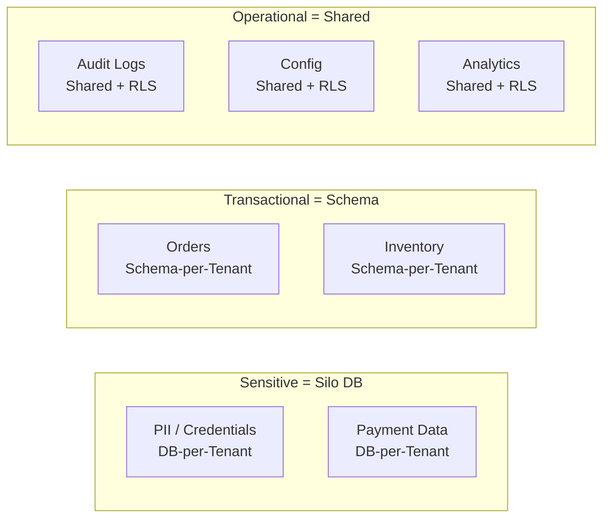
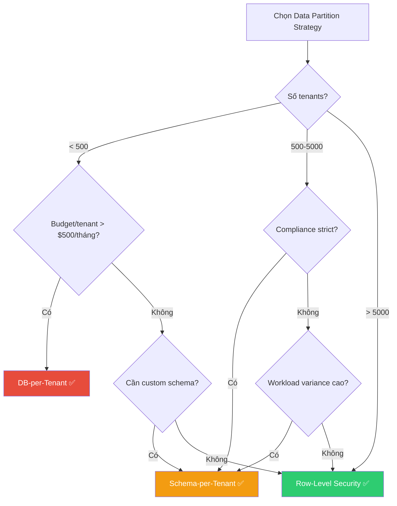

# Data Partitioning Strategies

Chiến lược phân tách dữ liệu (Data Partitioning) là **quyết định quan trọng nhất** khi xây dựng hệ thống multi-tenant. Nó ảnh hưởng trực tiếp đến isolation, performance, cost và khả năng scale.

```
                    DATA PARTITIONING SPECTRUM

  Database-per-Tenant     Schema-per-Tenant     Row-Level Security
  ┌─────────────┐         ┌─────────────┐       ┌─────────────────┐
  │ ┌───┐ ┌───┐ │         │ DB Instance │       │   DB Instance   │
  │ │DB │ │DB │ │         │ ┌────┬────┐ │       │ ┌─────────────┐ │
  │ │ A │ │ B │ │         │ │Sch │Sch │ │       │ │  Shared     │ │
  │ └───┘ └───┘ │         │ │ A  │ B  │ │       │ │  Table      │ │
  │ ┌───┐ ┌───┐ │         │ ├────┼────┤ │       │ │ tenant_id=A │ │
  │ │DB │ │DB │ │         │ │Sch │Sch │ │       │ │ tenant_id=B │ │
  │ │ C │ │ D │ │         │ │ C  │ D  │ │       │ │ tenant_id=C │ │
  │ └───┘ └───┘ │         │ └────┴────┘ │       │ └─────────────┘ │
  └─────────────┘         └─────────────┘       └─────────────────┘
  Max Isolation            Medium                Min Isolation
  Max Cost                 Medium Cost           Min Cost
```

## Database-per-Tenant

Mỗi tenant có **database instance riêng biệt hoàn toàn**. Đây là chiến lược cho isolation cao nhất ở tầng data.

#### Kiến trúc

```
┌──────────────────────────────────────────────────────┐
│                 Application Layer                    │
│                                                      │
│  Tenant Router: tenant_id → connection string        │
│                                                      │
│  ┌──────────────────────────────────────────────┐    │
│  │           Connection Pool Manager            │    │
│  │  tenant_a → jdbc:postgresql://db-a:5432/app  │    │
│  │  tenant_b → jdbc:postgresql://db-b:5432/app  │    │
│  │  tenant_c → jdbc:postgresql://db-c:5432/app  │    │
│  └──────┬──────────┬──────────┬─────────────────┘    │
│         │          │          │                      │
└─────────┼──────────┼──────────┼──────────────────────┘
          │          │          │
   ┌──────┴───┐ ┌────┴─────┐ ┌──┴─────────┐
   │ DB: app  │ │ DB: app  │ │ DB: app    │
   │ Host:db-a│ │ Host:db-b│ │ Host:db-c  │
   │ Tenant A │ │ Tenant B │ │ Tenant C   │
   └──────────┘ └──────────┘ └────────────┘
```

#### Implementation — Tenant Connection Routing

```java
// TenantConnectionProvider.java
@Component
public class TenantConnectionProvider {

    private final Map<String, DataSource> dataSources = new ConcurrentHashMap<>();
    private final TenantConfigRepository tenantConfigRepo;

    public DataSource getDataSource(String tenantId) {
        return dataSources.computeIfAbsent(tenantId, id -> {
            TenantConfig config = tenantConfigRepo.findByTenantId(id);
            return DataSourceBuilder.create()
                .url(config.getDbUrl())       // jdbc:postgresql://db-tenant-a:5432/app
                .username(config.getDbUser())
                .password(config.getDbPass())
                .build();
        });
    }
}

 Tenant Config Table (trong shared management DB)
 ┌───────────┬─────────────────────────────┬──────────┐
 │ tenant_id │ db_url                      │ db_user  │
 ├───────────┼─────────────────────────────┼──────────┤
 │ acme      │ jdbc:postgresql://db-a/app  │ acme_usr │
 │ beta      │ jdbc:postgresql://db-b/app  │ beta_usr │
 └───────────┴─────────────────────────────┴──────────┘
```

#### Ưu / Nhược điểm

| ✅ Ưu điểm | ❌ Nhược điểm |
|------------|--------------|
| Isolation vật lý mạnh nhất | Chi phí cao: 1 DB instance/tenant |
| Không noisy neighbor ở DB level | Connection pool explosion khi nhiều tenant |
| Backup/restore per tenant dễ dàng | Schema migration phải chạy N lần |
| Custom schema per tenant được | Monitoring N databases phức tạp |
| Compliance / data residency dễ | Provisioning chậm (tạo DB mới) |
| Performance tuning per tenant | Cross-tenant reporting cần ETL |

#### Khi nào dùng?

- Tenant < 500 và mỗi tenant đủ lớn để justify chi phí DB riêng
- Regulated industries: HIPAA, PCI-DSS, Government
- Yêu cầu data residency: tenant EU phải có DB ở EU region
- Enterprise tier trong Bridge model

#### Tip tiết kiệm chi phí

- **AWS RDS**: Dùng Aurora Serverless v2 → auto-scale, chỉ trả tiền khi dùng
- **Azure**: SQL Elastic Pool → nhiều DB share compute resources
- **PostgreSQL**: Dùng 1 PostgreSQL instance, mỗi tenant = 1 database (không phải 1 server)

## Schema-per-Tenant

Tất cả tenant chia sẻ **cùng một database instance**, nhưng mỗi tenant có **schema riêng** (namespace trong DB).

#### Kiến trúc

```
┌──────────────────────────────────────────────┐
│            PostgreSQL Instance               │
│                                              │
│  ┌──────────────┐  ┌──────────────┐          │
│  │ Schema: acme │  │ Schema: beta │          │
│  │              │  │              │          │
│  │  ┌────────┐  │  │  ┌────────┐  │          │
│  │  │ users  │  │  │  │ users  │  │ . . .    │
│  │  │ orders │  │  │  │ orders │  │          │
│  │  │products│  │  │  │products│  │          │
│  │  └────────┘  │  │  └────────┘  │          │
│  └──────────────┘  └──────────────┘          │
│                                              │
│  Shared resources: connections, memory, CPU  │
└──────────────────────────────────────────────┘
```

#### Implementation — PostgreSQL Schema Switching

```sql
-- Tạo schema cho tenant mới
CREATE SCHEMA tenant_acme;
CREATE SCHEMA tenant_beta;

-- Tạo table trong schema của tenant
CREATE TABLE tenant_acme.users (
    id UUID PRIMARY KEY DEFAULT gen_random_uuid(),
    email VARCHAR(255) NOT NULL,
    name VARCHAR(255)
);

CREATE TABLE tenant_beta.users (
    id UUID PRIMARY KEY DEFAULT gen_random_uuid(),
    email VARCHAR(255) NOT NULL,
    name VARCHAR(255)
);

-- Switch schema khi query
SET search_path TO tenant_acme;
SELECT * FROM users;  -- Tự động query tenant_acme.users
```

```java
// Application-level schema switching (Spring Boot + Hibernate)
@Component
public class TenantSchemaInterceptor implements HandlerInterceptor {

    @Override
    public boolean preHandle(HttpServletRequest request,
                             HttpServletResponse response,
                             Object handler) {
        String tenantId = extractTenantId(request);
        // Set schema cho connection hiện tại
        TenantContext.setCurrentTenant("tenant_" + tenantId);
        return true;
    }
}

// Hibernate MultiTenantConnectionProvider
public class SchemaMultiTenantProvider implements MultiTenantConnectionProvider {

    @Override
    public Connection getConnection(String tenantIdentifier) {
        Connection conn = dataSource.getConnection();
        conn.createStatement()
            .execute("SET search_path TO " + tenantIdentifier);
        return conn;
    }
}
```

#### Ưu / Nhược điểm

| ✅ Ưu điểm | ❌ Nhược điểm |
|------------|--------------|
| Isolation tốt hơn shared table | Vẫn share DB → noisy neighbor ở I/O level |
| Backup per tenant khả thi (pg_dump schema) | Migration phải chạy cho mỗi schema |
| Schema customization per tenant | Số schema có giới hạn (PostgreSQL: hàng nghìn OK, hàng chục nghìn → chậm) |
| Chi phí thấp hơn DB-per-tenant | Connection pool vẫn shared → cần quản lý |
| Không cần tenant_id trong mọi query | Catalog queries chậm khi nhiều schema |

#### Khi nào dùng?

- 50-5,000 tenants, mỗi tenant có workload tương đối
- Cần isolation tốt hơn shared table nhưng không cần dedicated DB
- Pro tier trong Bridge model
- PostgreSQL / SQL Server (hỗ trợ schema tốt)

## Row-Level Security (Shared Table)

Tất cả tenant chia sẻ **cùng database, schema, và table**. Phân biệt data bằng cột `tenant_id` trong **mọi bảng**.

#### Kiến trúc

```
┌──────────────────────────────────────────────────────┐
│                   Shared Database                    │
│                                                      │
│   users table:                                       │
│   ┌──────────┬──────┬───────────┬──────────────┐     │
│   │tenant_id │  id  │   email   │    name      │     │
│   ├──────────┼──────┼───────────┼──────────────┤     │
│   │  acme    │  1   │ j@acme    │ John         │     │
│   │  acme    │  2   │ k@acme    │ Kate         │     │
│   │  beta    │  3   │ b@beta    │ Bob          │     │
│   │  gamma   │  4   │ g@gamma   │ Grace        │     │
│   └──────────┴──────┴───────────┴──────────────┘     │
│                                                      │
│   ⚠️ EVERY query MUST filter by tenant_id            │
│   ⚠️ EVERY index SHOULD include tenant_id            │
│   ⚠️ EVERY foreign key SHOULD include tenant_id      │
└──────────────────────────────────────────────────────┘
```

#### Implementation — PostgreSQL Row-Level Security (RLS)

```sql
-- Bước 1: Tạo table với tenant_id
CREATE TABLE orders (
    id UUID PRIMARY KEY DEFAULT gen_random_uuid(),
    tenant_id VARCHAR(50) NOT NULL,
    customer_name VARCHAR(255),
    amount DECIMAL(10,2),
    created_at TIMESTAMP DEFAULT NOW()
);

-- Bước 2: Tạo index composite (tenant_id là prefix)
CREATE INDEX idx_orders_tenant ON orders (tenant_id, created_at DESC);

-- Bước 3: Enable RLS
ALTER TABLE orders ENABLE ROW LEVEL SECURITY;

-- Bước 4: Tạo policy — user chỉ thấy data của tenant mình
CREATE POLICY tenant_isolation_policy ON orders
    USING (tenant_id = current_setting('app.current_tenant'));

-- Bước 5: Set tenant context trước mỗi query
SET app.current_tenant = 'acme';
SELECT * FROM orders;  -- Chỉ trả về orders của 'acme'

-- ⚠️ QUAN TRỌNG: RLS không áp dụng cho superuser/table owner
-- Phải tạo role riêng cho application
CREATE ROLE app_user LOGIN PASSWORD 'xxx';
GRANT SELECT, INSERT, UPDATE, DELETE ON orders TO app_user;
```

#### Implementation — Application-Level Filter (ORM)

```java
// Spring Boot + Hibernate Global Filter
// Hibernate entity
@Entity
@Table(name = "orders")
@FilterDef(name = "tenantFilter",
           parameters = @ParamDef(name = "tenantId", type = "string"))
@Filter(name = "tenantFilter", condition = "tenant_id = :tenantId")
public class Order {
    @Id
    private UUID id;

    @Column(name = "tenant_id", nullable = false)
    private String tenantId;

    private String customerName;
    private BigDecimal amount;
}

// Tự động enable filter cho mọi session
@Component
public class TenantFilterAspect {

    @Autowired private EntityManager entityManager;

    @Before("execution(* com.app.repository.*.*(..))")
    public void enableTenantFilter() {
        Session session = entityManager.unwrap(Session.class);
        String tenantId = TenantContext.getCurrentTenant();
        session.enableFilter("tenantFilter")
               .setParameter("tenantId", tenantId);
    }
}
```

#### ⚠️ Các lỗi phổ biến với Shared Table

```
❌ LỖI 1: Quên WHERE tenant_id trong raw query
   SELECT * FROM orders WHERE amount > 100;
   → Lộ data tất cả tenant!
   ✅ FIX: Dùng RLS ở DB level + ORM filter ở app level (defense in depth)

❌ LỖI 2: Index không có tenant_id prefix
   CREATE INDEX idx_orders_date ON orders (created_at);
   → Full table scan across tenants, chậm
   ✅ FIX: CREATE INDEX idx ON orders (tenant_id, created_at);

❌ LỖI 3: Foreign key không check tenant_id
   orders.user_id → users.id  (không check tenant)
   → Tenant A có thể reference user của Tenant B
   ✅ FIX: Composite FK: (tenant_id, user_id) → (tenant_id, id)

❌ LỖI 4: Cache key không chứa tenant_id
   cache.get("user:123")  → có thể trả user 123 của tenant khác
   ✅ FIX: cache.get("tenant:acme:user:123")

❌ LỖI 5: Unique constraint không include tenant_id
   UNIQUE(email)  → 2 tenant không thể có user cùng email
   ✅ FIX: UNIQUE(tenant_id, email)
```

#### Ưu / Nhược điểm

| ✅ Ưu điểm | ❌ Nhược điểm |
|------------|--------------|
| Chi phí thấp nhất | Isolation yếu nhất — phụ thuộc code |
| Schema migration 1 lần | 1 bug = data leak cross-tenant |
| Onboarding instant | Noisy neighbor ở mọi layer |
| Cross-tenant analytics dễ | Mọi query, index, FK phải có tenant_id |
| Scale đến hàng triệu tenant | Backup/restore per tenant rất khó |
| Operational đơn giản | Table size lớn → cần partitioning |

## Table-per-Tenant

Ít phổ biến hơn — mỗi tenant có **bộ table riêng** trong cùng schema (thêm suffix/prefix tenant vào tên bảng).

```sql
-- Table per tenant
CREATE TABLE orders_acme (...);
CREATE TABLE orders_beta (...);
CREATE TABLE orders_gamma (...);

-- Dynamic table routing
SELECT * FROM orders_{tenant_id};
```

#### Tại sao KHÔNG nên dùng?

```
❌ ANTI-PATTERN — Table-per-Tenant

Vấn đề:
├── Schema migration nightmare: ALTER TABLE cho mỗi tenant table
├── Dynamic SQL: Không dùng được prepared statements tốt
├── ORM không hỗ trợ: Phải viết custom logic
├── Catalog bloat: Hàng nghìn tables → DB metadata chậm
├── Không có lợi ích isolation hơn Schema-per-Tenant
└── Connection pooling phức tạp

Thay vì Table-per-Tenant → Dùng:
├── Schema-per-Tenant (nếu cần isolation)
└── Row-Level Security (nếu cần đơn giản)
```

## Hybrid Data Partitioning

Kết hợp nhiều strategies cho các loại data khác nhau hoặc các tier khác nhau.

#### Tiered Partitioning

```
┌──────────────────────────────────────────────────────────────┐
│                    HYBRID PARTITIONING                       │
│                                                              │
│  Free Tier tenants (1000+):                                  │
│  ┌────────────────────────────────────────┐                  │
│  │  Shared Table + Row-Level Security     │                  │
│  │  (Pool model, tenant_id column)        │                  │
│  └────────────────────────────────────────┘                  │
│                                                              │
│  Pro Tier tenants (100-500):                                 │
│  ┌────────────────────────────────────────┐                  │
│  │  Schema-per-Tenant                     │                  │
│  │  (Dedicated schema, shared DB instance)│                  │
│  └────────────────────────────────────────┘                  │
│                                                              │
│  Enterprise Tier tenants (10-50):                            │
│  ┌────────────────────────────────────────┐                  │
│  │  Database-per-Tenant                   │                  │
│  │  (Dedicated DB, possibly dedicated     │                  │
│  │   instance in specific region)         │                  │
│  └────────────────────────────────────────┘                  │
└──────────────────────────────────────────────────────────────┘
```

#### Partitioning by Data Type



#### Implementation — Tenant Router

```java
@Component
public class DataPartitionRouter {

    public DataSource route(String tenantId, DataCategory category) {
        TenantConfig config = tenantConfigRepo.findByTenantId(tenantId);

        return switch (config.getTier()) {
            case ENTERPRISE -> getDedicatedDb(tenantId);
            case PRO        -> getSchemaBasedDs(tenantId);
            case FREE       -> getSharedDs(); // + RLS filter
        };
    }

    // Category-based routing (cross-tier)
    public DataSource routeByCategory(String tenantId, DataCategory cat) {
        return switch (cat) {
            case PII, PAYMENT -> getDedicatedDb(tenantId); // Luôn silo cho sensitive
            case TRANSACTIONAL -> getSchemaBasedDs(tenantId);
            case OPERATIONAL   -> getSharedDs();
        };
    }
}
```

## So sánh chi tiết

#### Bảng so sánh toàn diện

| Tiêu chí | DB-per-Tenant | Schema-per-Tenant | Row-Level Security | Table-per-Tenant |
|----------|:------------:|:-----------------:|:------------------:|:----------------:|
| **Isolation Level** | 🟢 Vật lý | 🟡 Logic (schema) | 🔴 Logic (row) | 🟡 Logic (table) |
| **Chi phí** | 🔴 Cao nhất | 🟡 Trung bình | 🟢 Thấp nhất | 🟡 Trung bình |
| **Max tenants** | 🔴 ~500 | 🟡 ~5,000 | 🟢 Hàng triệu | 🔴 ~1,000 |
| **Noisy neighbor** | 🟢 Không | 🟡 DB-level | 🔴 Mọi level | 🟡 DB-level |
| **Migration** | 🔴 N lần | 🔴 N lần | 🟢 1 lần | 🔴 N lần |
| **Onboarding** | 🔴 Chậm | 🟡 Trung bình | 🟢 Instant | 🟡 Trung bình |
| **Custom schema** | 🟢 Có | 🟢 Có | 🔴 Không | 🟡 Hạn chế |
| **Backup per tenant** | 🟢 Dễ | 🟡 Khả thi | 🔴 Khó | 🟡 Khả thi |
| **Cross-tenant query** | 🔴 Cần ETL | 🟡 Cross-schema | 🟢 Direct | 🟡 UNION ALL |
| **Compliance** | 🟢 Dễ | 🟡 Trung bình | 🔴 Khó | 🟡 Trung bình |
| **ORM support** | 🟢 Native | 🟢 Tốt | 🟡 Cần config | 🔴 Kém |
| **Recommended?** | ✅ Enterprise | ✅ Mid-tier | ✅ Free/Basic | ❌ Avoid |

#### Decision Flowchart




---

## Đọc thêm

- [Tenant Isolation Models](./02-isolation-models.md) — Silo/Pool/Bridge models
- [Security & Compliance](./09-security-compliance.md) — Encryption per tenant, data residency
- [Tenant Lifecycle](./08-tenant-lifecycle.md) — Provisioning và migration giữa strategies
