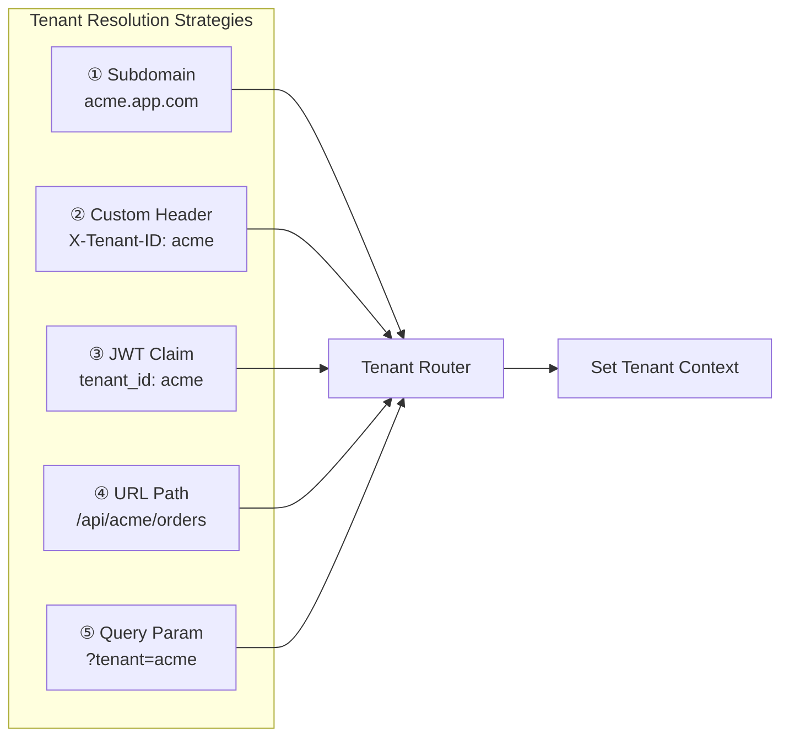
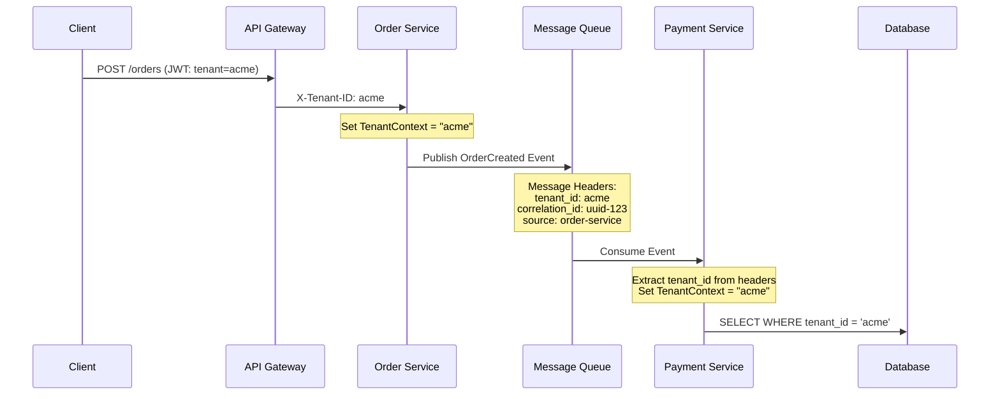

# Tenant Identity & Context Propagation

Tenant Identity & Context Propagation là **xương sống** của mọi hệ thống multi-tenant. Mỗi request đi vào hệ thống phải được **xác định thuộc về tenant nào** (Identity) và thông tin đó phải được **truyền xuyên suốt** qua tất cả các layer, service, message queue (Propagation) — không bao giờ bị mất.

```
┌─────────────────────────────────────────────────────────────────────┐
│              TENANT CONTEXT LIFECYCLE                               │
│                                                                     │
│  ① RESOLVE        ② SET CONTEXT      ③ PROPAGATE       ④ ENFORCE │
│                                                                     │
│  Client Request   Middleware/         Service-to-Service  DB Query  │
│  ───────────►     Interceptor         ───────────────►    Filter    │
│                   ───────────►        Event Bus           Cache Key │
│  Subdomain?                           Message Queue       Storage   │
│  Header?          ThreadLocal /                           Logging   │
│  JWT Claim?       Context Object                                    │
│  Path?            AsyncLocal                                        │
│                                                                     │
│  ⚠️ Nếu bất kỳ bước nào bị thiếu → Cross-Tenant Data Leak!          │
└─────────────────────────────────────────────────────────────────────┘
```

## Tenant Resolution Strategies

**Tenant Resolution** là bước đầu tiên — xác định request đến từ tenant nào. Có 5 chiến lược phổ biến:

#### Tổng quan các chiến lược



#### ① Subdomain-based Resolution

Mỗi tenant có **subdomain riêng**. Đây là chiến lược phổ biến nhất cho SaaS B2B.

```
┌─────────────────────────────────────────────────────┐
│  SUBDOMAIN RESOLUTION                               │
│                                                     │
│  acme.myapp.com    ──►  tenant_id = "acme"          │
│  beta.myapp.com    ──►  tenant_id = "beta"          │
│  gamma.myapp.com   ──►  tenant_id = "gamma"         │
│                                                     │
│  Custom domain (CNAME):                             │
│  app.acme-corp.com ──►  tenant_id = "acme"          │
│  (DNS CNAME → acme.myapp.com)                       │
└─────────────────────────────────────────────────────┘
```

**Implementation:**

```java
@Component
public class SubdomainTenantResolver implements TenantResolver {

    // Danh sách domain chính của platform
    private static final Set<String> PLATFORM_DOMAINS = Set.of(
        "myapp.com", "myapp.io", "localhost"
    );

    @Override
    public String resolve(HttpServletRequest request) {
        String host = request.getServerName(); // acme.myapp.com

        // Case 1: Subdomain resolution
        for (String domain : PLATFORM_DOMAINS) {
            if (host.endsWith("." + domain)) {
                String subdomain = host.replace("." + domain, "");
                return validateTenant(subdomain);
            }
        }

        // Case 2: Custom domain → lookup mapping table
        // app.acme-corp.com → tenants_domains table → "acme"
        return customDomainRepo.findTenantByDomain(host)
            .orElseThrow(() -> new TenantNotFoundException(
                "No tenant found for domain: " + host));
    }

    private String validateTenant(String tenantId) {
        if (!tenantRepo.existsById(tenantId)) {
            throw new TenantNotFoundException("Tenant not found: " + tenantId);
        }
        return tenantId;
    }
}
```

**Nginx routing cho subdomain:**

```nginx
# Wildcard subdomain → forward to app
server {
    listen 443 ssl;
    server_name ~^(?<tenant>[a-z0-9-]+)\.myapp\.com$;

    location / {
        proxy_pass http://app-backend;
        proxy_set_header X-Tenant-ID $tenant;
        proxy_set_header Host $host;
    }
}
```

| ✅ Ưu điểm | ❌ Nhược điểm |
|------------|--------------|
| UX tốt: tenant biết URL của mình | DNS wildcard certificate cần quản lý |
| SEO friendly | Custom domain cần CNAME mapping + SSL cert |
| Dễ cache per subdomain (CDN) | Không dùng được khi API-only (không có browser) |
| Tenant isolation rõ ràng ở URL level | CORS phức tạp hơn (cross-origin) |

**Ví dụ thực tế:** Slack (`acme.slack.com`), Shopify (`acme.myshopify.com`), Atlassian (`acme.atlassian.net`)

#### ② HTTP Header-based Resolution

Tenant ID được truyền qua **custom HTTP header**. Phù hợp cho API-first architectures.

```
┌─────────────────────────────────────────────────────┐
│  HEADER-BASED RESOLUTION                            │
│                                                     │
│  POST /api/orders HTTP/1.1                          │
│  Host: api.myapp.com                                │
│  X-Tenant-ID: acme                     ◄── tenant   │
│  Authorization: Bearer eyJ...                       │
│  Content-Type: application/json                     │
│                                                     │
│  {"item": "laptop", "qty": 1}                       │
└─────────────────────────────────────────────────────┘
```

**Implementation:**

```java
@Component
public class HeaderTenantResolver implements TenantResolver {

    private static final String TENANT_HEADER = "X-Tenant-ID";

    @Override
    public String resolve(HttpServletRequest request) {
        String tenantId = request.getHeader(TENANT_HEADER);

        if (tenantId == null || tenantId.isBlank()) {
            throw new MissingTenantException(
                "Missing required header: " + TENANT_HEADER);
        }

        // Sanitize — phòng injection
        tenantId = tenantId.trim().toLowerCase()
            .replaceAll("[^a-z0-9_-]", "");

        // Validate tenant tồn tại
        if (!tenantRepo.existsById(tenantId)) {
            throw new TenantNotFoundException("Invalid tenant: " + tenantId);
        }

        return tenantId;
    }
}
```

| ✅ Ưu điểm | ❌ Nhược điểm |
|------------|--------------|
| Đơn giản, dễ implement | Client phải tự thêm header → dễ quên/sai |
| Phù hợp API-to-API, service mesh | Header có thể bị giả mạo nếu không verify |
| Không ảnh hưởng URL structure | Không dùng cho browser-based apps (user không set header) |
| Dễ test (curl, Postman) | Cần validate + cross-check với auth context |

**⚠️ Security Warning:** Header `X-Tenant-ID` **phải luôn được validate** với JWT/auth context. Không bao giờ tin tưởng header đơn lẻ.

#### ③ JWT Claim-based Resolution

Tenant ID **nhúng trong JWT token** — cách **an toàn nhất** vì token đã được sign bởi auth server.

```
┌─────────────────────────────────────────────────────────┐
│  JWT CLAIM-BASED RESOLUTION                             │
│                                                         │
│  JWT Payload:                                           │
│  {                                                      │
│    "sub": "user-uuid-1234",                             │
│    "email": "john@acme.com",                            │
│    "tenant_id": "acme",           ◄── tenant identity   │
│    "tenant_tier": "enterprise",   ◄── tenant metadata   │
│    "roles": ["admin", "billing"],                       │
│    "iat": 1700000000,                                   │
│    "exp": 1700003600                                    │
│  }                                                      │
│                                                         │
│  Signed bởi Auth Server → Không thể giả mạo             │
└─────────────────────────────────────────────────────────┘
```

**Implementation:**

```java
@Component
public class JwtTenantResolver implements TenantResolver {

    private final JwtDecoder jwtDecoder;

    @Override
    public String resolve(HttpServletRequest request) {
        String authHeader = request.getHeader("Authorization");
        if (authHeader == null || !authHeader.startsWith("Bearer ")) {
            throw new AuthenticationException("Missing Bearer token");
        }

        String token = authHeader.substring(7);
        Jwt jwt = jwtDecoder.decode(token); // Verify signature + expiry

        String tenantId = jwt.getClaimAsString("tenant_id");
        if (tenantId == null) {
            throw new MissingTenantException("JWT missing tenant_id claim");
        }

        // Optional: Cross-check header vs JWT
        String headerTenant = request.getHeader("X-Tenant-ID");
        if (headerTenant != null && !headerTenant.equals(tenantId)) {
            throw new TenantMismatchException(
                "Header tenant '" + headerTenant +
                "' does not match JWT tenant '" + tenantId + "'");
        }

        return tenantId;
    }
}
```

| ✅ Ưu điểm | ❌ Nhược điểm |
|------------|--------------|
| An toàn nhất — token đã signed | Token size lớn hơn khi thêm claims |
| Không thể giả mạo tenant_id | Token revocation phức tạp (stateless JWT) |
| Kết hợp AuthN + tenant identity | Tenant switch cần re-authenticate |
| Không cần DB lookup per request | User thuộc nhiều tenant → cần tenant selector |

**Ví dụ thực tế:** Auth0, AWS Cognito, Keycloak đều hỗ trợ custom claims trong JWT.

#### ④ URL Path-based Resolution

Tenant ID nằm trong **URL path**.

```
GET /api/tenants/acme/orders         → tenant_id = "acme"
GET /api/tenants/beta/users          → tenant_id = "beta"
GET /api/v1/acme/products            → tenant_id = "acme"
```

**Implementation (Spring Boot):**

```java
@RestController
@RequestMapping("/api/tenants/{tenantId}")
public class OrderController {

    @GetMapping("/orders")
    public List<Order> getOrders(@PathVariable String tenantId) {
        // Validate tenantId matches authenticated user's tenant
        TenantContext.validateAccess(tenantId);
        TenantContext.setCurrentTenant(tenantId);
        return orderService.findAll();
    }
}
```

| ✅ Ưu điểm | ❌ Nhược điểm |
|------------|--------------|
| RESTful, explicit | URL dài, lặp tenant ở mọi endpoint |
| Dễ debug — thấy tenant trong URL | Khó refactor khi cần thay đổi URL structure |
| API versioning + tenant cùng lúc | Mỗi controller phải handle @PathVariable |

#### ⑤ Query Parameter-based Resolution

```
GET /api/orders?tenant_id=acme       → tenant_id = "acme"
```

**⚠️ Ít được khuyến khích** — dễ bị lộ trong logs, browser history, referrer headers.

#### Bảng so sánh tổng hợp

| Tiêu chí | Subdomain | Header | JWT Claim | URL Path | Query Param |
|----------|:---------:|:------:|:---------:|:--------:|:-----------:|
| **Security** | 🟡 | 🟡 | 🟢 Cao nhất | 🟡 | 🔴 Thấp |
| **UX (Browser)** | 🟢 Tốt nhất | 🔴 Không dùng được | 🟡 | 🟡 | 🟡 |
| **API-first** | 🟡 | 🟢 Tốt nhất | 🟢 | 🟢 | 🟡 |
| **Implementation** | 🟡 DNS + SSL | 🟢 Đơn giản | 🟡 Auth server | 🟢 Đơn giản | 🟢 Đơn giản |
| **Multi-tenant switch** | 🔴 Đổi URL | 🟢 Đổi header | 🔴 Re-auth | 🟢 Đổi path | 🟢 Đổi param |
| **Service-to-service** | 🔴 Không phù hợp | 🟢 Tốt nhất | 🟢 | 🟡 | 🟡 |
| **Phổ biến cho** | SaaS B2B web | Internal APIs | Public APIs | REST APIs | Legacy |

#### Composite Resolution — Best Practice

Trong thực tế, thường **kết hợp nhiều chiến lược** và ưu tiên theo thứ tự:

```java
@Component
public class CompositeTenantResolver implements TenantResolver {

    private final List<TenantResolver> resolvers;

    public CompositeTenantResolver(
            JwtTenantResolver jwtResolver,
            HeaderTenantResolver headerResolver,
            SubdomainTenantResolver subdomainResolver) {
        // Ưu tiên: JWT > Header > Subdomain
        this.resolvers = List.of(jwtResolver, headerResolver, subdomainResolver);
    }

    @Override
    public String resolve(HttpServletRequest request) {
        for (TenantResolver resolver : resolvers) {
            try {
                String tenantId = resolver.resolve(request);
                if (tenantId != null) {
                    return tenantId;
                }
            } catch (Exception ignored) {
                // Thử resolver tiếp theo
            }
        }
        throw new TenantNotFoundException("Cannot resolve tenant from request");
    }
}
```

```
Resolution Priority:
┌─────────────────────────────────────────────┐
│  1. JWT Claim (nếu có Bearer token)         │  ← Tin cậy nhất
│  2. HTTP Header (nếu internal service call) │  ← Service mesh
│  3. Subdomain (nếu browser request)         │  ← User-facing
│  4. URL Path (fallback)                     │  ← REST API
│  5. ❌ Reject request                       │  ← Không xác định
└─────────────────────────────────────────────┘
```

## Tenant Context trong Microservice

Sau khi resolve được tenant, bước tiếp theo là **lưu tenant context** sao cho toàn bộ code trong request có thể truy cập mà **không cần truyền tham số tenant_id** qua từng method.

#### Tenant Context Object

```java
// TenantContext.java — Immutable context object
public record TenantContext(
    String tenantId,          // "acme"
    String tenantTier,        // "enterprise" | "pro" | "free"
    String tenantRegion,      // "ap-southeast-1"
    Map<String, String> metadata  // Custom config
) {
    // Validation trong constructor
    public TenantContext {
        Objects.requireNonNull(tenantId, "tenantId must not be null");
        if (tenantId.isBlank()) {
            throw new IllegalArgumentException("tenantId must not be blank");
        }
    }
}
```

#### ① ThreadLocal Pattern (Java / JVM)

**ThreadLocal** lưu tenant context **per-thread** — mỗi request thread có context riêng, không chia sẻ.

```java
public class TenantContextHolder {

    private static final ThreadLocal<TenantContext> CONTEXT =
        new ThreadLocal<>();

    // ① Set khi request đến (middleware/interceptor)
    public static void set(TenantContext ctx) {
        CONTEXT.set(ctx);
    }

    // ② Get ở bất kỳ đâu trong cùng thread
    public static TenantContext get() {
        TenantContext ctx = CONTEXT.get();
        if (ctx == null) {
            throw new IllegalStateException(
                "TenantContext not set! " +
                "Ensure TenantInterceptor is configured.");
        }
        return ctx;
    }

    public static String getTenantId() {
        return get().tenantId();
    }

    // ③ Clear khi request kết thúc (BẮT BUỘC — tránh memory leak)
    public static void clear() {
        CONTEXT.remove();
    }
}
```

**Interceptor tự động set/clear context:**

```java
@Component
public class TenantInterceptor implements HandlerInterceptor {

    private final TenantResolver tenantResolver;
    private final TenantConfigService tenantConfigService;

    @Override
    public boolean preHandle(HttpServletRequest request,
                             HttpServletResponse response,
                             Object handler) {
        // ① Resolve tenant từ request
        String tenantId = tenantResolver.resolve(request);

        // ② Load tenant config
        TenantConfig config = tenantConfigService.getConfig(tenantId);

        // ③ Set context
        TenantContextHolder.set(new TenantContext(
            tenantId,
            config.getTier(),
            config.getRegion(),
            config.getMetadata()
        ));

        // ④ Set MDC cho logging (tự động thêm tenant_id vào mọi log)
        MDC.put("tenant_id", tenantId);
        MDC.put("tenant_tier", config.getTier());

        return true;
    }

    @Override
    public void afterCompletion(HttpServletRequest request,
                                HttpServletResponse response,
                                Object handler, Exception ex) {
        // ⑤ BẮT BUỘC: Clear context sau mỗi request
        TenantContextHolder.clear();
        MDC.clear();
    }
}

// Đăng ký interceptor
@Configuration
public class WebConfig implements WebMvcConfigurer {

    @Override
    public void addInterceptors(InterceptorRegistry registry) {
        registry.addInterceptor(tenantInterceptor)
            .addPathPatterns("/api/**")          // Áp dụng cho API
            .excludePathPatterns(
                "/api/health",                   // Health check — no tenant
                "/api/auth/login",               // Login — chưa có tenant
                "/api/public/**"                 // Public endpoints
            );
    }
}
```

#### ② Async Context Propagation

**⚠️ Vấn đề quan trọng:** ThreadLocal **không tự động truyền** sang thread khác (async, thread pool, @Async, CompletableFuture).

```
┌─────────────────────────────────────────────────────────┐
│  ⚠️ THREADLOCAL + ASYNC = CONTEXT LOST!                 │
│                                                         │
│  Request Thread (có context):                           │
│  ┌─────────────────────────────┐                        │
│  │ TenantContext = "acme"      │                        │
│  │                             │                        │
│  │ CompletableFuture.runAsync( │                        │
│  │   () -> {                   │                        │
│  │     // ❌ TenantContext = null!                      │
│  │     // Chạy trên thread pool thread khác             │
│  │   }                         │                        │
│  │ );                          │                        │
│  └─────────────────────────────┘                        │
│                                                         │
│  FIX: Dùng InheritableThreadLocal hoặc TaskDecorator    │
└─────────────────────────────────────────────────────────┘
```

**Fix 1: TaskDecorator (Spring) — Recommended:**

```java
@Component
public class TenantAwareTaskDecorator implements TaskDecorator {

    @Override
    public Runnable decorate(Runnable runnable) {
        // Capture context trên calling thread
        TenantContext ctx = TenantContextHolder.get();
        Map<String, String> mdcContext = MDC.getCopyOfContextMap();

        return () -> {
            try {
                // Set context trên worker thread
                TenantContextHolder.set(ctx);
                if (mdcContext != null) MDC.setContextMap(mdcContext);
                runnable.run();
            } finally {
                // Clear trên worker thread
                TenantContextHolder.clear();
                MDC.clear();
            }
        };
    }
}

// Cấu hình thread pool
@Configuration
@EnableAsync
public class AsyncConfig {

    @Bean
    public Executor taskExecutor(TenantAwareTaskDecorator decorator) {
        ThreadPoolTaskExecutor executor = new ThreadPoolTaskExecutor();
        executor.setCorePoolSize(10);
        executor.setMaxPoolSize(50);
        executor.setTaskDecorator(decorator);  // ← Truyền context
        executor.initialize();
        return executor;
    }
}
```

**Fix 2: Context wrapper cho CompletableFuture:**

```java
public class TenantAwareExecutor {

    public static <T> CompletableFuture<T> supplyAsync(
            Supplier<T> supplier, Executor executor) {
        TenantContext ctx = TenantContextHolder.get();
        return CompletableFuture.supplyAsync(() -> {
            try {
                TenantContextHolder.set(ctx);
                return supplier.get();
            } finally {
                TenantContextHolder.clear();
            }
        }, executor);
    }
}

// Sử dụng
CompletableFuture<Report> future = TenantAwareExecutor.supplyAsync(
    () -> reportService.generate(), // tenant context được giữ
    asyncExecutor
);
```

#### ③ Node.js / Express Pattern

```javascript
// Dùng AsyncLocalStorage (Node.js 16+) — tương đương ThreadLocal
import { AsyncLocalStorage } from 'async_hooks';

const tenantStorage = new AsyncLocalStorage();

// Middleware — set context
function tenantMiddleware(req, res, next) {
    const tenantId = req.headers['x-tenant-id']
        || extractFromJwt(req)
        || extractFromSubdomain(req);

    if (!tenantId) {
        return res.status(400).json({ error: 'Missing tenant context' });
    }

    const tenantCtx = {
        tenantId,
        tier: null, // sẽ load từ DB
        region: null,
    };

    // Chạy toàn bộ request chain trong context
    tenantStorage.run(tenantCtx, () => {
        next();
    });
}

// Get context ở bất kỳ đâu (service, repository, etc.)
function getCurrentTenant() {
    const ctx = tenantStorage.getStore();
    if (!ctx) throw new Error('Tenant context not available');
    return ctx;
}

// Sử dụng trong service
class OrderService {
    async getOrders() {
        const { tenantId } = getCurrentTenant();
        return db.query('SELECT * FROM orders WHERE tenant_id = $1', [tenantId]);
    }
}

app.use(tenantMiddleware);
```

#### ④ Python / FastAPI Pattern

```python
from contextvars import ContextVar
from fastapi import FastAPI, Request, HTTPException

# ContextVar — Python's ThreadLocal equivalent (async-safe)
tenant_ctx: ContextVar[dict] = ContextVar('tenant_ctx')

app = FastAPI()

@app.middleware("http")
async def tenant_middleware(request: Request, call_next):
    tenant_id = (
        request.headers.get("x-tenant-id")
        or extract_from_jwt(request)
        or extract_from_subdomain(request)
    )

    if not tenant_id:
        raise HTTPException(status_code=400, detail="Missing tenant context")

    # Set context — tự động propagate qua async/await
    token = tenant_ctx.set({
        "tenant_id": tenant_id,
        "tier": await load_tenant_tier(tenant_id),
    })

    try:
        response = await call_next(request)
        return response
    finally:
        tenant_ctx.reset(token)

# Sử dụng ở bất kỳ đâu
def get_current_tenant() -> dict:
    try:
        return tenant_ctx.get()
    except LookupError:
        raise RuntimeError("Tenant context not set")

class OrderService:
    async def get_orders(self):
        ctx = get_current_tenant()
        return await db.fetch(
            "SELECT * FROM orders WHERE tenant_id = $1",
            ctx["tenant_id"]
        )
```

#### ⚠️ Common Pitfalls — Lỗi thường gặp

```
❌ PITFALL 1: Quên clear ThreadLocal
   → Memory leak trong connection pool (Tomcat reuse threads)
   → Data leak: request sau nhận context của request trước
   ✅ FIX: Luôn clear trong finally/afterCompletion

❌ PITFALL 2: Async code mất context
   → @Async, CompletableFuture, parallel streams
   ✅ FIX: TaskDecorator hoặc context wrapper

❌ PITFALL 3: Scheduler/Cron job không có context
   → Background jobs không có HTTP request → không có tenant
   ✅ FIX: Job metadata phải chứa tenant_id, set context trước khi execute

❌ PITFALL 4: WebSocket connection không có context per message
   → Context chỉ set khi connect, không refresh per message
   ✅ FIX: Mỗi WebSocket message phải carry tenant_id

❌ PITFALL 5: Static method access tenant context
   → Khó test, khó trace
   ✅ FIX: Inject TenantContextProvider thay vì static access
```

## Propagation qua Message Queue / Event Bus

Khi service A gọi service B qua **message queue** (SQS, Kafka, RabbitMQ) hoặc **event bus** (EventBridge, SNS), tenant context phải được **nhúng vào message metadata**.

#### Luồng propagation tổng quan



#### Event Format — Chuẩn hóa

```json
{
  "metadata": {
    "event_id": "evt-uuid-7890",
    "event_type": "order.created",
    "source": "order-service",
    "timestamp": "2024-01-15T10:30:00Z",
    "version": "1.0",

    "tenant_id": "acme",
    "tenant_tier": "enterprise",
    "correlation_id": "corr-uuid-1234",
    "causation_id": "evt-uuid-6789",
    "trace_id": "trace-uuid-5678"
  },
  "payload": {
    "order_id": "ORD-001",
    "total": 150.00,
    "currency": "USD"
  }
}
```

**Quy tắc chuẩn hóa metadata:**

| Field | Bắt buộc? | Mô tả |
|-------|:---------:|-------|
| `tenant_id` | ✅ **Bắt buộc** | Tenant sở hữu event |
| `tenant_tier` | 🟡 Nên có | Để consumer biết routing/priority |
| `correlation_id` | ✅ **Bắt buộc** | Trace toàn bộ flow xuyên services |
| `causation_id` | 🟡 Nên có | Event nào gây ra event này |
| `trace_id` | 🟡 Nên có | Distributed tracing (OpenTelemetry) |
| `source` | ✅ **Bắt buộc** | Service nào publish event |
| `event_type` | ✅ **Bắt buộc** | Loại event |

#### Implementation — Kafka

**Producer (auto-inject tenant context):**

```java
@Component
public class TenantAwareKafkaProducer {

    private final KafkaTemplate<String, String> kafka;
    private final ObjectMapper mapper;

    public void publish(String topic, Object event) {
        String tenantId = TenantContextHolder.getTenantId();

        // Tạo message với tenant headers
        ProducerRecord<String, String> record = new ProducerRecord<>(
            topic,
            null,                          // partition (null = auto)
            tenantId,                      // key = tenant_id (để ordering)
            mapper.writeValueAsString(event)
        );

        // Inject tenant metadata vào Kafka headers
        record.headers()
            .add("tenant_id", tenantId.getBytes())
            .add("tenant_tier",
                 TenantContextHolder.get().tenantTier().getBytes())
            .add("correlation_id",
                 MDC.get("correlation_id").getBytes())
            .add("source", "order-service".getBytes());

        kafka.send(record);
    }
}
```

**Consumer (auto-extract tenant context):**

```java
@Component
public class TenantAwareKafkaConsumer {

    @KafkaListener(topics = "order-events")
    public void consume(ConsumerRecord<String, String> record) {
        try {
            // ① Extract tenant từ Kafka headers
            String tenantId = headerValue(record, "tenant_id");
            String tenantTier = headerValue(record, "tenant_tier");
            String correlationId = headerValue(record, "correlation_id");

            // ② Set context cho consumer thread
            TenantContextHolder.set(new TenantContext(
                tenantId, tenantTier, null, Map.of()
            ));
            MDC.put("tenant_id", tenantId);
            MDC.put("correlation_id", correlationId);

            // ③ Process event — toàn bộ code bên dưới có tenant context
            processEvent(record.value());

        } finally {
            // ④ Clear context
            TenantContextHolder.clear();
            MDC.clear();
        }
    }

    private String headerValue(ConsumerRecord<?, ?> record, String key) {
        Header header = record.headers().lastHeader(key);
        if (header == null) {
            throw new IllegalStateException(
                "Missing required header: " + key);
        }
        return new String(header.value());
    }
}
```

#### Implementation — SQS / SNS (AWS)

```java
// Producer — SQS message attributes
public void publishToSqs(String queueUrl, Object event) {
    String tenantId = TenantContextHolder.getTenantId();

    SendMessageRequest request = SendMessageRequest.builder()
        .queueUrl(queueUrl)
        .messageBody(mapper.writeValueAsString(event))
        .messageAttributes(Map.of(
            "tenant_id", attr(tenantId),
            "tenant_tier", attr(TenantContextHolder.get().tenantTier()),
            "correlation_id", attr(MDC.get("correlation_id")),
            "source", attr("order-service")
        ))
        // Message group ID = tenant_id → ordering per tenant
        .messageGroupId(tenantId)
        .build();

    sqsClient.sendMessage(request);
}

// Consumer — Lambda handler
public void handleSqsEvent(SQSEvent event) {
    for (SQSEvent.SQSMessage msg : event.getRecords()) {
        String tenantId = msg.getMessageAttributes()
            .get("tenant_id").getStringValue();

        try {
            TenantContextHolder.set(new TenantContext(tenantId, ...));
            processMessage(msg.getBody());
        } finally {
            TenantContextHolder.clear();
        }
    }
}
```

#### gRPC Metadata Propagation

```java
// gRPC Client Interceptor — auto-inject tenant
public class TenantClientInterceptor implements ClientInterceptor {

    private static final Metadata.Key<String> TENANT_KEY =
        Metadata.Key.of("x-tenant-id", Metadata.ASCII_STRING_MARSHALLER);

    @Override
    public <ReqT, RespT> ClientCall<ReqT, RespT> interceptCall(
            MethodDescriptor<ReqT, RespT> method,
            CallOptions options,
            Channel next) {

        return new ForwardingClientCall.SimpleForwardingClientCall<>(
                next.newCall(method, options)) {
            @Override
            public void start(Listener<RespT> listener, Metadata headers) {
                // Inject tenant vào gRPC metadata
                headers.put(TENANT_KEY,
                    TenantContextHolder.getTenantId());
                super.start(listener, headers);
            }
        };
    }
}

// gRPC Server Interceptor — auto-extract tenant
public class TenantServerInterceptor implements ServerInterceptor {

    @Override
    public <ReqT, RespT> ServerCall.Listener<ReqT> interceptCall(
            ServerCall<ReqT, RespT> call,
            Metadata headers,
            ServerCallHandler<ReqT, RespT> next) {

        String tenantId = headers.get(TENANT_KEY);
        if (tenantId == null) {
            call.close(Status.UNAUTHENTICATED
                .withDescription("Missing tenant context"), new Metadata());
            return new ServerCall.Listener<>() {};
        }

        // Set context cho gRPC handler thread
        Context ctx = Context.current()
            .withValue(TENANT_CONTEXT_KEY, tenantId);

        return Contexts.interceptCall(ctx, call, headers, next);
    }
}
```

#### Tổng kết Propagation — Checklist

```
✅ TENANT CONTEXT PROPAGATION CHECKLIST

Synchronous (HTTP/gRPC):
├── ✅ REST → X-Tenant-ID header (auto-inject via interceptor)
├── ✅ gRPC → Metadata key (auto-inject via ClientInterceptor)
├── ✅ GraphQL → Context object with tenant
└── ✅ Service Mesh → Header propagation (Istio/Linkerd auto-forward)

Asynchronous (Queues/Events):
├── ✅ Kafka → Record headers (tenant_id, correlation_id)
├── ✅ SQS → Message attributes
├── ✅ SNS → Message attributes
├── ✅ EventBridge → detail.metadata.tenant_id
└── ✅ RabbitMQ → Message headers

Background Jobs:
├── ✅ Cron jobs → Job metadata chứa tenant_id
├── ✅ Scheduled tasks → Iterate per tenant, set context trước mỗi tenant
└── ✅ Batch processing → Partition by tenant_id

Internal:
├── ✅ ThreadLocal / AsyncLocalStorage / ContextVar
├── ✅ Async thread pool → TaskDecorator
├── ✅ CompletableFuture → Context wrapper
├── ✅ MDC (logging) → tenant_id label
└── ✅ Metrics → tenant_id tag
```

```
⚠️ NGUYÊN TẮC VÀNG:
   Tenant context KHÔNG BAO GIỜ được "suy luận" (infer).
   Nó phải được TRUYỀN TƯỜNG MINH (explicit propagation)
   trong MỌI communication channel.

   Nếu bạn không trả lời được câu hỏi:
   "Tenant context được truyền từ đâu sang đâu, bằng cách nào?"
   → Bạn có lỗ hổng cross-tenant data leak.
```

---

## Đọc thêm

- [Authentication & Authorization](./05-authentication.md) — Tenant-aware AuthN/AuthZ, RBAC
- [Observability & Monitoring](./10-observability.md) — Tenant-aware logging, tracing
- [Noisy Neighbor Problem](./07-noisy-neighbor.md) — Per-tenant metrics và detection
