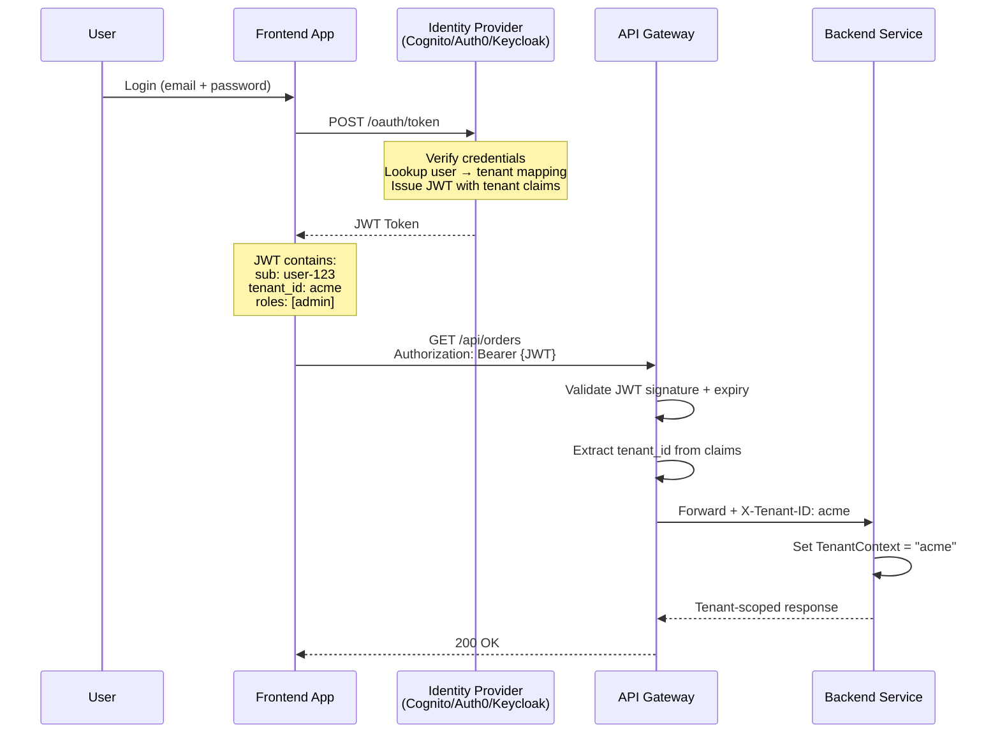
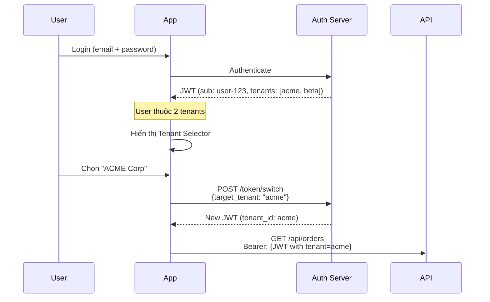
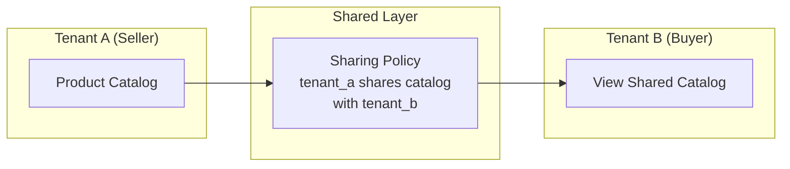
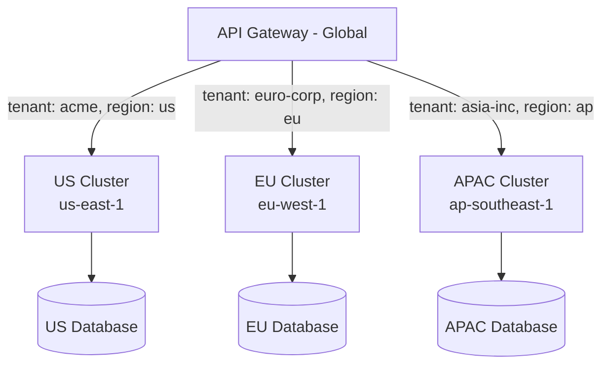

# Authentication & Authorization

Trong hệ thống multi-tenant, AuthN (xác thực) và AuthZ (phân quyền) phải trả lời **3 câu hỏi** cùng lúc:

```
┌─────────────────────────────────────────────────────────────────┐
│              MULTI-TENANT AUTH FLOW                             │
│                                                                 │
│  ① WHO are you?        → Authentication (AuthN)                │
│     User identity: email, password, MFA, SSO                    │
│                                                                 │
│  ② WHICH tenant?       → Tenant Resolution                     │
│     Tenant context: JWT claim, subdomain, header                │
│                                                                 │
│  ③ WHAT can you do?    → Authorization (AuthZ)                 │
│     Permissions: RBAC, ABAC, scoped to tenant                   │
│                                                                 │
│  ⚠️ AuthZ phải LUÔN scope theo tenant:                          │
│     "User X có quyền Y TRONG tenant Z" — không phải chỉ "X có Y"│
└─────────────────────────────────────────────────────────────────┘
```

## Tenant-aware AuthN/AuthZ

#### Authentication Flow — Multi-Tenant



#### JWT Structure cho Multi-Tenant

```json
{
  "header": {
    "alg": "RS256",
    "typ": "JWT",
    "kid": "key-id-123"
  },
  "payload": {
    "sub": "user-uuid-1234",
    "email": "john@acme.com",
    "name": "John Doe",

    "tenant_id": "acme",
    "tenant_name": "ACME Corp",
    "tenant_tier": "enterprise",

    "org_id": "org-acme-001",
    "roles": ["admin", "billing"],
    "permissions": ["order:read", "order:write", "user:manage"],

    "iss": "https://auth.myapp.com",
    "aud": "https://api.myapp.com",
    "iat": 1700000000,
    "exp": 1700003600,
    "scope": "openid profile email"
  }
}
```

**Các claim quan trọng cho multi-tenant:**

| Claim | Bắt buộc | Mô tả |
|-------|:--------:|-------|
| `sub` | ✅ | User ID duy nhất (UUID) |
| `tenant_id` | ✅ | Tenant hiện tại của user |
| `tenant_tier` | 🟡 | Tier ảnh hưởng rate limit, features |
| `roles` | ✅ | Roles **trong tenant** (admin, member, viewer) |
| `permissions` | 🟡 | Fine-grained permissions |
| `org_id` | 🟡 | Nếu org ≠ tenant (multi-level hierarchy) |

#### Mô hình Identity Provider

**① Shared Identity Provider (1 IDP cho tất cả tenant)**

```
┌──────────────────────────────────────────────────────┐
│              Shared Identity Provider                │
│              (Cognito / Auth0 / Keycloak)            │
│                                                      │
│  ┌──────────────────────────────────────────────┐    │
│  │              Single User Pool                │    │
│  │                                              │    │
│  │  User: john@acme.com → tenant_id: acme       │    │
│  │  User: jane@beta.com → tenant_id: beta       │    │
│  │  User: bob@acme.com  → tenant_id: acme       │    │
│  │                                              │    │
│  │Tenant mapping: user_attributes / app_metadata│    │
│  └──────────────────────────────────────────────┘    │
│                                                      │
│  ✅ Đơn giản, 1 pool to manage                       │
│  ❌ Rủi ro: user xem data tenant khác nếu bug        │
│  ❌ SSO config phải validate tenant                  │
└──────────────────────────────────────────────────────┘
```

**② Per-Tenant Identity Provider (1 IDP/pool per tenant)**

```
┌──────────────────────────────────────────────────────┐
│           Per-Tenant User Pools                      │
│                                                      │
│  ┌──────────────┐  ┌──────────────┐  ┌────────────┐  │
│  │  Pool: ACME  │  │  Pool: BETA  │  │ Pool:GAMMA │  │
│  │              │  │              │  │            │  │
│  │  john@acme   │  │  jane@beta   │  │ bob@gamma  │  │
│  │  bob@acme    │  │  alice@beta  │  │ sue@gamma  │  │
│  └──────────────┘  └──────────────┘  └────────────┘  │
│                                                      │
│  ✅ Isolation mạnh: mỗi tenant có IdP riêng          │
│  ✅ Tenant có thể tự cấu hình SSO (SAML/OIDC)        │
│  ❌ Quản lý N user pools → operational overhead      │
│  ❌ User thuộc nhiều tenant → phức tạp               │
└──────────────────────────────────────────────────────┘
```

**So sánh:**

| Tiêu chí | Shared Pool | Per-Tenant Pool |
|----------|:-----------:|:---------------:|
| **Isolation** | 🟡 Logic | 🟢 Vật lý |
| **Chi phí** | 🟢 Thấp | 🔴 Cao (N pools) |
| **SSO per tenant** | 🟡 Phức tạp | 🟢 Dễ (mỗi pool có SSO riêng) |
| **User multi-tenant** | 🟢 Dễ | 🔴 Phức tạp (user ở nhiều pools) |
| **Quản lý** | 🟢 1 pool | 🔴 N pools |
| **Phù hợp** | Free/Pro tier | Enterprise tier |

#### Tenant-aware Authentication Middleware

```java
@Component
public class TenantAuthFilter extends OncePerRequestFilter {

    private final JwtDecoder jwtDecoder;
    private final TenantRepository tenantRepo;

    @Override
    protected void doFilterInternal(HttpServletRequest request,
                                     HttpServletResponse response,
                                     FilterChain chain) throws Exception {

        String token = extractBearerToken(request);
        if (token == null) {
            response.sendError(401, "Missing authentication token");
            return;
        }

        try {
            // ① Decode + verify JWT
            Jwt jwt = jwtDecoder.decode(token);

            // ② Extract user + tenant info
            String userId = jwt.getSubject();
            String tenantId = jwt.getClaimAsString("tenant_id");
            List<String> roles = jwt.getClaimAsStringList("roles");

            if (tenantId == null) {
                response.sendError(403, "Token missing tenant_id claim");
                return;
            }

            // ③ Verify tenant is active
            Tenant tenant = tenantRepo.findById(tenantId).orElse(null);
            if (tenant == null || !tenant.isActive()) {
                response.sendError(403, "Tenant suspended or not found");
                return;
            }

            // ④ Set security context
            var auth = new TenantAuthentication(userId, tenantId, roles);
            SecurityContextHolder.getContext().setAuthentication(auth);

            // ⑤ Set tenant context
            TenantContextHolder.set(new TenantContext(
                tenantId, tenant.getTier(), tenant.getRegion(), Map.of()
            ));

            chain.doFilter(request, response);

        } catch (JwtException e) {
            response.sendError(401, "Invalid token: " + e.getMessage());
        } finally {
            TenantContextHolder.clear();
            SecurityContextHolder.clearContext();
        }
    }
}
```

#### User thuộc nhiều Tenant

Nhiều SaaS (Slack, Notion) cho phép user thuộc **nhiều tenant**. Điều này cần **tenant selector** flow:



```java
// Tenant switch endpoint
@PostMapping("/auth/switch-tenant")
public TokenResponse switchTenant(
        @RequestBody SwitchTenantRequest request,
        Authentication auth) {

    String userId = auth.getName();
    String targetTenant = request.getTargetTenantId();

    // Verify user có quyền access tenant này
    if (!userTenantRepo.existsByUserIdAndTenantId(userId, targetTenant)) {
        throw new ForbiddenException(
            "User not member of tenant: " + targetTenant);
    }

    // Issue new token với tenant mới
    return tokenService.issueToken(userId, targetTenant);
}
```

## RBAC trong Multi-Tenant

**Role-Based Access Control (RBAC)** trong multi-tenant phải **scope roles theo tenant** — cùng một user có thể là Admin ở tenant A nhưng chỉ là Viewer ở tenant B.

#### Mô hình RBAC Multi-Tenant

```
┌────────────────────────────────────────────────────────────────┐
│                  MULTI-TENANT RBAC                             │
│                                                                │
│  ┌──────────────────────────────────┐                          │
│  │        Platform Level            │                          │
│  │  Super Admin → quản lý tất cả    │                          │
│  │  tenant, billing, system config  │                          │
│  └──────────────┬───────────────────┘                          │
│                 │                                              │
│    ┌────────────┼────────────┐                                 │
│    ▼            ▼            ▼                                 │
│  ┌──────────┐┌──────────┐┌──────────┐                          │
│  │ Tenant A ││ Tenant B ││ Tenant C │                          │
│  │          ││          ││          │                          │
│  │ Roles:   ││ Roles:   ││ Roles:   │                          │
│  │ • Owner  ││ • Owner  ││ • Owner  │                          │
│  │ • Admin  ││ • Admin  ││ • Admin  │                          │
│  │ • Editor ││ • Member ││ • Viewer │   ← Roles có thể khác    │
│  │ • Viewer ││ • Guest  ││          │     nhau per tenant      │
│  └──────────┘└──────────┘└──────────┘                          │
│                                                                │
│  User John: Admin@TenantA, Member@TenantB                      │
│  User Jane: Owner@TenantB, Viewer@TenantC                      │
└────────────────────────────────────────────────────────────────┘
```

#### Database Schema cho RBAC Multi-Tenant

```sql
-- Bảng tenant
CREATE TABLE tenants (
    id VARCHAR(50) PRIMARY KEY,
    name VARCHAR(255) NOT NULL,
    tier VARCHAR(20) DEFAULT 'free',    -- free, pro, enterprise
    status VARCHAR(20) DEFAULT 'active', -- active, suspended, deleted
    created_at TIMESTAMP DEFAULT NOW()
);

-- Bảng users (global — user có thể thuộc nhiều tenant)
CREATE TABLE users (
    id UUID PRIMARY KEY DEFAULT gen_random_uuid(),
    email VARCHAR(255) UNIQUE NOT NULL,
    password_hash VARCHAR(255),
    name VARCHAR(255),
    created_at TIMESTAMP DEFAULT NOW()
);

-- Bảng roles (có thể global hoặc per-tenant)
CREATE TABLE roles (
    id UUID PRIMARY KEY DEFAULT gen_random_uuid(),
    tenant_id VARCHAR(50),             -- NULL = global role, NOT NULL = custom role
    name VARCHAR(100) NOT NULL,        -- "admin", "editor", "viewer"
    description TEXT,
    is_system BOOLEAN DEFAULT false,   -- System roles không được xóa
    UNIQUE(tenant_id, name),
    FOREIGN KEY (tenant_id) REFERENCES tenants(id)
);

-- Bảng permissions
CREATE TABLE permissions (
    id UUID PRIMARY KEY DEFAULT gen_random_uuid(),
    resource VARCHAR(100) NOT NULL,    -- "orders", "users", "billing"
    action VARCHAR(50) NOT NULL,       -- "read", "write", "delete", "manage"
    description TEXT,
    UNIQUE(resource, action)
);

-- Role ↔ Permission mapping
CREATE TABLE role_permissions (
    role_id UUID REFERENCES roles(id) ON DELETE CASCADE,
    permission_id UUID REFERENCES permissions(id) ON DELETE CASCADE,
    PRIMARY KEY (role_id, permission_id)
);

-- User ↔ Tenant ↔ Role mapping (QUAN TRỌNG NHẤT)
CREATE TABLE tenant_memberships (
    user_id UUID REFERENCES users(id) ON DELETE CASCADE,
    tenant_id VARCHAR(50) REFERENCES tenants(id) ON DELETE CASCADE,
    role_id UUID REFERENCES roles(id),
    status VARCHAR(20) DEFAULT 'active',  -- active, invited, suspended
    joined_at TIMESTAMP DEFAULT NOW(),
    PRIMARY KEY (user_id, tenant_id)
);

-- Index cho query phổ biến
CREATE INDEX idx_membership_tenant ON tenant_memberships(tenant_id);
CREATE INDEX idx_membership_user ON tenant_memberships(user_id);
```

```
Entity Relationship:
┌────────┐    ┌────────────────────┐    ┌──────────┐
│  User  │───▶│ tenant_memberships │◀───│  Tenant  │
│        │    │ (user, tenant,role)│    │          │
└────────┘    └─────────┬──────────┘    └──────────┘
                        │
                   ┌────▼────┐    ┌───────────────────┐
                   │  Role   │───▶│ role_permissions  │
                   │         │    │ (role, permission)│
                   └─────────┘    └────────┬──────────┘
                                           │
                                    ┌──────▼──────┐
                                    │ Permission  │
                                    │(resource,   │
                                    │ action)     │
                                    └─────────────┘
```

#### Default Roles — Template

```java
// Hệ thống roles mặc định cho mọi tenant
public enum DefaultRole {

    OWNER("owner", "Full access + tenant management", Set.of(
        "orders:*", "users:*", "billing:*", "settings:*", "roles:*"
    )),

    ADMIN("admin", "Full access trừ billing và tenant deletion", Set.of(
        "orders:*", "users:*", "settings:read", "settings:write"
    )),

    EDITOR("editor", "CRUD trên business resources", Set.of(
        "orders:read", "orders:write", "orders:delete",
        "products:read", "products:write"
    )),

    VIEWER("viewer", "Read-only access", Set.of(
        "orders:read", "products:read", "reports:read"
    )),

    GUEST("guest", "Minimal access", Set.of(
        "products:read"
    ));

    // Wildcard permission: "orders:*" = tất cả actions trên orders
}
```

#### Authorization Check — Implementation

```java
@Component
public class TenantAuthorizationService {

    private final TenantMembershipRepository membershipRepo;
    private final RolePermissionRepository rolePermRepo;

    /**
     * Check: User có permission X trong tenant hiện tại không?
     */
    public boolean hasPermission(String userId, String resource,
                                  String action) {
        String tenantId = TenantContextHolder.getTenantId();

        // ① Lấy role của user trong tenant
        TenantMembership membership = membershipRepo
            .findByUserIdAndTenantId(userId, tenantId)
            .orElseThrow(() -> new ForbiddenException(
                "User not member of tenant: " + tenantId));

        // ② Check membership status
        if (!"active".equals(membership.getStatus())) {
            throw new ForbiddenException("Membership suspended");
        }

        // ③ Check permission through role
        String requiredPerm = resource + ":" + action;
        String wildcardPerm = resource + ":*";

        Set<String> userPerms = rolePermRepo
            .findPermissionsByRoleId(membership.getRoleId());

        return userPerms.contains(requiredPerm)
            || userPerms.contains(wildcardPerm)
            || userPerms.contains("*:*"); // super permission
    }

    /**
     * Check permission — throw nếu không có
     */
    public void requirePermission(String resource, String action) {
        String userId = SecurityContextHolder.getContext()
            .getAuthentication().getName();

        if (!hasPermission(userId, resource, action)) {
            throw new ForbiddenException(String.format(
                "Permission denied: %s:%s in tenant %s",
                resource, action, TenantContextHolder.getTenantId()));
        }
    }
}

// Sử dụng với annotation
@Target(ElementType.METHOD)
@Retention(RetentionPolicy.RUNTIME)
public @interface RequirePermission {
    String resource();
    String action();
}

@Aspect
@Component
public class PermissionAspect {

    @Autowired private TenantAuthorizationService authService;

    @Before("@annotation(perm)")
    public void checkPermission(RequirePermission perm) {
        authService.requirePermission(perm.resource(), perm.action());
    }
}

// Controller sử dụng
@RestController
public class OrderController {

    @GetMapping("/api/orders")
    @RequirePermission(resource = "orders", action = "read")
    public List<Order> listOrders() {
        return orderService.findAll(); // Đã scoped theo tenant
    }

    @PostMapping("/api/orders")
    @RequirePermission(resource = "orders", action = "write")
    public Order createOrder(@RequestBody CreateOrderRequest req) {
        return orderService.create(req);
    }

    @DeleteMapping("/api/orders/{id}")
    @RequirePermission(resource = "orders", action = "delete")
    public void deleteOrder(@PathVariable String id) {
        orderService.delete(id);
    }
}

## Cross-Tenant Access Control

Mặc định, mọi truy cập **phải bị giới hạn trong tenant hiện tại**. Tuy nhiên, có những use case hợp lệ cần truy cập **cross-tenant**:

#### Khi nào cho phép Cross-Tenant Access?

```
✅ CHO PHÉP (có kiểm soát):
├── Platform Admin: quản lý, support, debugging cho tenant
├── Partner integration: tenant A chia sẻ catalog cho tenant B
├── Marketplace: seller (tenant A) bán hàng cho buyer (tenant B)
├── Parent-child tenant: head office xem data chi nhánh
└── Data export/analytics: aggregated report cross-tenant

❌ KHÔNG BAO GIỜ cho phép:
├── Regular user truy cập data tenant khác
├── API endpoint thiếu tenant validation
├── Background job process data không đúng tenant
└── Cache/queue message không có tenant context
```

#### Cross-Tenant Access Patterns

**① Platform Admin Pattern**

```
┌─────────────────────────────────────────────────────────┐
│  PLATFORM ADMIN ACCESS                                  │
│                                                         │
│  Platform Admin (role: SUPER_ADMIN)                     │
│  ┌─────────────────────────────────────────┐            │
│  │  Can:                                   │            │
│  │  • View any tenant's data (read-only)   │            │
│  │  • Impersonate tenant for debugging     │            │
│  │  • Manage tenant lifecycle              │            │
│  │                                         │            │
│  │  Cannot:                                │            │
│  │  • Modify tenant's business data        │            │
│  │  • Access without audit logging         │            │
│  │  • Bypass without explicit tenant_id    │            │
│  └─────────────────────────────────────────┘            │
│                                                         │
│  ⚠️ Mọi cross-tenant access PHẢI được audit logged      │
└─────────────────────────────────────────────────────────┘
```

```java
@Component
public class CrossTenantAccessService {

    private final AuditLogService auditLog;

    /**
     * Platform admin impersonate tenant — cho support/debugging
     */
    public <T> T executeAsTenant(String targetTenantId,
                                  String reason,
                                  Supplier<T> action) {
        String adminId = SecurityContextHolder.getContext()
            .getAuthentication().getName();

        // ① Verify caller là platform admin
        if (!isPlatformAdmin(adminId)) {
            throw new ForbiddenException("Only platform admins allowed");
        }

        // ② Audit log TRƯỚC KHI thực hiện
        auditLog.log(AuditEvent.builder()
            .action("CROSS_TENANT_ACCESS")
            .actor(adminId)
            .targetTenant(targetTenantId)
            .reason(reason)
            .timestamp(Instant.now())
            .build());

        // ③ Temporarily switch context
        TenantContext originalCtx = TenantContextHolder.get();
        try {
            TenantContextHolder.set(new TenantContext(
                targetTenantId, "admin-override", null, Map.of()
            ));
            return action.get();
        } finally {
            // ④ Restore original context
            TenantContextHolder.set(originalCtx);
        }
    }
}

// Sử dụng
@GetMapping("/admin/tenants/{tenantId}/orders")
@RequireRole("SUPER_ADMIN")
public List<Order> viewTenantOrders(
        @PathVariable String tenantId,
        @RequestParam String reason) {

    return crossTenantService.executeAsTenant(
        tenantId,
        reason,
        () -> orderService.findAll()
    );
}
```

**② Partner/Marketplace Pattern — Shared Resources**



```sql
-- Sharing policy table
CREATE TABLE resource_sharing_policies (
    id UUID PRIMARY KEY DEFAULT gen_random_uuid(),
    owner_tenant_id VARCHAR(50) NOT NULL,      -- Tenant sở hữu resource
    target_tenant_id VARCHAR(50) NOT NULL,      -- Tenant được chia sẻ
    resource_type VARCHAR(100) NOT NULL,        -- "product_catalog"
    access_level VARCHAR(20) NOT NULL,          -- "read", "write"
    expires_at TIMESTAMP,                       -- Có thời hạn
    created_at TIMESTAMP DEFAULT NOW(),
    FOREIGN KEY (owner_tenant_id) REFERENCES tenants(id),
    FOREIGN KEY (target_tenant_id) REFERENCES tenants(id)
);

-- Query: Tenant B xem catalog được share từ Tenant A
SELECT p.* FROM products p
JOIN resource_sharing_policies rsp
    ON rsp.owner_tenant_id = p.tenant_id
    AND rsp.resource_type = 'product_catalog'
    AND rsp.target_tenant_id = 'tenant_b'
    AND rsp.access_level IN ('read', 'write')
    AND (rsp.expires_at IS NULL OR rsp.expires_at > NOW());
```

#### Anti-patterns — Cross-Tenant Access

```
❌ ANTI-PATTERN 1: Bypass tenant filter cho "convenience"
   // NEVER DO THIS
   session.disableFilter("tenantFilter");
   List<Order> allOrders = orderRepo.findAll(); // Tất cả tenant!
   ✅ FIX: Luôn dùng explicit cross-tenant service với audit

❌ ANTI-PATTERN 2: Admin endpoint không có audit log
   ✅ FIX: Mọi cross-tenant access phải logged với who, what, when, why

❌ ANTI-PATTERN 3: Sharing bằng cách bỏ tenant_id khỏi query  
   ✅ FIX: Dùng sharing policy table, explicit access grants
```

## API Gateway và Tenant Routing

API Gateway là **điểm vào duy nhất** (single entry point) cho mọi request — nơi thực hiện tenant resolution, authentication, rate limiting, và routing **trước khi** request đến backend services.

#### Kiến trúc tổng quan

```
┌─────────────────────────────────────────────────────────────────────┐
│                        API GATEWAY                                  │
│                                                                     │
│ Request ──► ① TLS ──► ② Auth ──► ③ Tenant ──► ④ Rate ──► ⑤ Route│
│              Termination  Verify     Resolve     Limit     to Svc   │
│                                                                     │
│  ┌─────────────────────────────────────────────────────────────┐    │
│  │  ① TLS Termination: Decrypt HTTPS                          │    │
│  │  ② Authentication:  Verify JWT signature + expiry          │    │
│  │  ③ Tenant Resolve:  Extract tenant_id from JWT/subdomain   │    │
│  │  ④ Rate Limiting:   Apply per-tenant rate limits           │    │
│  │  ⑤ Routing:         Route to correct backend based on      │    │
│  │                     tenant tier / region / feature flags    │    │
│  └─────────────────────────────────────────────────────────────┘    │
│                                                                     │
│  Headers injected vào backend request:                              │
│  ┌─────────────────────────────────────────────────────────────┐    │
│  │  X-Tenant-ID: acme                                          │    │
│  │  X-Tenant-Tier: enterprise                                  │    │
│  │  X-User-ID: user-uuid-1234                                  │    │
│  │  X-User-Roles: admin,billing                                │    │
│  │  X-Request-ID: req-uuid-5678                                │    │
│  │  X-Forwarded-For: 1.2.3.4                                   │    │
│  └─────────────────────────────────────────────────────────────┘    │
└─────────────────────────────────────────────────────────────────────┘
```

#### Tenant-aware Routing Patterns

**① Tier-based Routing — Route theo tenant tier:**

```
┌──────────────────────────────────────────────────────────────┐
│                    API GATEWAY ROUTING                       │
│                                                              │
│  Request + tenant_id ──► Lookup tenant tier                  │
│                                                              │
│  ┌──────────────────────────────────────────────────┐        │
│  │ Free tier     ──► shared-cluster (pool)          │        │
│  │ Pro tier      ──► shared-cluster (priority queue)│        │
│  │ Enterprise    ──► dedicated-cluster (silo)       │        │
│  └──────────────────────────────────────────────────┘        │
│                                                              │
│  ┌──────────────────────────────────────────────────┐        │
│  │  Rate Limits per tier:                           │        │
│  │  Free:       100 req/min,  1K req/day            │        │
│  │  Pro:        1K req/min,   100K req/day          │        │
│  │  Enterprise: 10K req/min,  Unlimited             │        │
│  └──────────────────────────────────────────────────┘        │
└──────────────────────────────────────────────────────────────┘
```

**② Region-based Routing — Data residency compliance:**



#### Implementation — AWS API Gateway + Lambda Authorizer

```javascript
// Lambda Authorizer — validate JWT + resolve tenant + inject context
exports.handler = async (event) => {
    try {
        const token = event.authorizationToken.replace('Bearer ', '');
        const decoded = jwt.verify(token, publicKey, { algorithms: ['RS256'] });

        const tenantId = decoded.tenant_id;
        const userId = decoded.sub;
        const roles = decoded.roles || [];
        const tenantTier = decoded.tenant_tier || 'free';

        // Verify tenant active (cache this!)
        const tenant = await tenantCache.get(tenantId);
        if (!tenant || tenant.status !== 'active') {
            return generateDeny(userId, event.methodArn);
        }

        // Generate IAM policy with tenant context
        const policy = generateAllow(userId, event.methodArn);

        // Inject tenant info vào context → available in backend
        policy.context = {
            tenantId: tenantId,
            tenantTier: tenantTier,
            userId: userId,
            roles: roles.join(','),
        };

        return policy;
    } catch (err) {
        console.error('Auth failed:', err.message);
        return generateDeny('unknown', event.methodArn);
    }
};

// Backend nhận context từ API Gateway
// event.requestContext.authorizer.tenantId = "acme"
// event.requestContext.authorizer.tenantTier = "enterprise"
```

#### Implementation — Kong Gateway Plugin (Lua)

```lua
-- kong-tenant-plugin/handler.lua
local TenantHandler = {
    PRIORITY = 900, -- Chạy sau auth plugin
    VERSION = "1.0",
}

function TenantHandler:access(conf)
    -- Extract tenant từ JWT (đã verify bởi JWT plugin)
    local jwt_claims = kong.ctx.shared.authenticated_jwt_token_claims
    if not jwt_claims then
        return kong.response.exit(401, { message = "Missing JWT" })
    end

    local tenant_id = jwt_claims.tenant_id
    if not tenant_id then
        return kong.response.exit(403, { message = "Missing tenant_id" })
    end

    -- Lookup tenant config (cached)
    local tenant = get_tenant_config(tenant_id)  -- Redis cache
    if not tenant or tenant.status ~= "active" then
        return kong.response.exit(403, { message = "Tenant inactive" })
    end

    -- Rate limiting per tier
    local rate_limit = conf.rate_limits[tenant.tier] or 100
    -- Apply rate limit (delegate to rate-limiting plugin)

    -- Inject headers cho backend
    kong.service.request.set_header("X-Tenant-ID", tenant_id)
    kong.service.request.set_header("X-Tenant-Tier", tenant.tier)
    kong.service.request.set_header("X-User-ID", jwt_claims.sub)
    kong.service.request.set_header("X-User-Roles",
        table.concat(jwt_claims.roles or {}, ","))

    -- Tier-based routing
    if tenant.tier == "enterprise" and tenant.dedicated_upstream then
        kong.service.request.set_scheme("https")
        kong.service.set_target(tenant.dedicated_upstream, 443)
    end
end

return TenantHandler
```

#### Security Best Practices — Gateway Level

```
✅ GATEWAY SECURITY CHECKLIST

Authentication:
├── ✅ JWT validation: signature, expiry, issuer, audience
├── ✅ Token revocation check (blacklist / introspection)
├── ✅ mTLS cho service-to-service (internal traffic)
└── ✅ API key rotation policy

Tenant Isolation:
├── ✅ Strip client-provided X-Tenant-ID header (chống spoofing)
├── ✅ Re-inject tenant from verified JWT claims
├── ✅ Validate tenant active status before routing
└── ✅ Per-tenant rate limiting (không dùng global rate limit)

Request Validation:
├── ✅ Request size limits per tenant tier
├── ✅ Input validation / WAF rules
├── ✅ IP allowlist per enterprise tenant
└── ✅ CORS policy per tenant subdomain

Logging & Monitoring:
├── ✅ Log tenant_id trong mọi access log
├── ✅ Alert khi tenant bất thường (spike traffic)
├── ✅ Track API usage per tenant cho billing
└── ✅ Separate error rates per tenant
```


---

## Đọc thêm

- [Tenant Identity & Context Propagation](./04-tenant-identity.md) — Cách resolve và propagate tenant
- [Security & Compliance](./09-security-compliance.md) — Data leak prevention, encryption
- [Compute & Infrastructure Isolation](./06-compute-isolation.md) — Network isolation
