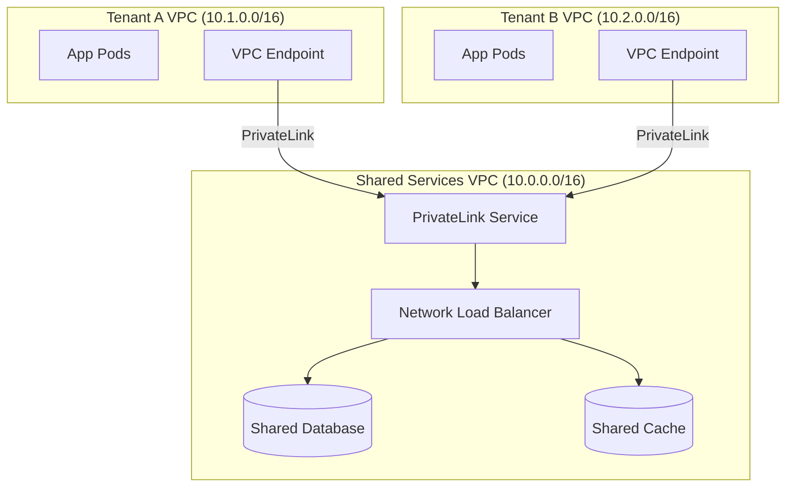

# Compute & Infrastructure Isolation

Compute isolation quyết định **cách các tenant chia sẻ (hoặc không chia sẻ) tài nguyên xử lý** — CPU, memory, network, storage. Đây là yếu tố ảnh hưởng trực tiếp đến **chi phí, hiệu năng, bảo mật** của hệ thống.

```
              COMPUTE ISOLATION SPECTRUM

  Shared Everything              Mixed                Dedicated Everything
  (Pool)                         (Bridge)             (Silo)
  ◄──────────────────────────────────────────────────────────►

  ┌────────────────┐    ┌──────────────────┐    ┌────────────────┐
  │ All tenants    │    │ Shared compute   │    │ Each tenant    │
  │ same pods      │    │ Dedicated DB     │    │ own cluster    │
  │ same DB        │    │ Per-tenant cache │    │ own DB         │
  │ same cache     │    │ Rate limits      │    │ own VPC        │
  └────────────────┘    └──────────────────┘    └────────────────┘
  💰 Cheapest           💰 Balanced              💰 Most expensive
  🔒 Least isolated     🔒 Reasonable            🔒 Most isolated
```

## Shared Compute (Pool)

Tất cả tenant chạy trên **cùng compute resources** — cùng pods/containers, cùng process, phân biệt bằng logic (tenant context).

#### Kiến trúc

```
┌──────────────────────────────────────────────────────────────┐
│                    SHARED COMPUTE                            │
│                                                              │
│  ┌────────────────────────────────────────────────────────┐  │
│  │              Shared Kubernetes Cluster                 │  │
│  │                                                        │  │
│  │  ┌──────────┐ ┌──────────┐ ┌──────────┐ ┌──────────┐   │  │
│  │  │  Pod 1   │ │  Pod 2   │ │  Pod 3   │ │  Pod N   │   │  │
│  │  │ order-svc│ │ order-svc│ │ user-svc │ │ user-svc │   │  │
│  │  │          │ │          │ │          │ │          │   │  │
│  │  │ Handles: │ │ Handles: │ │ Handles: │ │ Handles: │   │  │
│  │  │ Tenant A │ │ Tenant C │ │ Tenant A │ │ Tenant B │   │  │
│  │  │ Tenant B │ │ Tenant D │ │ Tenant B │ │ Tenant C │   │  │
│  │  │ Tenant E │ │ Tenant F │ │ Tenant D │ │ Tenant D │   │  │
│  │  └──────────┘ └──────────┘ └──────────┘ └──────────┘   │  │
│  │                                                        │  │
│  │  Load Balancer routes theo availability, KHÔNG theo    │  │
│  │  tenant — bất kỳ pod nào cũng handle bất kỳ tenant     │  │
│  └────────────────────────────────────────────────────────┘  │
│                                                              │
│  ✅ Max resource utilization                                 │
│  ❌ Noisy neighbor risk cao nhất                             │
│  ❌ Tenant A heavy query → ảnh hưởng tất cả tenant khác      │
└──────────────────────────────────────────────────────────────┘
```

#### Kỹ thuật cải thiện isolation trong Pool

| Kỹ thuật | Mô tả | Hiệu quả |
|---------|--------|:---------:|
| **Request-level rate limiting** | Giới hạn requests/giây per tenant | 🟡 |
| **Connection pooling per tenant** | Mỗi tenant có connection pool riêng (bounded) | 🟡 |
| **Priority queues** | Enterprise requests ưu tiên cao hơn Free | 🟢 |
| **CPU/Memory limits per request** | Timeout + memory cap cho mỗi request | 🟡 |
| **Circuit breaker per tenant** | Tenant lỗi nhiều → circuit break riêng | 🟢 |
| **Bulkhead pattern** | Thread pool riêng cho premium tenant | 🟢 |

#### Khi nào dùng?

```
✅ Shared Compute phù hợp khi:
├── Tenant workload tương đồng (đều nhỏ, ít spike)
├── Số lượng tenant rất lớn (1000+)
├── Budget hạn chế (startup, free tier)
├── Acceptable SLA: 99.5% (không cần 99.99%)
└── Không có compliance yêu cầu compute isolation
```

## Dedicated Compute (Silo)

Mỗi tenant (hoặc nhóm tenant) có **compute resources riêng biệt** — dedicated pods, nodes, hoặc toàn bộ cluster.

#### Kiến trúc

```
┌─────────────────────────────────────────────────────────────┐
│                   DEDICATED COMPUTE                         │
│                                                             │
│  ┌──────────────────┐  ┌──────────────────┐                 │
│  │   Tenant A       │  │   Tenant B       │                 │
│  │   (Enterprise)   │  │   (Enterprise)   │                 │
│  │                  │  │                  │                 │
│  │  ┌────┐ ┌────┐   │  │  ┌────┐ ┌────┐   │  . . .          │
│  │  │Pod │ │Pod │   │  │  │Pod │ │Pod │   │                 │
│  │  │ A1 │ │ A2 │   │  │  │ B1 │ │ B2 │   │                 │
│  │  └────┘ └────┘   │  │  └────┘ └────┘   │                 │
│  │                  │  │                  │                 │
│  │  Node Pool: A    │  │  Node Pool: B    │                 │
│  │  CPU: 8 cores    │  │  CPU: 16 cores   │                 │
│  │  RAM: 32 GB      │  │  RAM: 64 GB      │                 │
│  │                  │  │                  │                 │
│  │  ┌──────────┐    │  │  ┌──────────┐    │                 │
│  │  │ DB: A    │    │  │  │ DB: B    │    │                 │
│  │  └──────────┘    │  │  └──────────┘    │                 │
│  └──────────────────┘  └──────────────────┘                 │
│                                                             │
│  ✅ Zero noisy neighbor                                     │
│  ✅ Custom scaling per tenant                               │
│  ❌ Costly — resources idle khi tenant inactive             │
└─────────────────────────────────────────────────────────────┘
```

#### Các mức Dedicated

| Mức | Mô tả | Chi phí | Isolation | Use case |
|-----|--------|:-------:|:---------:|----------|
| **Dedicated Pods** | Tenant-specific pods trên shared nodes | 💰💰 | 🔒🔒 | Mid-tier |
| **Dedicated Node Pool** | Tenant pods chạy trên reserved nodes | 💰💰💰 | 🔒🔒🔒 | Enterprise |
| **Dedicated Cluster** | Tenant có K8s cluster riêng | 💰💰💰💰 | 🔒🔒🔒🔒 | Regulated |
| **Dedicated Account/VPC** | Tenant có cloud account riêng | 💰💰💰💰💰 | 🔒🔒🔒🔒🔒 | Government |

#### Bảng so sánh Pool vs Silo Compute

| Tiêu chí | Shared (Pool) | Dedicated (Silo) |
|----------|:-------------:|:-----------------:|
| **Chi phí per tenant** | 🟢 $1-10/tháng | 🔴 $100-10,000/tháng |
| **Noisy neighbor** | 🔴 Cao | 🟢 Không |
| **Resource utilization** | 🟢 80-95% | 🔴 20-50% |
| **Scaling speed** | 🟢 Nhanh (shared pool) | 🟡 Chậm hơn (provision) |
| **Custom tuning** | 🔴 Không | 🟢 Per tenant |
| **Blast radius** | 🔴 Tất cả tenant | 🟢 1 tenant |
| **Max tenants** | 🟢 10,000+ | 🔴 10-500 |
| **Monitoring** | 🟢 1 cluster | 🔴 N clusters |
| **Compliance** | 🔴 Khó | 🟢 Dễ |

## Kubernetes Multi-Tenancy

Kubernetes cung cấp nhiều cơ chế native cho multi-tenancy. Có **3 mô hình chính**:

#### Tổng quan 3 mô hình K8s Multi-Tenancy

```
┌─────────────────────────────────────────────────────────────────┐
│              KUBERNETES MULTI-TENANCY MODELS                    │
│                                                                 │
│  Model 1: Namespace        Model 2: vCluster      Model 3:      │
│  per Tenant               per Tenant              Cluster per   │
│                                                    Tenant       │
│  ┌─────────────────┐     ┌─────────────────┐     ┌───────────┐  │
│  │  Shared Cluster │     │  Shared Cluster │     │ Cluster A │  │
│  │                 │     │                 │     │           │  │
│  │  ┌───┐ ┌───┐    │     │  ┌──────────┐   │     │ ┌────────┐│  │
│  │  │ns │ │ns │    │     │  │ vCluster │   │     │ │Full K8s││  │
│  │  │ A │ │ B │    │     │  │A (virtual│   │     │ │for A   ││  │
│  │  └───┘ └───┘    │     │  │ control  │   │     │ └────────┘│  │
│  │  ┌───┐ ┌───┐    │     │  │ plane)   │   │     └───────────┘  │
│  │  │ns │ │ns │    │     │  └──────────┘   │     ┌───────────┐  │
│  │  │ C │ │ D │    │     │  ┌──────────┐   │     │ Cluster B │  │
│  │  └───┘ └───┘    │     │  │ vCluster │   │     │           │  │
│  │                 │     │  │ B        │   │     │ ┌────────┐│  │
│  └─────────────────┘     │  └──────────┘   │     │ │Full K8s││  │
│                          └─────────────────┘     │ │for B   ││  │
│  💰 Cheapest             💰 Medium               │ └────────┘│  │
│  🔒 Soft isolation       🔒 Strong               └───────────┘  │
│                                                  💰 Expensive   │
│                                                  🔒 Full        │
└─────────────────────────────────────────────────────────────────┘
```

#### ① Namespace-per-Tenant

Mỗi tenant có **Kubernetes namespace riêng** với resource quotas, network policies, và RBAC.

**Namespace + ResourceQuota:**

```yaml
# namespace cho tenant
apiVersion: v1
kind: Namespace
metadata:
  name: tenant-acme
  labels:
    tenant: acme
    tier: enterprise
---
# Resource quota — giới hạn tài nguyên per tenant
apiVersion: v1
kind: ResourceQuota
metadata:
  name: tenant-quota
  namespace: tenant-acme
spec:
  hard:
    requests.cpu: "4"           # Max 4 CPU requests
    requests.memory: "8Gi"      # Max 8 GB RAM requests
    limits.cpu: "8"             # Max 8 CPU limits
    limits.memory: "16Gi"       # Max 16 GB RAM limits
    pods: "20"                  # Max 20 pods
    services: "10"              # Max 10 services
    persistentvolumeclaims: "5" # Max 5 PVCs
---
# LimitRange — default limits cho mỗi pod
apiVersion: v1
kind: LimitRange
metadata:
  name: tenant-limits
  namespace: tenant-acme
spec:
  limits:
    - default:
        cpu: "500m"
        memory: "512Mi"
      defaultRequest:
        cpu: "200m"
        memory: "256Mi"
      type: Container
```

**Network Policy — Tenant isolation:**

```yaml
# Deny all traffic giữa các tenant namespaces
apiVersion: networking.k8s.io/v1
kind: NetworkPolicy
metadata:
  name: deny-cross-tenant
  namespace: tenant-acme
spec:
  podSelector: {}  # Áp dụng cho tất cả pods trong namespace
  policyTypes:
    - Ingress
    - Egress
  ingress:
    # Chỉ cho phép traffic từ cùng namespace
    - from:
        - namespaceSelector:
            matchLabels:
              tenant: acme
    # Cho phép traffic từ ingress controller
    - from:
        - namespaceSelector:
            matchLabels:
              app: ingress-nginx
  egress:
    # Cho phép traffic tới cùng namespace
    - to:
        - namespaceSelector:
            matchLabels:
              tenant: acme
    # Cho phép DNS
    - to:
        - namespaceSelector:
            matchLabels:
              k8s-app: kube-dns
      ports:
        - protocol: UDP
          port: 53
    # Cho phép shared services (database, cache)
    - to:
        - namespaceSelector:
            matchLabels:
              app: shared-services
```

**RBAC — Per-tenant access:**

```yaml
# Role cho tenant admin
apiVersion: rbac.authorization.k8s.io/v1
kind: Role
metadata:
  name: tenant-admin
  namespace: tenant-acme
rules:
  - apiGroups: ["", "apps", "batch"]
    resources: ["pods", "deployments", "services", "configmaps", "jobs"]
    verbs: ["get", "list", "watch", "create", "update", "delete"]
  - apiGroups: [""]
    resources: ["secrets"]
    verbs: ["get", "list"]   # Chỉ read secrets, không create
---
# Bind role cho tenant admin user
apiVersion: rbac.authorization.k8s.io/v1
kind: RoleBinding
metadata:
  name: tenant-admin-binding
  namespace: tenant-acme
subjects:
  - kind: User
    name: admin@acme.com
    apiGroup: rbac.authorization.k8s.io
roleRef:
  kind: Role
  name: tenant-admin
  apiGroup: rbac.authorization.k8s.io
```

#### ② vCluster — Virtual Clusters

**vCluster** tạo **virtual Kubernetes cluster** bên trong host cluster — mỗi tenant có control plane riêng (virtual API server, virtual scheduler) nhưng chia sẻ worker nodes.

```
┌─────────────────────────────────────────────────────────┐
│                   HOST CLUSTER                          │
│                                                         │
│  ┌────────────────────┐  ┌────────────────────┐         │
│  │ vCluster: Acme     │  │ vCluster: Beta     │         │
│  │                    │  │                    │         │
│  │ ┌──────────────┐   │  │ ┌──────────────┐   │         │
│  │ │Virtual API   │   │  │ │Virtual API   │   │         │
│  │ │Server + etcd │   │  │ │Server + etcd │   │         │
│  │ └──────────────┘   │  │ └──────────────┘   │         │
│  │                    │  │                    │         │
│  │ Tenant thấy full   │  │ Tenant thấy full   │         │
│  │ K8s cluster riêng  │  │ K8s cluster riêng  │         │
│  │ • kubectl works    │  │ • kubectl works    │         │
│  │ • CRDs riêng       │  │ • CRDs riêng       │         │
│  │ • Namespaces riêng │  │ • Helm riêng       │         │
│  └────────────────────┘  └────────────────────┘         │
│                                                         │
│  Workloads thực tế chạy trên shared worker nodes        │
│  (synced từ vCluster xuống host cluster)                │
└─────────────────────────────────────────────────────────┘
```

```bash
# Tạo vCluster cho tenant
vcluster create tenant-acme \
  --namespace host-ns-acme \
  --set syncer.extraArgs="{--enforce-node-selector}" \
  --set isolation.enabled=true \
  --set isolation.resourceQuota.enabled=true \
  --set isolation.limitRange.enabled=true \
  --set isolation.networkPolicy.enabled=true

# Tenant connect vào vCluster riêng
vcluster connect tenant-acme --namespace host-ns-acme
kubectl get pods  # Chỉ thấy pods của tenant mình
```

#### So sánh các mô hình K8s Multi-Tenancy

| Tiêu chí | Namespace | vCluster | Dedicated Cluster |
|----------|:---------:|:--------:|:-----------------:|
| **Isolation** | 🟡 Soft (logical) | 🟢 Strong (virtual) | 🟢 Full (physical) |
| **Chi phí** | 🟢 Thấp nhất | 🟡 Trung bình | 🔴 Cao nhất |
| **Tenant UX** | 🔴 Hạn chế | 🟢 Full kubectl | 🟢 Full cluster |
| **CRDs per tenant** | 🔴 Shared | 🟢 Riêng | 🟢 Riêng |
| **Max tenants** | 🟢 1000+ | 🟡 100-500 | 🔴 10-50 |
| **Noisy neighbor** | 🟡 ResourceQuota | 🟡 + isolation | 🟢 Không |
| **Network isolation** | 🟡 NetworkPolicy | 🟢 + virtual network | 🟢 VPC tách biệt |
| **Ops overhead** | 🟢 Thấp | 🟡 Trung bình | 🔴 Cao |
| **Phù hợp** | Free/Basic tier | Pro/Enterprise | Regulated/Gov |

## Serverless Multi-Tenancy

Serverless (AWS Lambda, Azure Functions, Google Cloud Functions) mang lại **lợi thế tự nhiên** cho multi-tenancy — auto-scaling, pay-per-use — nhưng cũng có **thách thức riêng** về isolation.

#### Serverless Multi-Tenancy Models

```
┌──────────────────────────────────────────────────────────────────┐
│              SERVERLESS MULTI-TENANCY                            │
│                                                                  │
│  Model A: Shared Function          Model B: Function per Tenant  │
│  (Pool)                            (Silo)                        │
│                                                                  │
│  ┌─────────────────────┐          ┌────────────────────────┐     │
│  │  Lambda: order-svc  │          │ Lambda: order-svc-acme │     │
│  │                     │          │ (only tenant acme)     │     │
│  │  Handles ALL tenants│          └────────────────────────┘     │
│  │  tenant_id from JWT │          ┌────────────────────────┐     │
│  │                     │          │ Lambda: order-svc-beta │     │
│  └─────────────────────┘          │ (only tenant beta)     │     │
│                                   └────────────────────────┘     │
│  ✅ Simple, cost-effective        ✅ Full isolation              │
│  ❌ Noisy neighbor (cold start)   ❌ N functions to manage       │
│  ❌ Shared concurrency limits     ❌ Higher cost                 │
└──────────────────────────────────────────────────────────────────┘
```

#### AWS Lambda — Isolation Techniques

**① Shared Function + Reserved Concurrency per Tenant:**

```
┌─────────────────────────────────────────────────────────┐
│  AWS Lambda Concurrency Management                      │
│                                                         │
│  Account limit: 1000 concurrent executions              │
│                                                         │
│  ┌──────────────────────────────────────────┐           │
│  │ order-svc (shared, all tenants)          │           │
│  │ Reserved concurrency: 500                │           │
│  │                                          │           │
│  │Per-tenant throttling (application-level):│           │
│  │   Free tier:       10 concurrent         │           │
│  │   Pro tier:        50 concurrent         │           │
│  │   Enterprise tier: 200 concurrent        │           │
│  └──────────────────────────────────────────┘           │
│                                                         │
│  ┌──────────────────────────────────────────┐           │
│  │ order-svc-enterprise-acme (dedicated)    │           │
│  │ Reserved concurrency: 200                │           │
│  │ Provisioned concurrency: 50 (no cold     │           │
│  │                            start)        │           │
│  └──────────────────────────────────────────┘           │
└─────────────────────────────────────────────────────────┘
```

**② IAM Role per Tenant (Security boundary):**

```python
# Lambda handler — tenant-scoped IAM
import boto3

def handler(event, context):
    tenant_id = event['requestContext']['authorizer']['tenantId']
    tenant_tier = event['requestContext']['authorizer']['tenantTier']

    if tenant_tier == 'enterprise':
        # Enterprise: assume tenant-specific role
        sts = boto3.client('sts')
        credentials = sts.assume_role(
            RoleArn=f'arn:aws:iam::role/tenant-{tenant_id}-role',
            RoleSessionName=f'session-{tenant_id}',
            # Inline policy: restrict to tenant's resources only
            Policy=json.dumps({
                "Version": "2012-10-17",
                "Statement": [{
                    "Effect": "Allow",
                    "Action": ["dynamodb:*"],
                    "Resource": f"arn:aws:dynamodb:*:*:table/orders",
                    "Condition": {
                        "ForAllValues:StringEquals": {
                            "dynamodb:LeadingKeys": [tenant_id]
                        }
                    }
                }]
            })
        )['Credentials']

        # Tạo client với tenant-scoped credentials
        dynamodb = boto3.resource('dynamodb',
            aws_access_key_id=credentials['AccessKeyId'],
            aws_secret_access_key=credentials['SecretAccessKey'],
            aws_session_token=credentials['SessionToken']
        )
    else:
        # Free/Pro: shared role + application-level filter
        dynamodb = boto3.resource('dynamodb')

    table = dynamodb.Table('orders')
    response = table.query(
        KeyConditionExpression=Key('tenant_id').eq(tenant_id)
    )
    return {'statusCode': 200, 'body': json.dumps(response['Items'])}
```

#### Serverless Multi-Tenancy — So sánh

| Tiêu chí | Shared Function | Dedicated Function | Hybrid |
|----------|:--------------:|:------------------:|:------:|
| **Isolation** | 🔴 Application-level | 🟢 Function-level | 🟡 Per tier |
| **Chi phí** | 🟢 Lowest | 🔴 Highest | 🟡 Balanced |
| **Cold start** | 🟢 Shared warm pool | 🔴 Per-tenant cold | 🟡 Provisioned for premium |
| **Concurrency** | 🔴 Shared limit | 🟢 Per-function limit | 🟡 Reserved per tier |
| **Deployment** | 🟢 1 function | 🔴 N functions | 🟡 1 + N |
| **Scaling** | 🟢 Auto (pooled) | 🟢 Auto (isolated) | 🟢 Auto |
| **Phù hợp** | Free/Basic | Enterprise | Bridge model |

## Network Isolation

Network isolation đảm bảo **traffic của tenant A không thể reach tài nguyên của tenant B** ở layer network.

#### Các mức Network Isolation

```
┌──────────────────────────────────────────────────────────────────┐
│              NETWORK ISOLATION LEVELS                            │
│                                                                  │
│  Level 1: Security Groups       Level 2: Subnet/VPC Isolation    │
│  (Weakest — cùng VPC)           (Stronger)                       │
│                                                                  │
│  ┌─────────────────────┐       ┌────────────────────────────┐    │
│  │  VPC: Shared        │       │  VPC: tenant-acme          │    │
│  │                     │       │  CIDR: 10.1.0.0/16         │    │
│  │  SG-A: tenant-acme  │       │  ┌──────────────────┐      │    │
│  │  SG-B: tenant-beta  │       │  │ Private Subnet   │      │    │
│  │                     │       │  │ 10.1.1.0/24      │      │    │
│  │  SG rules:          │       │  └──────────────────┘      │    │
│  │  A → A only         │       └────────────────────────────┘    │
│  │  B → B only         │       ┌────────────────────────────┐    │
│  └─────────────────────┘       │  VPC: tenant-beta          │    │
│                                │  CIDR: 10.2.0.0/16         │    │
│  Level 3: VPC + PrivateLink    │  ┌──────────────────┐      │    │
│  (Strongest)                   │  │ Private Subnet   │      │    │
│                                │  └──────────────────┘      │    │
│  Tenant VPC ◄── PrivateLink    └────────────────────────────┘    │
│       ──► Shared Service VPC                                     │
│  (No internet, no VPC Peering)                                   │
└──────────────────────────────────────────────────────────────────┘
```

#### ① Security Groups (Cùng VPC, phân tách bằng SG rules)

```
┌─────────────────────────────────────────────────┐
│  Shared VPC: 10.0.0.0/16                        │
│                                                 │
│  ┌────────────────┐  ┌────────────────┐         │
│  │ SG: tenant-acme│  │ SG: tenant-beta│         │
│  │                │  │                │         │
│  │ Inbound:       │  │ Inbound:       │         │
│  │  - Self (acme) │  │  - Self (beta) │         │
│  │  - ALB SG      │  │  - ALB SG      │         │
│  │                │  │                │         │
│  │ Outbound:      │  │ Outbound:      │         │
│  │  - Shared DB SG│  │  - Shared DB SG│         │
│  │  - NAT GW      │  │  - NAT GW      │         │
│  └────────────────┘  └────────────────┘         │
│                                                 │
│  ⚠️ Weak isolation: cùng VPC, chỉ SG rules      │
│  ✅ Simple, cost-effective                      │
└─────────────────────────────────────────────────┘
```

#### ② VPC per Tenant + Shared Services via PrivateLink



**Terraform — VPC per Tenant:**

```hcl
# Module: per-tenant VPC
module "tenant_vpc" {
  source   = "./modules/tenant-vpc"
  for_each = var.enterprise_tenants

  tenant_id       = each.key
  vpc_cidr        = each.value.cidr   # "10.${index}.0.0/16"
  azs             = ["ap-southeast-1a", "ap-southeast-1b"]
  private_subnets = each.value.private_subnets
  public_subnets  = each.value.public_subnets

  # PrivateLink endpoint tới shared services
  shared_service_endpoint = aws_vpc_endpoint_service.shared.id

  tags = {
    Tenant = each.key
    Tier   = each.value.tier
  }
}

# PrivateLink — expose shared services
resource "aws_vpc_endpoint_service" "shared" {
  acceptance_required        = false
  network_load_balancer_arns = [aws_lb.shared_nlb.arn]

  allowed_principals = [
    for tenant in var.enterprise_tenants :
    "arn:aws:iam::root"  # Restrict per tenant account
  ]
}
```

#### Network Isolation Decision Matrix

| Tiêu chí | Security Groups | Subnet Isolation | VPC per Tenant | VPC + PrivateLink |
|----------|:--------------:|:----------------:|:--------------:|:------------------:|
| **Isolation** | 🔴 Weak | 🟡 Medium | 🟢 Strong | 🟢 Strongest |
| **Chi phí** | 🟢 Free | 🟢 Low | 🟡 Medium | 🔴 High |
| **Complexity** | 🟢 Simple | 🟡 Medium | 🔴 Complex | 🔴 Complex |
| **Cross-tenant risk** | 🔴 SG misconfiguration | 🟡 Routing leak | 🟢 No shared network | 🟢 No shared network |
| **Shared services** | 🟢 Same VPC | 🟢 Same VPC | 🟡 VPC Peering/TGW | 🟢 PrivateLink |
| **Max tenants** | 🟢 Unlimited | 🟢 ~200/VPC | 🟡 ~50 VPCs | 🟡 ~50 VPCs |
| **Phù hợp** | Free/Basic | Pro tier | Enterprise | Regulated/Gov |

#### Tổng kết — Compute & Network Isolation Checklist

```
✅ COMPUTE & NETWORK ISOLATION CHECKLIST

Compute:
├── ✅ ResourceQuota / LimitRange per tenant namespace
├── ✅ Pod Security Standards (restricted/baseline/privileged)
├── ✅ Node affinity/taints cho enterprise tenants
├── ✅ Provisioned concurrency cho premium Lambda functions
└── ✅ Bulkhead pattern — thread pool isolation

Network:
├── ✅ NetworkPolicy deny-all + allowlist per namespace
├── ✅ Security Groups per tenant (minimum)
├── ✅ VPC per tenant cho enterprise (PrivateLink to shared)
├── ✅ DNS resolution scoped per tenant
├── ✅ TLS/mTLS giữa tất cả services
└── ✅ Egress filtering — tenant không access internet trực tiếp
```


---

## Đọc thêm

- [Tenant Isolation Models](./02-isolation-models.md) — Silo/Pool/Bridge concept  
- [Noisy Neighbor Problem](./07-noisy-neighbor.md) — Giải quyết vấn đề noisy neighbor trong shared compute
- [Authentication & Authorization](./05-authentication.md) — API Gateway routing per tier
