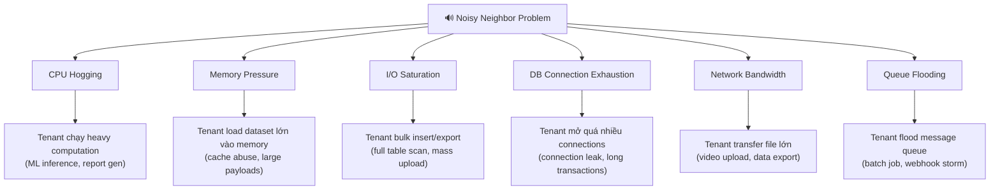

# Noisy Neighbor Problem

**Noisy Neighbor** là hiện tượng **một tenant tiêu thụ tài nguyên quá mức**, làm **suy giảm hiệu năng** của các tenant khác cùng chia sẻ infrastructure. Đây là thách thức lớn nhất của mô hình Pool (shared compute).

```
┌──────────────────────────────────────────────────────────────────┐
│                    NOISY NEIGHBOR PROBLEM                        │
│                                                                  │
│  Shared Resource Pool (CPU, Memory, DB Connections, I/O)         │
│  ┌────────────────────────────────────────────────────────┐      │
│  │  ████████████████████████████████████░░░░░░░░░░░░░░░░  │      │
│  │  ▲ Tenant A: 80% resources!!!       ▲ Tenant B-F: 20%  │      │
│  └────────────────────────────────────────────────────────┘      │
│                                                                  │
│  Hậu quả:                                                        │
│  • Tenant B-F: tăng latency 5x-10x                               │
│  • Timeout, 5xx errors tăng vọt                                  │
│  • SLA violation cho tất cả tenant                               │
│  • Customer churn — tenant trả tiền bỏ đi vì "app chậm"          │
└──────────────────────────────────────────────────────────────────┘
```

## Nguyên nhân và tác động

#### Nguyên nhân phổ biến



#### Bảng nguyên nhân — tác động — ví dụ thực tế

| Nguyên nhân | Tài nguyên bị ảnh hưởng | Tác động | Ví dụ thực tế |
|------------|:----------------------:|---------|---------------|
| **Bulk data export** | CPU + DB I/O | Query chậm cho tất cả tenant | Tenant export 1M rows CSV |
| **Heavy API usage** | CPU + Network | Rate limit shared, latency tăng | Tenant call API 1000 req/s |
| **Large file upload** | Network + Storage I/O | Upload/download chậm | Tenant upload video 2GB |
| **Long-running query** | DB connections + Lock | Connection pool exhausted | `SELECT * FROM orders` (no index) |
| **Memory leak** | RAM | Pod/container OOM kill | Tenant app không release cache |
| **Message flood** | Queue throughput | Consumer lag cho tất cả | Tenant produce 100K messages/min |
| **Webhook storm** | Outbound connections | Connection pool exhausted | Tenant configure 50 webhooks |

#### Tác động theo cascade

```
Tenant A sends heavy query
    │
    ▼
1. DB connection pool: 50/50 used by Tenant A
    │
    ▼
2. Tenant B, C, D: connection timeout (no available connections)
    │
    ▼
3. API response time: 200ms → 5000ms → timeout (30s)
    │
    ▼
4. Health check fails → pod restart
    │
    ▼
5. During restart: ALL tenants get 503 errors
    │
    ▼
6. Auto-scaler kicks in (1-2 min delay)
    │
    ▼
7. New pods start but DB still saturated by Tenant A
    │
    ▼
8. Cascading failure: entire service degraded for 5-15 minutes
```

## Detection & Monitoring

Phát hiện noisy neighbor **sớm** là chìa khóa — trước khi nó ảnh hưởng các tenant khác.

#### Metrics cần thu thập per Tenant

```
┌──────────────────────────────────────────────────────────────┐
│              PER-TENANT METRICS                              │
│                                                              │
│  Application Layer:                                          │
│  ├── request_count{tenant_id="acme"}                         │
│  ├── request_latency_p99{tenant_id="acme"}                   │
│  ├── error_rate{tenant_id="acme"}                            │
│  ├── active_connections{tenant_id="acme"}                    │
│  └── payload_size_bytes{tenant_id="acme"}                    │
│                                                              │
│  Database Layer:                                             │
│  ├── db_query_count{tenant_id="acme"}                        │
│  ├── db_query_duration_p99{tenant_id="acme"}                 │
│  ├── db_connections_active{tenant_id="acme"}                 │
│  └── db_rows_scanned{tenant_id="acme"}                       │
│                                                              │
│  Infrastructure Layer:                                       │
│  ├── cpu_usage_percent{tenant_id="acme"}                     │
│  ├── memory_usage_bytes{tenant_id="acme"}                    │
│  ├── network_bytes_in{tenant_id="acme"}                      │
│  └── disk_iops{tenant_id="acme"}                             │
│                                                              │
│  Queue Layer:                                                │
│  ├── messages_produced{tenant_id="acme"}                     │
│  ├── messages_consumed{tenant_id="acme"}                     │
│  └── consumer_lag{tenant_id="acme"}                          │
└──────────────────────────────────────────────────────────────┘
```

#### Implementation — Per-Tenant Metrics (Micrometer / Prometheus)

```java
@Component
public class TenantMetricsRecorder {

    private final MeterRegistry registry;

    /**
     * Record request metrics per tenant
     */
    public void recordRequest(String tenantId, String endpoint,
                               long durationMs, int statusCode) {
        // Request count per tenant
        registry.counter("http_requests_total",
            "tenant_id", tenantId,
            "endpoint", endpoint,
            "status", String.valueOf(statusCode)
        ).increment();

        // Request duration per tenant
        registry.timer("http_request_duration",
            "tenant_id", tenantId,
            "endpoint", endpoint
        ).record(Duration.ofMillis(durationMs));
    }

    /**
     * Record DB query metrics per tenant
     */
    public void recordDbQuery(String tenantId, String operation,
                               long durationMs, long rowsScanned) {
        registry.timer("db_query_duration",
            "tenant_id", tenantId,
            "operation", operation
        ).record(Duration.ofMillis(durationMs));

        registry.counter("db_rows_scanned_total",
            "tenant_id", tenantId
        ).increment(rowsScanned);
    }

    /**
     * Track active connections per tenant (gauge)
     */
    public void trackActiveConnections(String tenantId,
                                        AtomicInteger counter) {
        registry.gauge("active_connections",
            Tags.of("tenant_id", tenantId),
            counter
        );
    }
}
```

#### Alert Rules — Phát hiện Noisy Neighbor

```yaml
# Prometheus alerting rules
groups:
  - name: noisy_neighbor_alerts
    rules:
      # Alert: Tenant chiếm >50% DB connections
      - alert: TenantExcessiveDbConnections
        expr: |
          db_connections_active / ignoring(tenant_id)
          group_left sum(db_connections_active) > 0.5
        for: 2m
        labels:
          severity: warning
        annotations:
          summary: "Tenant {{ $labels.tenant_id }} using >50% DB connections"

      # Alert: Tenant request rate gấp 10x trung bình
      - alert: TenantRequestSpike
        expr: |
          rate(http_requests_total[5m])
          > 10 * avg without(tenant_id)(rate(http_requests_total[5m]))
        for: 3m
        labels:
          severity: warning
        annotations:
          summary: "Tenant {{ $labels.tenant_id }} request rate 10x above average"

      # Alert: Tenant latency p99 >5s (ảnh hưởng shared resources)
      - alert: TenantHighLatency
        expr: |
          histogram_quantile(0.99, rate(http_request_duration_bucket[5m])) > 5
        for: 5m
        labels:
          severity: critical
        annotations:
          summary: "Tenant {{ $labels.tenant_id }} p99 latency >5s"

      # Alert: Tenant error rate >10%
      - alert: TenantHighErrorRate
        expr: |
          rate(http_requests_total{status=~"5.."}[5m])
          / rate(http_requests_total[5m]) > 0.1
        for: 3m
        labels:
          severity: warning
```

#### Dashboard — Noisy Neighbor Detection

```
┌─────────────────────────────────────────────────────────────┐
│  📊 NOISY NEIGHBOR DASHBOARD                                │
│                                                             │
│  ┌────────────────────────┐  ┌───────────────────────────┐  │
│  │ Top 5 Tenants by CPU   │  │ Top 5 by DB Connections   │  │
│  │                        │  │                           │  │
│  │ 1. acme    ████░ 45%   │  │ 1. acme    ████████ 80%   │  │
│  │ 2. beta    ██░░░ 20%   │  │ 2. beta    ██░░░░░░  8%   │  │
│  │ 3. gamma   █░░░░ 12%   │  │ 3. gamma   █░░░░░░░  5%   │  │
│  │ 4. delta   █░░░░  8%   │  │ 4. delta   █░░░░░░░  3%   │  │
│  │ 5. other   ██░░░ 15%   │  │ 5. other   █░░░░░░░  4%   │  │
│  └────────────────────────┘  └───────────────────────────┘  │
│                                                             │
│  ┌────────────────────────┐  ┌───────────────────────────┐  │
│  │ Request Rate (req/s)   │  │ P99 Latency per Tenant    │  │
│  │                        │  │                           │  │
│  │     ╱╲    ← acme spike │  │ acme:  ███████████  5.2s  │  │
│  │    ╱  ╲                │  │ beta:  ██░░░░░░░░  0.8s   │  │
│  │ ──╱────╲──── baseline  │  │ gamma: ██░░░░░░░░  0.6s   │  │
│  │  ╱      ╲              │  │ delta: █░░░░░░░░░  0.3s   │  │
│  └────────────────────────┘  └───────────────────────────┘  │
│                                                             │
│  ⚠️ ALERT: Tenant "acme" consuming 80% DB connections       │
│     Action: Auto-throttle applied at 08:32:15 UTC           │
└─────────────────────────────────────────────────────────────┘
```

## Mitigation Strategies

#### Tổng quan các chiến lược

```
┌──────────────────────────────────────────────────────────────────┐
│              NOISY NEIGHBOR MITIGATION STRATEGIES                │
│                                                                  │
│  Reactive (Phát hiện → Phản ứng)       Proactive (Ngăn chặn)     │
│  ├── Auto-throttle khi vượt ngưỡng     ├── Rate limiting         │
│  ├── Circuit breaker per tenant        ├── Resource quotas       │
│  ├── Alert + manual intervention       ├── Connection pool cap   │
│  └── Tenant suspend (extreme case)     ├── Request size limits   │
│                                        ├── Query timeout         │
│                                        └── Fair scheduling       │
│                                                                  │
│  Infrastructure (Cách ly vật lý)                                 │
│  ├── Bulkhead pattern (thread pools)                             │
│  ├── Dedicated resources for premium                             │
│  ├── Auto-scale per tenant workload                              │
│  └── Priority queues per tier                                    │
└──────────────────────────────────────────────────────────────────┘
```

#### ① Bulkhead Pattern — Thread Pool Isolation

```
┌──────────────────────────────────────────────────────────────┐
│              BULKHEAD PATTERN                                │
│                                                              │
│  TRƯỚC (Shared Thread Pool):                                 │
│  ┌────────────────────────────────────────────────────┐      │
│  │  Thread Pool: 200 threads (shared)                 │      │
│  │  Tenant A flood → 190 threads                      │      │
│  │  Tenant B, C, D, E → fight for 10 threads          │      │
│  └────────────────────────────────────────────────────┘      │
│                                                              │
│  SAU (Isolated Thread Pools):                                │
│  ┌──────────┐ ┌──────────┐ ┌──────────┐ ┌───────────┐        │
│  │ Premium  │ │ Standard │ │ Free     │ │ Internal  │        │
│  │ Pool: 80 │ │ Pool: 60 │ │ Pool: 40 │ │ Pool: 20  │        │
│  │          │ │          │ │          │ │           │        │
│  │ acme     │ │ beta     │ │ free-xyz │ │ health    │        │
│  │enterprise│ │ gamma    │ │ free-abc │ │ metrics   │        │
│  └──────────┘ └──────────┘ └──────────┘ └───────────┘        │
│                                                              │
│  Tenant A flood → chỉ exhaust Premium Pool                   │
│  Tenant B, C, D vẫn có 60 threads available                  │
└──────────────────────────────────────────────────────────────┘
```

```java
// Resilience4j Bulkhead per tenant tier
@Configuration
public class TenantBulkheadConfig {

    @Bean
    public BulkheadRegistry bulkheadRegistry() {
        BulkheadConfig premiumConfig = BulkheadConfig.custom()
            .maxConcurrentCalls(80)
            .maxWaitDuration(Duration.ofMillis(500))
            .build();

        BulkheadConfig standardConfig = BulkheadConfig.custom()
            .maxConcurrentCalls(40)
            .maxWaitDuration(Duration.ofMillis(200))
            .build();

        BulkheadConfig freeConfig = BulkheadConfig.custom()
            .maxConcurrentCalls(10)
            .maxWaitDuration(Duration.ofMillis(100))
            .build();

        return BulkheadRegistry.of(Map.of(
            "enterprise", premiumConfig,
            "pro", standardConfig,
            "free", freeConfig
        ));
    }
}

// Usage in service
@Service
public class OrderService {

    private final BulkheadRegistry bulkheadRegistry;

    public List<Order> findOrders(String tenantId, String tier) {
        Bulkhead bulkhead = bulkheadRegistry.bulkhead(tier);

        return Bulkhead.decorateSupplier(bulkhead, () -> {
            return orderRepository.findByTenantId(tenantId);
        }).get();
        // Throws BulkheadFullException nếu pool đầy
        // → trả 429 Too Many Requests cho tenant
    }
}
```

#### ② Circuit Breaker per Tenant

```java
// Circuit breaker per tenant — isolate failures
@Component
public class TenantCircuitBreakerManager {

    private final ConcurrentMap<String, CircuitBreaker> breakers
        = new ConcurrentHashMap<>();

    public CircuitBreaker getOrCreate(String tenantId) {
        return breakers.computeIfAbsent(tenantId, id -> {
            CircuitBreakerConfig config = CircuitBreakerConfig.custom()
                .slidingWindowSize(20)
                .failureRateThreshold(50)        // 50% failure → open
                .waitDurationInOpenState(Duration.ofSeconds(30))
                .permittedNumberOfCallsInHalfOpenState(5)
                .slowCallRateThreshold(80)       // 80% slow → open
                .slowCallDurationThreshold(Duration.ofSeconds(3))
                .build();

            return CircuitBreaker.of("tenant-" + id, config);
        });
    }

    /**
     * Execute with per-tenant circuit breaker
     */
    public <T> T execute(String tenantId, Supplier<T> action) {
        CircuitBreaker cb = getOrCreate(tenantId);

        try {
            return CircuitBreaker.decorateSupplier(cb, action).get();
        } catch (CallNotPermittedException e) {
            // Circuit is OPEN — tenant bị tạm ngừng
            throw new TenantThrottledException(
                "Tenant " + tenantId + " is temporarily throttled. " +
                "Circuit breaker state: OPEN. Retry after 30s.");
        }
    }
}
```

```
Circuit Breaker States per Tenant:

  Tenant A: ● CLOSED  (healthy — requests pass through)
  Tenant B: ● CLOSED  (healthy)
  Tenant C: ◐ HALF-OPEN (testing — 5 probe requests)
  Tenant D: ○ OPEN   (unhealthy — all requests rejected with 429)

  Khi Tenant D fail rate >50%:
  CLOSED → OPEN (reject tất cả request Tenant D)
  → 30s sau → HALF-OPEN (cho 5 request thử)
  → Thành công → CLOSED (recovery)
  → Thất bại → OPEN (tiếp tục reject)

  ⚡ Chỉ ảnh hưởng Tenant D, không ảnh hưởng A, B, C
```

#### ③ Connection Pool per Tenant (Database)

```java
@Component
public class TenantConnectionPoolManager {

    private final Map<String, HikariDataSource> tenantPools
        = new ConcurrentHashMap<>();

    /**
     * Mỗi tenant có connection pool riêng với giới hạn
     */
    public DataSource getDataSource(String tenantId, String tier) {
        return tenantPools.computeIfAbsent(tenantId, id -> {
            HikariConfig config = new HikariConfig();
            config.setJdbcUrl("jdbc:postgresql://db-host:5432/mydb");
            config.setPoolName("pool-" + tenantId);

            // Connection limit theo tier
            switch (tier) {
                case "enterprise":
                    config.setMaximumPoolSize(20);
                    config.setMinimumIdle(5);
                    break;
                case "pro":
                    config.setMaximumPoolSize(10);
                    config.setMinimumIdle(2);
                    break;
                default: // free
                    config.setMaximumPoolSize(3);
                    config.setMinimumIdle(1);
            }

            config.setConnectionTimeout(5000);    // 5s timeout
            config.setMaxLifetime(600000);         // 10 min max life
            config.setLeakDetectionThreshold(30000); // Detect leak >30s

            return new HikariDataSource(config);
        });
    }
}
```

```
Connection Pool Isolation:

┌──────────────────────────────────────────────────────┐
│  Total DB connections: 100                           │
│                                                      │
│  ┌──────────┐ ┌──────────┐ ┌──────────┐ ┌────────┐   │
│  │ Acme     │ │ Beta     │ │ Gamma    │ │ Reserve│   │
│  │ (ent)    │ │ (pro)    │ │ (free)   │ │        │   │
│  │ max: 20  │ │ max: 10  │ │ max: 3   │ │ 20     │   │
│  │ used: 15 │ │ used: 4  │ │ used: 2  │ │ (burst)│   │
│  └──────────┘ └──────────┘ └──────────┘ └────────┘   │
│                                                      │
│  Acme heavy query → exhausts 20 connections          │
│  Beta và Gamma: KHÔNG bị ảnh hưởng                   │
└──────────────────────────────────────────────────────┘
```

#### ④ Query Timeout + Row Limit per Tenant

```java
@Component
public class TenantQueryGuard {

    /**
     * Enforce query limits per tenant tier
     */
    public <T> List<T> executeWithLimits(String tenantId,
                                          String tier,
                                          Supplier<List<T>> query) {
        // Set statement timeout
        int timeoutSeconds = switch (tier) {
            case "enterprise" -> 30;
            case "pro" -> 15;
            default -> 5;  // free: max 5 seconds
        };

        int maxRows = switch (tier) {
            case "enterprise" -> 10_000;
            case "pro" -> 5_000;
            default -> 1_000;  // free: max 1000 rows
        };

        // Execute with timeout
        try {
            jdbcTemplate.execute(
                "SET LOCAL statement_timeout = '" + 
                timeoutSeconds * 1000 + "ms'");

            List<T> results = query.get();

            // Enforce row limit
            if (results.size() > maxRows) {
                log.warn("Tenant {} exceeded row limit: {} > {}",
                    tenantId, results.size(), maxRows);
                return results.subList(0, maxRows);
            }

            return results;
        } catch (QueryTimeoutException e) {
            log.error("Tenant {} query timeout after {}s",
                tenantId, timeoutSeconds);
            throw new TenantQuotaExceededException(
                "Query timeout. Max " + timeoutSeconds + "s allowed.");
        }
    }
}
```

## Rate Limiting & Throttling per Tenant

Rate limiting là **tuyến phòng thủ đầu tiên** chống noisy neighbor — giới hạn số lượng requests/operations mà mỗi tenant có thể thực hiện trong một khoảng thời gian.

#### Rate Limiting Algorithms

```
┌──────────────────────────────────────────────────────────────────┐
│              RATE LIMITING ALGORITHMS                            │
│                                                                  │
│  ① Fixed Window          ② Sliding Window      ③ Token Bucket  │
│                                                                  │
│  ┌─────┬─────┐           ┌───────────────┐        ┌───────────┐  │
│  │ 0-1 │ 1-2 │           │  ╱────────╲   │        │ Bucket    │  │
│  │ min │ min │           │ ╱  sliding ╲  │        │ capacity  │  │
│  │     │     │           │╱   1 min    ╲ │        │ = 100     │  │
│  │ 100 │ 100 │           │  window       │        │ refill    │  │
│  │ req │ req │           │  max: 100     │        │ = 10/sec  │  │
│  └─────┴─────┘           └───────────────┘        └───────────┘  │
│                                                                  │
│  ⚠️ Burst at              ✅ Smooth                ✅ Allows     │
│  window boundary           distribution            burst         │
│                                                                  │
│  ④ Leaky Bucket          ⑤ Sliding Log (Precise)               │
│  ┌───────────┐           ┌───────────────────────┐               │
│  │ ●●●●●     │           │ Timestamp log:        │               │
│  │ drip rate │           │ [t1, t2, t3, ..., tN] │               │
│  │ = 10/sec  │           │ Count in window       │               │
│  │ (constant)│           │ Exact, but memory ↑   │               │
│  └───────────┘           └───────────────────────┘               │
└──────────────────────────────────────────────────────────────────┘
```

#### Per-Tenant Rate Limits theo Tier

| Resource | Free | Pro | Enterprise |
|----------|:----:|:---:|:----------:|
| **API requests** | 100/min | 1,000/min | 10,000/min |
| **API daily cap** | 5,000/day | 100,000/day | Unlimited |
| **Bulk operations** | 10/hour | 100/hour | 1,000/hour |
| **File upload size** | 10 MB | 100 MB | 1 GB |
| **Webhook endpoints** | 3 | 10 | 50 |
| **Concurrent connections** | 5 | 50 | 500 |
| **Query timeout** | 5s | 15s | 30s |
| **Export rows** | 1,000 | 10,000 | 100,000 |
| **Storage** | 1 GB | 50 GB | 500 GB |

#### Implementation — Distributed Rate Limiter (Redis)

```java
@Component
public class TenantRateLimiter {

    private final StringRedisTemplate redis;

    /**
     * Sliding Window Rate Limiter — per tenant
     *
     * Dùng Redis sorted set: score = timestamp, member = request ID
     */
    public RateLimitResult checkRateLimit(String tenantId,
                                           String endpoint,
                                           int maxRequests,
                                           Duration window) {
        String key = "rate_limit:" + tenantId + ":" + endpoint;
        long now = System.currentTimeMillis();
        long windowStart = now - window.toMillis();

        // Lua script cho atomicity
        String luaScript = """
            -- Remove expired entries
            redis.call('ZREMRANGEBYSCORE', KEYS[1], 0, ARGV[1])

            -- Count current window
            local count = redis.call('ZCARD', KEYS[1])

            if count < tonumber(ARGV[2]) then
                -- Under limit: add new request
                redis.call('ZADD', KEYS[1], ARGV[3], ARGV[4])
                redis.call('EXPIRE', KEYS[1], ARGV[5])
                return {1, count + 1, tonumber(ARGV[2])}
            else
                -- Over limit: reject
                return {0, count, tonumber(ARGV[2])}
            end
            """;

        List<Long> result = redis.execute(
            RedisScript.of(luaScript, List.class),
            List.of(key),
            String.valueOf(windowStart),     // ARGV[1]
            String.valueOf(maxRequests),      // ARGV[2]
            String.valueOf(now),             // ARGV[3]
            UUID.randomUUID().toString(),    // ARGV[4]
            String.valueOf(window.toSeconds()) // ARGV[5]
        );

        boolean allowed = result.get(0) == 1;
        long currentCount = result.get(1);
        long limit = result.get(2);

        return new RateLimitResult(
            allowed,
            limit,
            limit - currentCount,  // remaining
            windowStart + window.toMillis()  // reset time
        );
    }
}

// Record kết quả
public record RateLimitResult(
    boolean allowed,
    long limit,
    long remaining,
    long resetTimestamp
) {}
```

#### Rate Limit Response Headers

```java
@Component
public class RateLimitResponseFilter implements Filter {

    @Override
    public void doFilter(ServletRequest req, ServletResponse resp,
                          FilterChain chain) throws Exception {
        HttpServletResponse response = (HttpServletResponse) resp;
        String tenantId = TenantContextHolder.getTenantId();
        String tier = TenantContextHolder.getTier();

        // Lookup tier limits
        int maxRequests = getTierLimit(tier);

        RateLimitResult result = rateLimiter.checkRateLimit(
            tenantId, "api", maxRequests, Duration.ofMinutes(1));

        // Set standard rate limit headers
        response.setHeader("X-RateLimit-Limit",
            String.valueOf(result.limit()));
        response.setHeader("X-RateLimit-Remaining",
            String.valueOf(result.remaining()));
        response.setHeader("X-RateLimit-Reset",
            String.valueOf(result.resetTimestamp()));

        if (!result.allowed()) {
            response.setStatus(429);
            response.setHeader("Retry-After", "60");
            response.getWriter().write("""
                {
                  "error": "rate_limit_exceeded",
                  "message": "Too many requests. Upgrade plan for higher limits.",
                  "limit": %d,
                  "retry_after_seconds": 60,
                  "upgrade_url": "https://app.example.com/billing/upgrade"
                }
                """.formatted(result.limit()));
            return;
        }

        chain.doFilter(req, resp);
    }
}
```

#### Multi-Dimension Rate Limiting

```
┌──────────────────────────────────────────────────────────────┐
│              MULTI-DIMENSION RATE LIMITING                   │
│                                                              │
│  Dimension 1: API endpoint                                   │
│  ├── GET /api/orders           → 100 req/min                 │
│  ├── POST /api/orders          → 20 req/min                  │
│  ├── DELETE /api/orders/{id}   → 10 req/min                  │
│  └── POST /api/export          → 2 req/hour (heavy)          │
│                                                              │
│  Dimension 2: Operation type                                 │
│  ├── Read operations           → higher limit                │
│  ├── Write operations          → lower limit                 │
│  └── Bulk/Export operations    → very low limit              │
│                                                              │
│  Dimension 3: Tenant tier                                    │
│  ├── Free                      → 1x base limits              │
│  ├── Pro                       → 10x base limits             │
│  └── Enterprise                → 100x base limits            │
│                                                              │
│  Dimension 4: Time of day (optional)                         │
│  ├── Peak hours (9am-5pm)      → standard limits             │
│  └── Off-peak hours            → 2x limits (burst)           │
└──────────────────────────────────────────────────────────────┘
```

## Resource Quotas & Fair Scheduling

Resource Quotas giới hạn **tổng tài nguyên** mà tenant có thể sử dụng (storage, compute, API calls). Fair Scheduling đảm bảo **mọi tenant đều có cơ hội truy cập** tài nguyên một cách công bằng.

#### Quota Management System

```
┌──────────────────────────────────────────────────────────────┐
│              TENANT QUOTA MANAGEMENT                         │
│                                                              │
│  ┌───────────────────────────────────────────────────┐       │
│  │            Quota Configuration                    │       │
│  │                                                   │       │
│  │  Tenant: acme (Pro tier)                          │       │
│  │  ┌─────────────────┬──────────┬──────────┐        │       │
│  │  │ Resource        │ Limit    │ Used     │        │       │
│  │  ├─────────────────┼──────────┼──────────┤        │       │
│  │  │ Storage         │ 50 GB    │ 23 GB    │        │       │
│  │  │ API calls/month │ 100,000  │ 67,432   │        │       │
│  │  │ Users           │ 50       │ 23       │        │       │
│  │  │ Projects        │ 20       │ 8        │        │       │
│  │  │ Webhooks        │ 10       │ 5        │        │       │
│  │  │ File upload/day │ 500 MB   │ 120 MB   │        │       │
│  │  └─────────────────┴──────────┴──────────┘        │       │
│  └───────────────────────────────────────────────────┘       │
│                                                              │
│  Enforcement:                                                │
│  ├── ✅ Soft limit (80%): Warning notification               │
│  ├── ⚠️ Hard limit (100%): Block new creation                │
│  └── 🔴 Grace period (110%): 7 days to reduce usage          │
└──────────────────────────────────────────────────────────────┘
```

#### Implementation — Quota Service

```java
@Service
public class TenantQuotaService {

    private final QuotaRepository quotaRepo;
    private final NotificationService notificationService;

    /**
     * Check + enforce quota trước khi cho phép operation
     */
    public void checkAndConsumeQuota(String tenantId,
                                      QuotaType type,
                                      long amount) {
        TenantQuota quota = quotaRepo.findByTenantIdAndType(
            tenantId, type)
            .orElseThrow(() -> new QuotaNotFoundException(
                "No quota defined for " + type));

        long newUsage = quota.getCurrentUsage() + amount;
        double usagePercent = (double) newUsage / quota.getLimit() * 100;

        // Hard limit — block
        if (newUsage > quota.getLimit()) {
            throw new QuotaExceededException(String.format(
                "Quota exceeded for %s. Limit: %d, Used: %d, Requested: %d. " +
                "Upgrade your plan at /billing/upgrade",
                type, quota.getLimit(), quota.getCurrentUsage(), amount));
        }

        // Soft limit — warn at 80%
        if (usagePercent >= 80 && !quota.isWarningNotified()) {
            notificationService.sendQuotaWarning(tenantId, type,
                quota.getCurrentUsage(), quota.getLimit());
            quota.setWarningNotified(true);
        }

        // Critical — warn at 95%
        if (usagePercent >= 95) {
            notificationService.sendQuotaCritical(tenantId, type,
                quota.getCurrentUsage(), quota.getLimit());
        }

        // Update usage
        quota.setCurrentUsage(newUsage);
        quotaRepo.save(quota);
    }

    /**
     * Get quota status for tenant dashboard
     */
    public List<QuotaStatus> getQuotaStatus(String tenantId) {
        return quotaRepo.findByTenantId(tenantId).stream()
            .map(q -> new QuotaStatus(
                q.getType(),
                q.getLimit(),
                q.getCurrentUsage(),
                (double) q.getCurrentUsage() / q.getLimit() * 100
            ))
            .toList();
    }
}

// Quota enforcement annotation
@Target(ElementType.METHOD)
@Retention(RetentionPolicy.RUNTIME)
public @interface RequireQuota {
    QuotaType type();
    long amount() default 1;
}

@Aspect
@Component
public class QuotaEnforcementAspect {

    @Autowired private TenantQuotaService quotaService;

    @Before("@annotation(quota)")
    public void enforceQuota(RequireQuota quota) {
        String tenantId = TenantContextHolder.getTenantId();
        quotaService.checkAndConsumeQuota(
            tenantId, quota.type(), quota.amount());
    }
}

// Usage
@PostMapping("/api/projects")
@RequireQuota(type = QuotaType.PROJECTS)
public Project createProject(@RequestBody CreateProjectRequest req) {
    return projectService.create(req);
}

@PostMapping("/api/upload")
@RequireQuota(type = QuotaType.STORAGE_MB, amount = 10) // 10 MB
public UploadResponse uploadFile(@RequestParam MultipartFile file) {
    return storageService.upload(file);
}
```

#### Fair Scheduling — Weighted Fair Queue

```
┌──────────────────────────────────────────────────────────────┐
│              WEIGHTED FAIR QUEUE                             │
│                                                              │
│  Incoming requests → Priority Queue → Worker Pool            │
│                                                              │
│  ┌─────────────────────────────────────────┐                 │
│  │  Priority Queue (weighted):             │                 │
│  │                                         │                 │
│  │  Enterprise (weight: 5)  ██████████████ │                 │
│  │  Pro        (weight: 3)  ████████       │                 │
│  │  Free       (weight: 1)  ███            │                 │
│  └─────────────────────────────────────────┘                 │
│                                                              │
│  Processing order:                                           │
│  E, E, E, E, E, P, P, P, F, E, E, E, E, E, P, P, P, F...     │
│                                                              │
│  Enterprise gets 5/(5+3+1) = 55% of processing capacity      │
│  Pro gets       3/(5+3+1) = 33% of processing capacity       │
│  Free gets      1/(5+3+1) = 11% of processing capacity       │
└──────────────────────────────────────────────────────────────┘
```

```java
@Component
public class TenantFairScheduler {

    private final Map<String, PriorityBlockingQueue<TenantTask>> queues
        = new ConcurrentHashMap<>();

    private static final Map<String, Integer> TIER_WEIGHTS = Map.of(
        "enterprise", 5,
        "pro", 3,
        "free", 1
    );

    /**
     * Submit task với priority theo tenant tier
     */
    public <T> CompletableFuture<T> submit(String tenantId,
                                            String tier,
                                            Callable<T> task) {
        int weight = TIER_WEIGHTS.getOrDefault(tier, 1);

        CompletableFuture<T> future = new CompletableFuture<>();
        TenantTask<T> tenantTask = new TenantTask<>(
            tenantId, tier, weight, task, future,
            System.nanoTime()
        );

        // Virtual timestamp = actual_time / weight
        // Lower virtualTimestamp → higher priority
        globalQueue.offer(tenantTask);
        return future;
    }

    /**
     * Worker loop — processes tasks fairly
     */
    @Scheduled(fixedDelay = 1)
    public void processQueue() {
        TenantTask<?> task = globalQueue.poll();
        if (task != null) {
            TenantContextHolder.set(new TenantContext(task.tenantId()));
            try {
                Object result = task.callable().call();
                task.future().complete(result);
            } catch (Exception e) {
                task.future().completeExceptionally(e);
            } finally {
                TenantContextHolder.clear();
            }
        }
    }

    record TenantTask<T>(
        String tenantId,
        String tier,
        int weight,
        Callable<T> callable,
        CompletableFuture<T> future,
        long submitTime
    ) implements Comparable<TenantTask<?>> {

        // Virtual timestamp = submitTime / weight
        // Enterprise (weight=5): lower virtual time → processed sooner
        @Override
        public int compareTo(TenantTask<?> other) {
            long myVirtual = this.submitTime / this.weight;
            long otherVirtual = other.submitTime / other.weight;
            return Long.compare(myVirtual, otherVirtual);
        }
    }
}
```

#### Tổng kết — Noisy Neighbor Prevention Checklist

```
✅ NOISY NEIGHBOR PREVENTION CHECKLIST

Detection:
├── ✅ Per-tenant metrics (request count, latency, error rate)
├── ✅ Per-tenant DB metrics (connections, query duration, rows)
├── ✅ Alert rules: spike detection, resource hogging
├── ✅ Dashboard: Top N tenants by resource consumption
└── ✅ Anomaly detection (baseline deviation)

Rate Limiting:
├── ✅ API rate limit per tenant tier (Redis-based)
├── ✅ Multi-dimension: per endpoint + per tier + per operation
├── ✅ Standard headers: X-RateLimit-Limit, Remaining, Reset
├── ✅ Graceful 429 response with upgrade CTA
└── ✅ Distributed rate limiter (Redis Lua script)

Resource Isolation:
├── ✅ Bulkhead pattern: thread pool per tier
├── ✅ Circuit breaker per tenant
├── ✅ Connection pool per tenant (bounded)
├── ✅ Query timeout + row limit per tier
└── ✅ Fair scheduling: weighted priority queue

Quotas:
├── ✅ Storage, API calls, users, projects — per tenant
├── ✅ Soft limit (80% warning) + hard limit (100% block)
├── ✅ Quota dashboard for self-service monitoring
└── ✅ Upgrade CTA when approaching limits
```


---

## Đọc thêm

- [Compute & Infrastructure Isolation](./06-compute-isolation.md) — Bulkhead pattern, dedicated compute
- [Scaling & Performance](./11-scaling-performance.md) — Auto scaling per tenant
- [Observability & Monitoring](./10-observability.md) — Per-tenant metrics, dashboards
