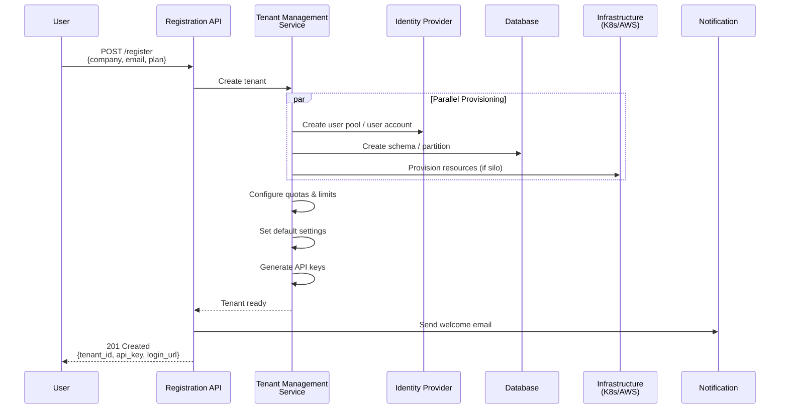
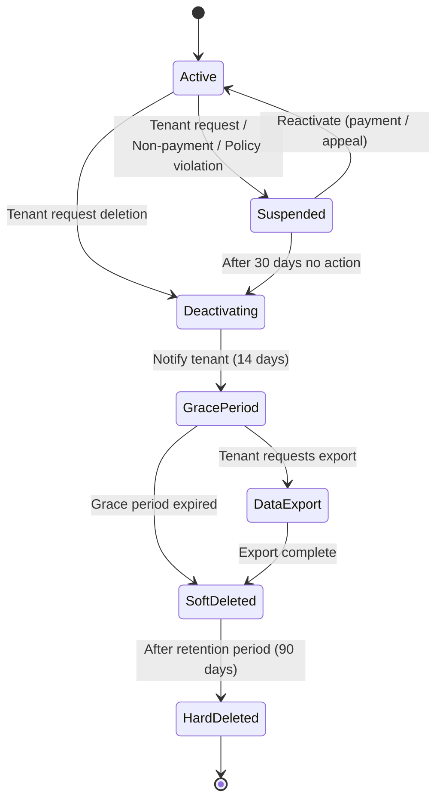
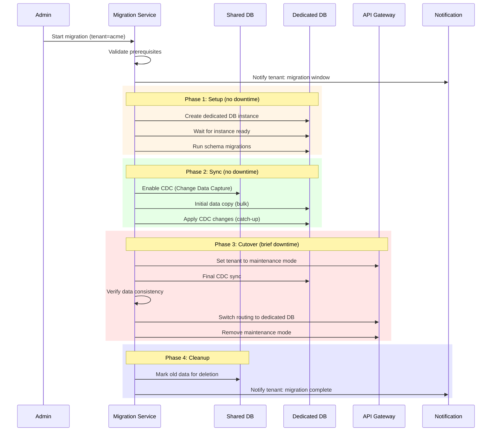

# Tenant Onboarding & Lifecycle

Tenant lifecycle quản lý **toàn bộ vòng đời** của một tenant — từ lúc đăng ký, provisioning, hoạt động, cho đến offboarding/xóa. Đây là quy trình **tự động hóa cao** để scale được số lượng tenant lớn.

```
┌──────────────────────────────────────────────────────────────────┐
│               TENANT LIFECYCLE                                   │
│                                                                  │
│  ① Sign-up    ② Provision   ③ Active   ④ Suspend   ⑤ Delete  │
│                                                                  │
│  ┌──────┐    ┌──────┐     ┌──────┐      ┌───────┐    ┌──────┐    │
│  │ NEW  │───▶│SETUP │────▶│ACTIVE│─────▶│ SUSP. │───▶│DELETE│    │
│  └──────┘    └──────┘     └──┬───┘      └───┬───┘    └──────┘    │
│                              │              │                    │
│                              │   ┌───────┐  │                    │
│                              └──▶│UPGRADE│──┘                    │
│                                  │ tier  │  (reactivate)         │
│                                  └───────┘                       │
│                                                                  │
│  Duration:                                                       │
│  Sign-up → Active: 30 seconds (fully automated)                  │
│  Active → Suspend: immediate (API call)                          │
│  Suspend → Delete: 30-90 days (data retention policy)            │
└──────────────────────────────────────────────────────────────────┘
```

## Automated Provisioning

Khi tenant mới đăng ký, hệ thống phải **tự động tạo mọi resource cần thiết** — không cần human intervention.

#### Provisioning Flow



#### Provisioning Pipeline — Implementation

```java
@Service
public class TenantProvisioningService {

    private final TenantRepository tenantRepo;
    private final IdentityService identityService;
    private final DatabaseProvisioner dbProvisioner;
    private final QuotaService quotaService;
    private final NotificationService notificationService;

    /**
     * Full automated provisioning pipeline
     */
    @Transactional
    public TenantOnboardingResult provisionTenant(
            TenantRegistrationRequest request) {

        // ① Validate
        validateRegistration(request);

        // ② Create tenant record
        Tenant tenant = Tenant.builder()
            .id(generateTenantId(request.getCompanyName()))
            .name(request.getCompanyName())
            .tier(request.getPlan())
            .status(TenantStatus.PROVISIONING)
            .region(request.getPreferredRegion())
            .createdAt(Instant.now())
            .build();
        tenantRepo.save(tenant);

        try {
            // ③ Provision identity (user + credentials)
            UserCredentials creds = identityService.createTenantAdmin(
                tenant.getId(),
                request.getAdminEmail(),
                request.getAdminName()
            );

            // ④ Provision data storage
            dbProvisioner.provision(tenant.getId(), tenant.getTier());

            // ⑤ Setup quotas
            quotaService.initializeQuotas(tenant.getId(), tenant.getTier());

            // ⑥ Generate API keys
            ApiKey apiKey = apiKeyService.generate(tenant.getId());

            // ⑦ Setup default configuration
            configService.initializeDefaults(tenant.getId(), tenant.getTier());

            // ⑧ Mark as active
            tenant.setStatus(TenantStatus.ACTIVE);
            tenant.setProvisionedAt(Instant.now());
            tenantRepo.save(tenant);

            // ⑨ Send welcome notification
            notificationService.sendWelcome(
                request.getAdminEmail(), tenant, apiKey);

            return TenantOnboardingResult.success(tenant, creds, apiKey);

        } catch (Exception e) {
            // ⑩ Rollback on failure
            log.error("Provisioning failed for tenant: {}",
                tenant.getId(), e);
            tenant.setStatus(TenantStatus.FAILED);
            tenantRepo.save(tenant);
            rollback(tenant.getId());
            throw new ProvisioningException(
                "Failed to provision tenant", e);
        }
    }

    private String generateTenantId(String companyName) {
        String slug = companyName.toLowerCase()
            .replaceAll("[^a-z0-9]", "-")
            .replaceAll("-+", "-")
            .substring(0, Math.min(companyName.length(), 20));
        return slug + "-" + RandomStringUtils.randomAlphanumeric(6);
    }
}
```

#### Database Provisioner — Per-Tier Strategy

```java
@Component
public class DatabaseProvisioner {

    /**
     * Provision database resources based on tenant tier
     */
    public void provision(String tenantId, String tier) {
        switch (tier) {
            case "free", "pro" -> provisionSharedSchema(tenantId);
            case "enterprise" -> provisionDedicatedDatabase(tenantId);
        }
    }

    /**
     * Pool model: create schema in shared database
     */
    private void provisionSharedSchema(String tenantId) {
        // Schema-per-tenant trong shared DB
        String schema = "tenant_" + tenantId.replace("-", "_");

        jdbcTemplate.execute("CREATE SCHEMA IF NOT EXISTS " + schema);

        // Run migrations cho schema mới
        flyway.configure()
            .schemas(schema)
            .load()
            .migrate();

        // Register tenant → schema mapping
        tenantSchemaRegistry.register(tenantId, schema);

        log.info("Provisioned shared schema '{}' for tenant '{}'",
            schema, tenantId);
    }

    /**
     * Silo model: create dedicated RDS instance
     */
    private void provisionDedicatedDatabase(String tenantId) {
        // Create RDS instance via AWS SDK
        CreateDBInstanceRequest request = CreateDBInstanceRequest.builder()
            .dbInstanceIdentifier("db-" + tenantId)
            .dbInstanceClass("db.r6g.large")
            .engine("postgres")
            .masterUsername("tenant_admin")
            .masterUserPassword(secretsManager.generatePassword())
            .allocatedStorage(100)
            .multiAZ(true)
            .storageEncrypted(true)
            .kmsKeyId(getOrCreateTenantKmsKey(tenantId))
            .vpcSecurityGroupIds(getSecurityGroups(tenantId))
            .tags(Tag.builder()
                .key("tenant_id").value(tenantId)
                .build())
            .build();

        rdsClient.createDBInstance(request);

        // Wait for instance to be available (async)
        eventBus.publish(new DatabaseProvisioningStarted(tenantId));
    }
}
```

#### Provisioning — Tier-based Resource Matrix

| Resource | Free | Pro | Enterprise |
|----------|------|-----|-----------|
| **Database** | Shared DB, shared schema | Shared DB, tenant schema | Dedicated RDS instance |
| **Storage** | Shared S3 bucket + prefix | Shared S3 bucket + prefix | Dedicated S3 bucket |
| **Cache** | Shared Redis, key prefix | Shared Redis, dedicated DB# | Dedicated Redis cluster |
| **Compute** | Shared pods | Shared pods, priority | Dedicated namespace/pods |
| **Identity** | Shared user pool | Shared user pool | Dedicated user pool |
| **API Keys** | 1 key | 5 keys | Unlimited keys |
| **Encryption** | Platform key | Platform key | Dedicated KMS key |
| **DNS** | — | — | Custom subdomain |
| **Provisioning time** | < 5 seconds | < 10 seconds | 5-15 minutes |

## Tenant Configuration & Customization

Mỗi tenant có thể **tùy chỉnh hành vi** của hệ thống theo nhu cầu riêng mà **không ảnh hưởng tenant khác**.

#### Configuration Layers

```
┌──────────────────────────────────────────────────────────────────┐
│              TENANT CONFIGURATION LAYERS                         │
│                                                                  │
│  Layer 1: Platform Defaults (base config, all tenants)           │
│  ┌──────────────────────────────────────────────────────────┐    │
│  │  timezone: UTC, locale: en-US, currency: USD             │    │
│  │  date_format: ISO-8601, pagination: 20                   │    │
│  └──────────────────────────────────────────────────────────┘    │
│                     ▼ Override                                   │
│  Layer 2: Tier Defaults (per-tier config)                        │
│  ┌──────────────────────────────────────────────────────────┐    │
│  │  Free: max_users=5, features=[basic]                     │    │
│  │  Pro:  max_users=50, features=[basic, advanced]          │    │
│  │  Ent:  max_users=unlimited, features=[basic, adv, custom]│    │
│  └──────────────────────────────────────────────────────────┘    │
│                     ▼ Override                                   │
│  Layer 3: Tenant-Specific Config (per-tenant overrides)          │
│  ┌──────────────────────────────────────────────────────────┐    │
│  │  acme: timezone=Asia/Tokyo, locale=ja-JP, currency=JPY   │    │
│  │  beta: timezone=Europe/London, locale=en-GB, currency=GBP│    │
│  └──────────────────────────────────────────────────────────┘    │
│                                                                  │
│  Resolution: Tenant > Tier > Platform (most specific wins)       │
└──────────────────────────────────────────────────────────────────┘
```

#### Implementation — Hierarchical Configuration

```java
@Service
public class TenantConfigService {

    private final ConfigRepository configRepo;
    private final LoadingCache<String, Map<String, Object>> cache;

    public TenantConfigService(ConfigRepository configRepo) {
        this.configRepo = configRepo;
        this.cache = CacheBuilder.newBuilder()
            .expireAfterWrite(5, TimeUnit.MINUTES)
            .maximumSize(10_000)
            .build(CacheLoader.from(this::loadConfig));
    }

    /**
     * Lấy config value — theo thứ tự ưu tiên:
     * tenant-specific > tier-default > platform-default
     */
    public <T> T getConfig(String tenantId, String key, Class<T> type) {
        Map<String, Object> config = cache.get(tenantId);
        Object value = config.get(key);

        if (value == null) {
            throw new ConfigNotFoundException(
                "Config key not found: " + key);
        }

        return type.cast(value);
    }

    /**
     * Load merged config for tenant
     */
    private Map<String, Object> loadConfig(String tenantId) {
        Tenant tenant = tenantRepo.findById(tenantId)
            .orElseThrow();

        // Layer 1: Platform defaults
        Map<String, Object> merged = new HashMap<>(
            configRepo.findByScope("platform"));

        // Layer 2: Tier defaults (override platform)
        merged.putAll(
            configRepo.findByScope("tier:" + tenant.getTier()));

        // Layer 3: Tenant-specific (override tier)
        merged.putAll(
            configRepo.findByScope("tenant:" + tenantId));

        return Collections.unmodifiableMap(merged);
    }

    /**
     * Tenant tự cập nhật config riêng
     */
    public void updateTenantConfig(String tenantId,
                                     String key, Object value) {
        // Validate key is tenant-configurable
        if (!isConfigurable(key)) {
            throw new ForbiddenException(
                "Config key '" + key + "' is not tenant-configurable");
        }

        configRepo.upsert("tenant:" + tenantId, key, value);

        // Invalidate cache
        cache.invalidate(tenantId);

        // Publish event cho các service khác
        eventBus.publish(new TenantConfigChanged(tenantId, key, value));
    }
}
```

#### Feature Flags per Tenant

```java
@Service
public class TenantFeatureService {

    /**
     * Check feature availability for tenant
     */
    public boolean isFeatureEnabled(String tenantId, String feature) {
        TenantConfig config = getConfig(tenantId);

        // Check explicit tenant override
        Boolean override = config.getFeatureOverride(feature);
        if (override != null) return override;

        // Check tier-based feature set
        String tier = config.getTier();
        return TIER_FEATURES.getOrDefault(tier, Set.of())
                            .contains(feature);
    }

    private static final Map<String, Set<String>> TIER_FEATURES = Map.of(
        "free", Set.of(
            "basic_dashboard", "email_notifications"
        ),
        "pro", Set.of(
            "basic_dashboard", "email_notifications",
            "advanced_analytics", "api_access",
            "webhook_integration", "custom_branding"
        ),
        "enterprise", Set.of(
            "basic_dashboard", "email_notifications",
            "advanced_analytics", "api_access",
            "webhook_integration", "custom_branding",
            "sso_saml", "audit_log", "data_export",
            "custom_roles", "sla_support", "dedicated_compute"
        )
    );
}

// Sử dụng trong controller
@GetMapping("/api/analytics/advanced")
public AnalyticsResponse advancedAnalytics() {
    String tenantId = TenantContextHolder.getTenantId();

    if (!featureService.isFeatureEnabled(tenantId, "advanced_analytics")) {
        throw new FeatureNotAvailableException(
            "Advanced Analytics requires Pro plan or above. " +
            "Upgrade at /billing/upgrade");
    }

    return analyticsService.getAdvanced(tenantId);
}
```

#### Customization Options per Tenant

| Category | Config Key | Type | Tenant-Editable | Example |
|----------|-----------|:----:|:--------------:|---------|
| **Locale** | `timezone` | String | ✅ | `Asia/Ho_Chi_Minh` |
| **Locale** | `locale` | String | ✅ | `vi-VN` |
| **Locale** | `currency` | String | ✅ | `VND` |
| **Locale** | `date_format` | String | ✅ | `DD/MM/YYYY` |
| **Branding** | `logo_url` | URL | ✅ (Pro+) | `https://cdn.../logo.png` |
| **Branding** | `primary_color` | HEX | ✅ (Pro+) | `#1E40AF` |
| **Branding** | `custom_domain` | String | ✅ (Ent) | `app.acme.com` |
| **Security** | `mfa_required` | Boolean | ✅ | `true` |
| **Security** | `session_timeout` | Minutes | ✅ | `30` |
| **Security** | `ip_allowlist` | List | ✅ (Ent) | `["1.2.3.0/24"]` |
| **Notification** | `webhook_url` | URL | ✅ | `https://hooks.slack...` |
| **Notification** | `email_digest` | Enum | ✅ | `daily` |
| **Data** | `retention_days` | Integer | 🔒 Platform | `365` |
| **Infra** | `compute_tier` | Enum | 🔒 Platform | `dedicated` |

## Tenant Offboarding & Data Retention

Offboarding phải **an toàn, tuân thủ compliance**, và **không ảnh hưởng tenant khác**. Dữ liệu không được xóa ngay mà phải tuân theo **data retention policy**.

#### Offboarding State Machine



#### Data Retention Policy

```
┌──────────────────────────────────────────────────────────────────┐
│              DATA RETENTION TIMELINE                             │
│                                                                  │
│  Day 0          Day 14         Day 30          Day 90    Day 365 │
│  ├──────────────┼──────────────┼───────────────┼─────────┤       │
│  │              │              │               │         │       │
│  ▼              ▼              ▼               ▼         ▼       │
│  Deactivate     Grace Period   Soft Delete     Hard      Backup  │
│  Request        Ends           (anonymize PII) Delete    Purge   │
│                                                                  │
│  Access:                                                         │
│  ┌───────┐ ┌──────────┐ ┌──────────┐ ┌────────┐ ┌──────────┐     │
│  │ Full  │ │ Read-only│ │ Export   │ │ No     │ │ No       │     │
│  │ access│ │ + export │ │ only     │ │ access │ │ recovery │     │
│  └───────┘ └──────────┘ └──────────┘ └────────┘ └──────────┘     │
│                                                                  │
│  Compliance:                                                     │
│  • GDPR: Right to erasure — hard delete PII within 30 days       │
│  • HIPAA: Retain records minimum 6 years                         │
│  • SOX: Financial records retain 7 years                         │
│  → Retention policy phải configurable per compliance regime      │
└──────────────────────────────────────────────────────────────────┘
```

#### Offboarding Pipeline — Implementation

```java
@Service
public class TenantOffboardingService {

    /**
     * Initiate tenant offboarding — starts grace period
     */
    public OffboardingResult initiate(String tenantId, String reason) {

        Tenant tenant = tenantRepo.findById(tenantId)
            .orElseThrow();

        // ① Mark tenant as deactivating
        tenant.setStatus(TenantStatus.DEACTIVATING);
        tenant.setDeactivationReason(reason);
        tenant.setDeactivationRequestedAt(Instant.now());
        tenant.setGracePeriodEndsAt(
            Instant.now().plus(14, ChronoUnit.DAYS));
        tenantRepo.save(tenant);

        // ② Revoke API keys (no new requests)
        apiKeyService.revokeAll(tenantId);

        // ③ Notify admin
        notificationService.sendOffboardingNotice(
            tenant.getAdminEmail(),
            tenant.getGracePeriodEndsAt());

        // ④ Schedule data export generation
        exportService.scheduleExport(tenantId);

        return new OffboardingResult(
            tenant.getId(),
            tenant.getGracePeriodEndsAt(),
            "Offboarding initiated. Data export available for 14 days."
        );
    }

    /**
     * Soft delete — after grace period
     * Anonymize PII, keep business data for compliance
     */
    @Scheduled(cron = "0 0 2 * * ?") // Daily at 2 AM
    public void processSoftDeletes() {
        List<Tenant> expired = tenantRepo
            .findByStatusAndGracePeriodEndsBefore(
                TenantStatus.DEACTIVATING, Instant.now());

        for (Tenant tenant : expired) {
            try {
                // Anonymize user PII
                userService.anonymizeAllUsers(tenant.getId());

                // Remove secrets and credentials
                secretsService.deleteAll(tenant.getId());

                // Delete cached data
                cacheService.evictAll(tenant.getId());

                // Mark soft-deleted
                tenant.setStatus(TenantStatus.SOFT_DELETED);
                tenant.setSoftDeletedAt(Instant.now());
                tenant.setHardDeleteScheduledAt(
                    Instant.now().plus(90, ChronoUnit.DAYS));
                tenantRepo.save(tenant);

                auditLog.log("TENANT_SOFT_DELETED", tenant.getId());

            } catch (Exception e) {
                log.error("Soft delete failed for tenant: {}",
                    tenant.getId(), e);
                alertService.alert("Offboarding failure: " + tenant.getId());
            }
        }
    }

    /**
     * Hard delete — permanently remove all data
     */
    @Scheduled(cron = "0 0 3 * * ?") // Daily at 3 AM
    public void processHardDeletes() {
        List<Tenant> toDelete = tenantRepo
            .findByStatusAndHardDeleteScheduledBefore(
                TenantStatus.SOFT_DELETED, Instant.now());

        for (Tenant tenant : toDelete) {
            // ① Delete database schema/tables
            dbProvisioner.deprovision(tenant.getId(), tenant.getTier());

            // ② Delete storage (S3 objects, files)
            storageService.deleteAllTenantData(tenant.getId());

            // ③ Delete search index
            searchService.deleteIndex(tenant.getId());

            // ④ Delete message queue topics (if dedicated)
            messagingService.cleanup(tenant.getId());

            // ⑤ Delete infrastructure (if silo)
            if ("enterprise".equals(tenant.getTier())) {
                infraService.deprovision(tenant.getId());
            }

            // ⑥ Final: delete tenant record
            tenant.setStatus(TenantStatus.HARD_DELETED);
            tenantRepo.save(tenant); // Keep tombstone record
            
            auditLog.log("TENANT_HARD_DELETED", tenant.getId());
        }
    }
}
```

#### Data Export — Cho tenant download trước khi xóa

```java
@Service
public class TenantDataExportService {

    /**
     * Generate full data export cho tenant
     * Format: ZIP file chứa JSON/CSV per entity
     */
    public ExportResult exportAll(String tenantId) {
        String exportId = UUID.randomUUID().toString();
        Path exportDir = Path.of("/tmp/exports/" + exportId);
        Files.createDirectories(exportDir);

        TenantContextHolder.set(new TenantContext(tenantId));
        try {
            // Export từng entity
            exportEntity(exportDir, "users", userRepo.findAll());
            exportEntity(exportDir, "orders", orderRepo.findAll());
            exportEntity(exportDir, "products", productRepo.findAll());
            exportEntity(exportDir, "settings", configRepo.findAll());

            // Create ZIP
            Path zipFile = createZip(exportDir, tenantId);

            // Upload to S3 (signed URL, valid 7 days)
            String downloadUrl = s3Service.uploadExport(
                zipFile, tenantId, Duration.ofDays(7));

            return new ExportResult(exportId, downloadUrl,
                Instant.now().plus(7, ChronoUnit.DAYS));

        } finally {
            TenantContextHolder.clear();
            FileUtils.deleteDirectory(exportDir.toFile());
        }
    }
}
```

## Tenant Migration

Migration là quá trình **di chuyển tenant giữa các tiers, regions, hoặc infrastructure models** mà không downtime.

#### Các kịch bản Migration

```
┌──────────────────────────────────────────────────────────────────┐
│              TENANT MIGRATION SCENARIOS                          │
│                                                                  │
│  ① Tier Upgrade: Free → Pro → Enterprise                        │
│     Trigger: Tenant upgrade plan                                 │
│     Impact: Thay đổi quotas, features, possibly infra            │
│                                                                  │
│  ② Pool → Silo: Shared DB → Dedicated DB                        │
│     Trigger: Tier upgrade to Enterprise                          │
│     Impact: Data migration, connection switch                    │
│                                                                  │
│  ③ Region Migration: us-east-1 → eu-west-1                      │
│     Trigger: Data residency requirement (GDPR)                   │
│     Impact: Full data + infra migration                          │
│                                                                  │
│  ④ Schema Migration: Add new columns/tables per tenant          │
│     Trigger: Application update                                  │
│     Impact: Schema change without downtime                       │
└──────────────────────────────────────────────────────────────────┘
```

#### Pool → Silo Migration (chi tiết)



#### Migration Service — Implementation

```java
@Service
public class TenantMigrationService {

    /**
     * Migrate tenant from shared (pool) to dedicated (silo) DB
     */
    public MigrationResult migratePoolToSilo(String tenantId) {
        String migrationId = UUID.randomUUID().toString();

        log.info("Starting pool→silo migration: tenant={}, migration={}",
            tenantId, migrationId);

        // Phase 1: Provision dedicated infrastructure
        log.info("[Phase 1] Provisioning dedicated DB...");
        DatabaseInfo dedicatedDb = dbProvisioner
            .provisionDedicatedDatabase(tenantId);
        waitForReady(dedicatedDb, Duration.ofMinutes(15));
        runSchemaMigrations(dedicatedDb);

        // Phase 2: Data sync
        log.info("[Phase 2] Starting data sync...");
        CdcStream cdc = cdcService.startCapture(
            sharedDb, tenantId);                   // Start CDC
        bulkCopyService.copy(
            sharedDb, dedicatedDb, tenantId);       // Initial bulk copy
        cdc.applyPending(dedicatedDb);              // Apply CDC changes

        // Phase 3: Cutover (minimize downtime)
        log.info("[Phase 3] Cutover...");
        maintenanceService.enable(tenantId,
            "System upgrade in progress. Back in ~30 seconds.");

        cdc.applyPending(dedicatedDb);              // Final sync
        long pendingChanges = cdc.getPendingCount();
        if (pendingChanges > 0) {
            throw new MigrationException(
                "Still " + pendingChanges + " pending changes");
        }

        // Verify data consistency
        DataConsistencyResult check = consistencyChecker.verify(
            sharedDb, dedicatedDb, tenantId);
        if (!check.isConsistent()) {
            maintenanceService.disable(tenantId);
            throw new MigrationException(
                "Data inconsistency detected: " + check.getDetails());
        }

        // Switch routing
        routingService.updateRoute(tenantId, dedicatedDb.getEndpoint());
        tenantRepo.updateTier(tenantId, "enterprise");

        maintenanceService.disable(tenantId);

        // Phase 4: Cleanup
        log.info("[Phase 4] Cleanup...");
        cdc.stop();
        scheduleDataCleanup(sharedDb, tenantId, Duration.ofDays(7));

        return new MigrationResult(migrationId, "SUCCESS",
            "Migration completed. Downtime: ~30 seconds.");
    }
}
```

#### Tổng kết — Tenant Lifecycle Checklist

```
✅ TENANT LIFECYCLE CHECKLIST

Onboarding:
├── ✅ Automated provisioning pipeline (no human intervention)
├── ✅ Per-tier resource provisioning (DB, cache, storage, compute)
├── ✅ Rollback on provisioning failure
├── ✅ Welcome email with credentials + quick start guide
└── ✅ Provisioning time: <30s (pool), <15min (silo)

Configuration:
├── ✅ Hierarchical config: Platform > Tier > Tenant
├── ✅ Tenant self-service config (timezone, locale, branding)
├── ✅ Feature flags per tier + per tenant override
├── ✅ Config change events → propagated to all services
└── ✅ Config cache with TTL + invalidation

Offboarding:
├── ✅ Grace period (14 days) with read-only + export
├── ✅ Data export (ZIP) with signed download URL
├── ✅ Soft delete: anonymize PII, keep business data
├── ✅ Hard delete: scheduled after retention period (90 days)
├── ✅ Compliance-aware retention (GDPR, HIPAA, SOX)
└── ✅ Audit log for all offboarding actions

Migration:
├── ✅ Pool → Silo with CDC (near-zero downtime)
├── ✅ Tier upgrade with instant quota/feature update
├── ✅ Region migration for data residency compliance
├── ✅ Data consistency verification before cutover
└── ✅ Rollback capability at every phase
```


---

## Đọc thêm

- [Data Partitioning Strategies](./03-data-partitioning.md) — Database provisioning per model
- [Security & Compliance](./09-security-compliance.md) — GDPR data retention, right to erasure
- [Tenant Isolation Models](./02-isolation-models.md) — Tier-based isolation decisions
