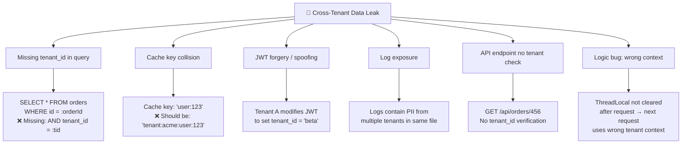
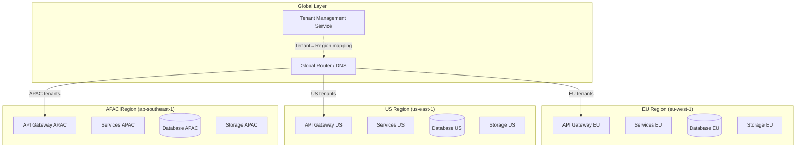

# Security & Compliance

Security trong multi-tenant là **mission-critical** — một lỗ hổng có thể **leak data giữa các tenant**, gây mất niềm tin và vi phạm pháp luật. Nguyên tắc: **Zero Trust between tenants** — mọi lớp đều phải enforce isolation.

```
┌──────────────────────────────────────────────────────────────────┐
│              MULTI-TENANT SECURITY LAYERS                        │
│                                                                  │
│  Layer 1: Network          Firewall, SG, VPC isolation           │
│  Layer 2: Authentication   JWT + tenant_id, SSO/SAML             │
│  Layer 3: Authorization    RBAC scoped by tenant_id              │
│  Layer 4: Data Access      Row-level security, schema isolation  │
│  Layer 5: Encryption       Per-tenant keys (KMS), TLS            │
│  Layer 6: Audit            Per-tenant audit log, immutable       │
│  Layer 7: Compliance       GDPR, HIPAA, SOC2 — per tenant        │
│                                                                  │
│  ⚡ MỌI layer phải enforce tenant_id — không layer nào optional   │
└──────────────────────────────────────────────────────────────────┘
```

## Cross-Tenant Data Leak Prevention

Cross-tenant data leak (hay **tenant bleed**) là lỗi nghiêm trọng nhất trong multi-tenancy — khi tenant A truy cập được data của tenant B.

#### Nguyên nhân phổ biến



#### Phòng chống — Database Layer

```java
/**
 * ① Hibernate Filter — TỰ ĐỘNG thêm tenant_id vào mọi query
 * Đây là lớp bảo vệ QUAN TRỌNG nhất
 */
@FilterDef(
    name = "tenantFilter",
    parameters = @ParamDef(name = "tenantId", type = String.class)
)
@Filter(
    name = "tenantFilter",
    condition = "tenant_id = :tenantId"
)
@Entity
@Table(name = "orders")
public class Order {
    @Id private Long id;

    @Column(name = "tenant_id", nullable = false, updatable = false)
    private String tenantId;

    // ... other fields
}

/**
 * ② Interceptor enable filter cho mọi request
 */
@Component
public class TenantFilterInterceptor implements HandlerInterceptor {

    @Autowired private EntityManager em;

    @Override
    public boolean preHandle(HttpServletRequest req,
                              HttpServletResponse resp,
                              Object handler) {
        String tenantId = TenantContextHolder.getTenantId();
        if (tenantId == null) {
            throw new SecurityException("No tenant context");
        }

        Session session = em.unwrap(Session.class);
        session.enableFilter("tenantFilter")
               .setParameter("tenantId", tenantId);
        return true;
    }
}

/**
 * ③ PostgreSQL Row-Level Security — backup protection
 */
-- Tạo RLS policy (defense-in-depth)
-- Ngay cả khi application code bỏ sót WHERE clause,
-- database vẫn enforce tenant isolation

ALTER TABLE orders ENABLE ROW LEVEL SECURITY;

CREATE POLICY tenant_isolation ON orders
    USING (tenant_id = current_setting('app.current_tenant'));

-- Set tenant context cho mỗi DB connection
SET app.current_tenant = 'acme';
```

#### Phòng chống — Cache Layer

```java
/**
 * Tenant-safe cache key strategy
 * MỌI cache key PHẢI có tenant_id prefix
 */
@Component
public class TenantCacheKeyGenerator implements KeyGenerator {

    @Override
    public Object generate(Object target, Method method, Object... params) {
        String tenantId = TenantContextHolder.getTenantId();
        String methodKey = target.getClass().getSimpleName()
            + "." + method.getName();
        String paramsKey = Arrays.stream(params)
            .map(Object::toString)
            .collect(Collectors.joining(":"));

        // Format: tenant:{tenantId}:{class.method}:{params}
        return "tenant:" + tenantId + ":" + methodKey + ":" + paramsKey;
    }
}

// Usage — cache LUÔN scoped theo tenant
@Cacheable(cacheNames = "orders", keyGenerator = "tenantCacheKeyGenerator")
public List<Order> findOrders(String status) {
    // Cache key: tenant:acme:OrderService.findOrders:PENDING
    return orderRepository.findByStatus(status);
}
```

#### Phòng chống — Context Propagation Safety

```java
/**
 * Đảm bảo TenantContext LUÔN được clear sau mỗi request
 * Tránh context leak sang request tiếp theo
 */
@Component
@Order(Ordered.HIGHEST_PRECEDENCE)
public class TenantContextSafetyFilter extends OncePerRequestFilter {

    @Override
    protected void doFilterInternal(HttpServletRequest req,
                                      HttpServletResponse resp,
                                      FilterChain chain) throws Exception {
        try {
            chain.doFilter(req, resp);
        } finally {
            // CRITICAL: Always clear context — prevent tenant bleed
            TenantContextHolder.clear();
        }
    }
}

/**
 * Async task wrapper — propagate tenant context safely
 */
public class TenantAwareRunnable implements Runnable {
    private final String tenantId;
    private final Runnable delegate;

    public TenantAwareRunnable(Runnable delegate) {
        this.tenantId = TenantContextHolder.getTenantId();
        this.delegate = delegate;
    }

    @Override
    public void run() {
        TenantContextHolder.set(new TenantContext(tenantId));
        try {
            delegate.run();
        } finally {
            TenantContextHolder.clear();
        }
    }
}
```

#### Cross-Tenant Leak Testing

```java
/**
 * Integration test — verify tenant isolation
 */
@SpringBootTest
public class TenantIsolationTest {

    @Test
    void tenant_A_cannot_see_tenant_B_data() {
        // Setup: Create data for both tenants
        setTenantContext("tenant-a");
        orderService.create(new Order("Order A1"));
        orderService.create(new Order("Order A2"));

        setTenantContext("tenant-b");
        orderService.create(new Order("Order B1"));

        // Test: Tenant A should only see their orders
        setTenantContext("tenant-a");
        List<Order> ordersA = orderService.findAll();
        assertThat(ordersA).hasSize(2);
        assertThat(ordersA).allMatch(o ->
            o.getTenantId().equals("tenant-a"));

        // Test: Tenant B should only see their orders
        setTenantContext("tenant-b");
        List<Order> ordersB = orderService.findAll();
        assertThat(ordersB).hasSize(1);
        assertThat(ordersB).allMatch(o ->
            o.getTenantId().equals("tenant-b"));
    }

    @Test
    void tenant_A_cannot_access_tenant_B_by_id() {
        setTenantContext("tenant-a");
        Order orderA = orderService.create(new Order("Order A1"));

        // Tenant B tries to access Tenant A's order by ID
        setTenantContext("tenant-b");
        assertThrows(NotFoundException.class, () ->
            orderService.findById(orderA.getId()));
    }

    @Test
    void cache_is_isolated_between_tenants() {
        setTenantContext("tenant-a");
        orderService.findAll(); // Populate cache

        setTenantContext("tenant-b");
        List<Order> ordersB = orderService.findAll();

        // Should NOT return Tenant A's cached data
        assertThat(ordersB).allMatch(o ->
            o.getTenantId().equals("tenant-b"));
    }
}
```

## Encryption Strategies

#### Encryption at Rest — Per-Tenant Keys

```
┌──────────────────────────────────────────────────────────────────┐
│              ENCRYPTION ARCHITECTURE                             │
│                                                                  │
│  ① Shared Platform Key (Free/Pro tier)                          │
│  ┌──────────────────────────────────────────────────────┐        │
│  │  AWS KMS: platform-master-key                        │        │
│  │  ├── Encrypts ALL tenant data                        │        │
│  │  ├── Key rotation: annual (automatic)                │        │
│  │  └── Simple, cost-effective                          │        │
│  └──────────────────────────────────────────────────────┘        │
│                                                                  │
│  ② Per-Tenant Key (Enterprise tier)                             │
│  ┌──────────────────────────────────────────────────────┐        │
│  │  AWS KMS: tenant-{id}-master-key                     │        │
│  │  ├── Each tenant has dedicated CMK                   │        │
│  │  ├── Tenant can manage own key policy                │        │
│  │  ├── Independent key rotation                        │        │
│  │  └── Crypto-erase: delete key = delete all data      │        │
│  └──────────────────────────────────────────────────────┘        │
│                                                                  │
│  ③ BYOK — Bring Your Own Key (Enterprise+)                      │
│  ┌──────────────────────────────────────────────────────┐        │
│  │  Tenant provides their own KMS key                   │        │
│  │  ├── Full tenant control over encryption             │        │
│  │  ├── Tenant can revoke access anytime                │        │
│  │  └── Required: HIPAA, financial compliance           │        │
│  └──────────────────────────────────────────────────────┘        │
└──────────────────────────────────────────────────────────────────┘
```

#### Implementation — Per-Tenant Encryption

```java
@Service
public class TenantEncryptionService {

    private final KmsClient kmsClient;
    private final LoadingCache<String, String> keyCache;

    /**
     * Encrypt data with tenant-specific key
     */
    public byte[] encrypt(String tenantId, byte[] plaintext) {
        String keyId = getOrCreateTenantKey(tenantId);

        EncryptResponse response = kmsClient.encrypt(
            EncryptRequest.builder()
                .keyId(keyId)
                .plaintext(SdkBytes.fromByteArray(plaintext))
                .encryptionContext(Map.of(
                    "tenant_id", tenantId,
                    "service", "order-service"
                ))
                .build());

        return response.ciphertextBlob().asByteArray();
    }

    /**
     * Decrypt with tenant-specific key
     */
    public byte[] decrypt(String tenantId, byte[] ciphertext) {
        DecryptResponse response = kmsClient.decrypt(
            DecryptRequest.builder()
                .ciphertextBlob(SdkBytes.fromByteArray(ciphertext))
                .encryptionContext(Map.of(
                    "tenant_id", tenantId,
                    "service", "order-service"
                ))
                .build());

        // Verify the decryption was done with correct tenant key
        // (encryption context mismatch → DecryptException)
        return response.plaintext().asByteArray();
    }

    /**
     * Get or create dedicated KMS key for tenant
     */
    private String getOrCreateTenantKey(String tenantId) {
        return keyCache.get(tenantId, id -> {
            // Check existing key
            Optional<String> existing = keyRegistry.findByTenant(id);
            if (existing.isPresent()) return existing.get();

            // Create new CMK for tenant
            CreateKeyResponse key = kmsClient.createKey(
                CreateKeyRequest.builder()
                    .description("Data encryption key for tenant: " + id)
                    .keyUsage(KeyUsageType.ENCRYPT_DECRYPT)
                    .tags(Tag.builder()
                        .tagKey("tenant_id").tagValue(id)
                        .build())
                    .build());

            String keyId = key.keyMetadata().keyId();

            // Setup automatic key rotation
            kmsClient.enableKeyRotation(
                EnableKeyRotationRequest.builder()
                    .keyId(keyId).build());

            keyRegistry.register(id, keyId);
            return keyId;
        });
    }

    /**
     * Crypto-erase: xóa key = xóa toàn bộ data (dùng cho offboarding)
     */
    public void cryptoErase(String tenantId) {
        String keyId = keyRegistry.findByTenant(tenantId)
            .orElseThrow();

        // Schedule key deletion (7 days minimum waiting period)
        kmsClient.scheduleKeyDeletion(
            ScheduleKeyDeletionRequest.builder()
                .keyId(keyId)
                .pendingWindowInDays(7)
                .build());

        log.info("Scheduled crypto-erase for tenant: {}. " +
                 "Key will be deleted in 7 days.", tenantId);
    }
}
```

#### Encryption in Transit

```
┌──────────────────────────────────────────────────────────────┐
│  ENCRYPTION IN TRANSIT                                       │
│                                                              │
│  Client ──TLS 1.3──▶ ALB ──TLS──▶ Service ──TLS──▶ Database  │
│                                                              │
│  Requirements:                                               │
│  ├── TLS 1.2+ (prefer TLS 1.3) for all endpoints             │
│  ├── mTLS between internal services                          │
│  ├── Certificate per service (not per tenant)                │
│  ├── Private CA for internal communication                   │
│  └── HSTS headers for all web endpoints                      │
│                                                              │
│  Per-Tenant Custom Domains:                                  │
│  ├── acme.app.example.com → ACM certificate (auto-renewal)   │
│  ├── beta.app.example.com → ACM certificate                  │
│  └── custom.acme.com → Customer-provided certificate         │
└──────────────────────────────────────────────────────────────┘
```

## Compliance (GDPR, HIPAA, SOC2)

#### Compliance Matrix per Regulation

| Requirement | GDPR | HIPAA | SOC2 | Implementation |
|------------|:----:|:-----:|:----:|----------------|
| **Data encryption at rest** | ✅ | ✅ | ✅ | KMS per tenant |
| **Data encryption in transit** | ✅ | ✅ | ✅ | TLS 1.2+ |
| **Access logging** | ✅ | ✅ | ✅ | Audit log per tenant |
| **Right to erasure** | ✅ | ❌ | ❌ | Hard delete within 30 days |
| **Data portability** | ✅ | ❌ | ❌ | Export API (JSON/CSV) |
| **Data minimization** | ✅ | ❌ | ❌ | Collect only necessary data |
| **Consent management** | ✅ | ❌ | ❌ | Consent service |
| **Breach notification** | ✅ 72h | ✅ 60 days | ✅ | Incident response plan |
| **Data residency** | ✅ | ❌ | ❌ | Region-specific deployment |
| **BAA (Business Associate)** | ❌ | ✅ | ❌ | Legal agreement |
| **Minimum retention** | ❌ | ✅ 6yr | ❌ | Retention policy |
| **Annual audit** | ❌ | ❌ | ✅ | Third-party attestation |
| **Access controls** | ✅ | ✅ | ✅ | RBAC + MFA |
| **Vulnerability management** | ✅ | ✅ | ✅ | Regular scanning |

#### Per-Tenant Compliance Configuration

```java
@Service
public class TenantComplianceService {

    /**
     * Set compliance regime per tenant
     * Ảnh hưởng: encryption, retention, audit, data handling
     */
    public void setComplianceRegime(String tenantId,
                                      Set<ComplianceRegime> regimes) {
        TenantCompliance compliance = TenantCompliance.builder()
            .tenantId(tenantId)
            .regimes(regimes)
            .build();

        // Apply most restrictive rules from all applicable regimes
        if (regimes.contains(ComplianceRegime.GDPR)) {
            compliance.setDataResidencyRequired(true);
            compliance.setRightToErasure(true);
            compliance.setConsentRequired(true);
            compliance.setBreachNotificationHours(72);
        }

        if (regimes.contains(ComplianceRegime.HIPAA)) {
            compliance.setEncryptionRequired(true);
            compliance.setDedicatedKeyRequired(true);
            compliance.setMinRetentionYears(6);
            compliance.setAuditLogRequired(true);
            compliance.setBreachNotificationDays(60);
        }

        if (regimes.contains(ComplianceRegime.SOC2)) {
            compliance.setAuditLogRequired(true);
            compliance.setAccessControlRequired(true);
            compliance.setVulnerabilityScanRequired(true);
        }

        complianceRepo.save(compliance);

        // Apply compliance settings to infrastructure
        applyComplianceSettings(tenantId, compliance);
    }

    /**
     * Validate ongoing compliance
     */
    public ComplianceReport validateCompliance(String tenantId) {
        TenantCompliance compliance = complianceRepo
            .findByTenantId(tenantId).orElseThrow();

        List<ComplianceViolation> violations = new ArrayList<>();

        // Check encryption
        if (compliance.isEncryptionRequired()) {
            if (!encryptionService.hasDedicatedKey(tenantId)) {
                violations.add(new ComplianceViolation(
                    "ENCRYPTION", "Dedicated KMS key required but not found"));
            }
        }

        // Check data residency
        if (compliance.isDataResidencyRequired()) {
            String region = tenantRepo.findById(tenantId)
                .map(Tenant::getRegion).orElse("unknown");
            if (!isAllowedRegion(tenantId, region)) {
                violations.add(new ComplianceViolation(
                    "DATA_RESIDENCY",
                    "Data stored in non-compliant region: " + region));
            }
        }

        // Check audit logging
        if (compliance.isAuditLogRequired()) {
            if (!auditService.isEnabledForTenant(tenantId)) {
                violations.add(new ComplianceViolation(
                    "AUDIT_LOG", "Audit logging not enabled"));
            }
        }

        return new ComplianceReport(tenantId,
            compliance.getRegimes(),
            violations,
            violations.isEmpty() ? "COMPLIANT" : "NON_COMPLIANT");
    }
}
```

#### GDPR — Right to Erasure Implementation

```java
@Service
public class GdprErasureService {

    /**
     * Process GDPR erasure request
     * Must complete within 30 days (law requirement)
     */
    public ErasureResult processErasureRequest(String tenantId,
                                                 String userId) {
        String requestId = UUID.randomUUID().toString();

        // ① Log the request
        auditLog.log("GDPR_ERASURE_REQUESTED", tenantId,
            Map.of("user_id", userId, "request_id", requestId));

        // ② Find all PII data across services
        List<DataLocation> locations = dataDiscovery
            .findPersonalData(tenantId, userId);

        // ③ Delete or anonymize PII in each location
        for (DataLocation loc : locations) {
            switch (loc.getType()) {
                case DATABASE:
                    anonymizeInDatabase(loc, userId);
                    break;
                case STORAGE:
                    deleteFromStorage(loc, userId);
                    break;
                case SEARCH_INDEX:
                    deleteFromSearchIndex(loc, userId);
                    break;
                case CACHE:
                    evictFromCache(loc, userId);
                    break;
                case LOG:
                    // Logs: anonymize, cannot delete (audit trail)
                    redactInLogs(loc, userId);
                    break;
            }
        }

        // ④ Verify erasure
        List<DataLocation> remaining = dataDiscovery
            .findPersonalData(tenantId, userId);

        boolean complete = remaining.isEmpty();

        // ⑤ Log completion
        auditLog.log("GDPR_ERASURE_COMPLETED", tenantId,
            Map.of("request_id", requestId,
                    "locations_processed", locations.size(),
                    "complete", complete));

        return new ErasureResult(requestId, complete,
            Instant.now(), locations.size());
    }

    private void anonymizeInDatabase(DataLocation loc, String userId) {
        // Replace PII with anonymized values
        jdbcTemplate.update("""
            UPDATE users SET
                email = CONCAT('deleted_', id, '@redacted.com'),
                full_name = 'REDACTED',
                phone = NULL,
                address = NULL,
                ip_address = NULL,
                anonymized_at = NOW()
            WHERE id = ? AND tenant_id = ?
            """, userId, loc.getTenantId());
    }
}

## Data Residency & Sovereignty

Data Residency yêu cầu **dữ liệu của tenant phải được lưu trữ và xử lý** tại một vùng địa lý cụ thể (thường là quốc gia/khu vực mà tenant hoạt động).

#### Tại sao cần Data Residency?

```
┌──────────────────────────────────────────────────────────────────┐
│              DATA RESIDENCY REQUIREMENTS                         │
│                                                                  │
│  GDPR (EU):                                                      │
│  ├── Data EU citizens → phải ở EU hoặc "adequate" countries      │
│  ├── Transfer sang US/Asia → cần Standard Contractual Clauses    │
│  └── Violation: fine up to 4% global revenue                     │
│                                                                  │
│  China (PIPL):                                                   │
│  ├── Data Chinese citizens → PHẢI ở China                        │
│  └── Cross-border transfer → government approval required        │
│                                                                  │
│  Russia (Federal Law 152-FZ):                                    │
│  ├── Personal data Russian citizens → PHẢI ở Russia              │
│  └── No exception for SaaS platforms                             │
│                                                                  │
│  Vietnam (Decree 13):                                            │
│  ├── Important data → PHẢI có bản sao ở Vietnam                  │
│  └── Cross-border → impact assessment required                   │
└──────────────────────────────────────────────────────────────────┘
```

#### Multi-Region Architecture



#### Implementation — Region-Aware Routing

```java
@Service
public class TenantRegionRouter {

    private static final Map<String, String> COUNTRY_TO_REGION = Map.of(
        "DE", "eu-west-1",
        "FR", "eu-west-1",
        "NL", "eu-west-1",
        "US", "us-east-1",
        "CA", "us-east-1",
        "JP", "ap-northeast-1",
        "SG", "ap-southeast-1",
        "VN", "ap-southeast-1",
        "AU", "ap-southeast-2"
    );

    /**
     * Resolve region for tenant based on residency requirements
     */
    public String resolveRegion(String tenantId) {
        Tenant tenant = tenantRepo.findById(tenantId).orElseThrow();

        // Priority 1: Explicit region override (enterprise config)
        if (tenant.getRegionOverride() != null) {
            return tenant.getRegionOverride();
        }

        // Priority 2: Compliance-driven region
        TenantCompliance compliance = complianceRepo
            .findByTenantId(tenantId).orElse(null);
        if (compliance != null && compliance.getRequiredRegion() != null) {
            return compliance.getRequiredRegion();
        }

        // Priority 3: Country-based default
        String country = tenant.getCountryCode();
        return COUNTRY_TO_REGION.getOrDefault(country, "us-east-1");
    }

    /**
     * Validate data does not leave allowed region
     */
    public void enforceResidency(String tenantId, String targetRegion) {
        String allowedRegion = resolveRegion(tenantId);

        if (!targetRegion.equals(allowedRegion)) {
            throw new DataResidencyViolationException(String.format(
                "Data residency violation: tenant %s data must stay in %s, " +
                "but operation targets %s",
                tenantId, allowedRegion, targetRegion));
        }
    }
}
```

#### Terraform — Multi-Region Infrastructure

```hcl
# modules/tenant-region/main.tf
variable "regions" {
  default = ["eu-west-1", "us-east-1", "ap-southeast-1"]
}

# Deploy per region
module "region" {
  source   = "./modules/region-stack"
  for_each = toset(var.regions)

  region = each.value

  # Database
  db_instance_class = "db.r6g.large"
  db_multi_az       = true
  db_encrypted      = true

  # S3 — block cross-region replication
  s3_bucket_policy = jsonencode({
    Version = "2012-10-17"
    Statement = [
      {
        Sid       = "DenyNonRegionalAccess"
        Effect    = "Deny"
        Principal = "*"
        Action    = "s3:*"
        Resource  = "arn:aws:s3:::tenant-data-${each.value}/*"
        Condition = {
          StringNotEquals = {
            "aws:RequestedRegion" = each.value
          }
        }
      }
    ]
  })

  tags = {
    Environment = "production"
    Region      = each.value
    DataResidency = "enforced"
  }
}
```

## Audit Logging per Tenant

Audit log ghi lại **mọi hành động** liên quan đến data và security của tenant — immutable, searchable, và compliance-ready.

#### Audit Log Architecture

```
┌─────────────────────────────────────────────────────────────────┐
│              AUDIT LOG ARCHITECTURE                             │
│                                                                 │
│  Application ──▶ Audit Service ──▶ Storage                      │
│                                                                 │
│  ┌──────────┐   ┌──────────────┐   ┌────────────────────────┐   │
│  │ API call │──▶│ AuditLogger  │──▶│ Kinesis / Kafka        │   │
│  │ DB write │   │              │   │ (streaming, ordered)   │   │
│  │ Login    │   │ Enrichment:  │   └─────────┬──────────────┘   │
│  │ Config   │   │ + timestamp  │             │                  │
│  │ change   │   │ + tenant_id  │   ┌─────────▼──────────────┐   │
│  └──────────┘   │ + user_id    │   │ S3 (long-term archive) │   │
│                 │ + ip_address │   │ (immutable, encrypted) │   │
│                 │ + request_id │   └─────────┬──────────────┘   │
│                 └──────────────┘             │                  │
│                                    ┌─────────▼──────────────┐   │
│                                    │ OpenSearch / CloudWatc │   │
│                                    │(searchable, dashboards)│   │
│                                    └────────────────────────┘   │
│                                                                 │
│  Requirements:                                                  │
│  ├── Immutable (append-only, no delete)                         │
│  ├── Tamper-proof (hash chain or WORM storage)                  │
│  ├── Per-tenant isolated (tenant A cannot read B's logs)        │
│  ├── Searchable (by tenant, user, action, time range)           │
│  └── Retention: configurable per compliance regime              │
└─────────────────────────────────────────────────────────────────┘
```

#### Implementation — Structured Audit Logger

```java
@Service
public class TenantAuditService {

    private final KinesisClient kinesis;
    private final ObjectMapper objectMapper;

    /**
     * Log audit event — immutable, structured
     */
    public void log(AuditEvent event) {
        // Enrich event
        event.setTimestamp(Instant.now());
        event.setRequestId(MDC.get("requestId"));
        event.setSourceIp(MDC.get("sourceIp"));
        event.setUserAgent(MDC.get("userAgent"));

        // Compute hash for integrity
        String payload = objectMapper.writeValueAsString(event);
        event.setContentHash(sha256(payload));

        // Send to stream (ordered by tenant)
        kinesis.putRecord(PutRecordRequest.builder()
            .streamName("audit-events")
            .data(SdkBytes.fromUtf8String(payload))
            .partitionKey(event.getTenantId()) // Same tenant → same shard
            .build());
    }

    /**
     * Convenience methods for common audit events
     */
    public void logDataAccess(String tenantId, String userId,
                               String resource, String action) {
        log(AuditEvent.builder()
            .tenantId(tenantId)
            .userId(userId)
            .category("DATA_ACCESS")
            .action(action)
            .resource(resource)
            .build());
    }

    public void logAuthEvent(String tenantId, String userId,
                              String action, boolean success) {
        log(AuditEvent.builder()
            .tenantId(tenantId)
            .userId(userId)
            .category("AUTHENTICATION")
            .action(action)
            .success(success)
            .severity(success ? "INFO" : "WARNING")
            .build());
    }

    public void logConfigChange(String tenantId, String userId,
                                  String key, Object oldValue,
                                  Object newValue) {
        log(AuditEvent.builder()
            .tenantId(tenantId)
            .userId(userId)
            .category("CONFIGURATION")
            .action("CONFIG_CHANGED")
            .details(Map.of(
                "key", key,
                "old_value", String.valueOf(oldValue),
                "new_value", String.valueOf(newValue)
            ))
            .build());
    }

    public void logSecurityEvent(String tenantId, String userId,
                                   String action, String severity,
                                   Map<String, String> details) {
        log(AuditEvent.builder()
            .tenantId(tenantId)
            .userId(userId)
            .category("SECURITY")
            .action(action)
            .severity(severity)
            .details(details)
            .build());
    }
}

/**
 * Audit Event — Structured log entry
 */
@Data @Builder
public class AuditEvent {
    private String id;              // UUID
    private Instant timestamp;
    private String tenantId;
    private String userId;
    private String category;        // DATA_ACCESS, AUTH, CONFIG, SECURITY
    private String action;          // CREATE, READ, UPDATE, DELETE, LOGIN
    private String resource;        // orders/123, users/456
    private String severity;        // INFO, WARNING, CRITICAL
    private boolean success;
    private String requestId;
    private String sourceIp;
    private String userAgent;
    private Map<String, String> details;
    private String contentHash;     // SHA-256 for integrity
}
```

#### Audit Log Query API — Per Tenant

```java
@RestController
@RequestMapping("/api/audit")
public class AuditLogController {

    @Autowired private AuditQueryService queryService;

    /**
     * Tenant admin có thể query audit logs của tenant mình
     */
    @GetMapping("/logs")
    @PreAuthorize("hasAuthority('AUDIT_READ')")
    public Page<AuditEvent> queryLogs(
            @RequestParam(required = false) String userId,
            @RequestParam(required = false) String category,
            @RequestParam(required = false) String action,
            @RequestParam(required = false)
                @DateTimeFormat(iso = ISO.DATE_TIME) Instant from,
            @RequestParam(required = false)
                @DateTimeFormat(iso = ISO.DATE_TIME) Instant to,
            Pageable pageable) {

        String tenantId = TenantContextHolder.getTenantId();

        // Tenant can ONLY query their own logs
        return queryService.search(
            tenantId, userId, category, action,
            from, to, pageable);
    }

    /**
     * Export audit logs (compliance requirement)
     */
    @PostMapping("/export")
    @PreAuthorize("hasAuthority('AUDIT_EXPORT')")
    public ExportResponse exportLogs(
            @RequestBody AuditExportRequest request) {
        String tenantId = TenantContextHolder.getTenantId();
        return queryService.exportToCsv(tenantId, request);
    }
}
```

#### Tổng kết — Security & Compliance Checklist

```
✅ SECURITY & COMPLIANCE CHECKLIST

Cross-Tenant Isolation:
├── ✅ Hibernate Filter: auto tenant_id on all queries
├── ✅ PostgreSQL RLS: defense-in-depth at DB level
├── ✅ Cache key: tenant-prefixed (no collision)
├── ✅ Context safety: ThreadLocal cleared after every request
├── ✅ Async safety: TenantAwareRunnable for thread pool tasks
└── ✅ Integration tests: tenant isolation verification

Encryption:
├── ✅ At rest: KMS per tenant (Enterprise), shared key (Free/Pro)
├── ✅ In transit: TLS 1.2+ all endpoints, mTLS internal
├── ✅ BYOK support for Enterprise+ tier
└── ✅ Crypto-erase for offboarding (delete key = delete data)

Compliance:
├── ✅ GDPR: right to erasure, data portability, consent
├── ✅ HIPAA: BAA, encryption, 6-year retention
├── ✅ SOC2: audit logs, access controls, vulnerability scanning
├── ✅ Per-tenant compliance configuration
└── ✅ Automated compliance validation

Data Residency:
├── ✅ Multi-region deployment (EU, US, APAC)
├── ✅ Country → Region routing
├── ✅ S3 bucket policy: deny cross-region access
└── ✅ Enforcement at API + infrastructure level

Audit Logging:
├── ✅ Structured events: DATA_ACCESS, AUTH, CONFIG, SECURITY
├── ✅ Immutable: append-only, hash chain
├── ✅ Per-tenant isolation: tenant can only query own logs
├── ✅ Searchable + exportable (compliance requirement)
└── ✅ Configurable retention per compliance regime
```


---

## Đọc thêm

- [Authentication & Authorization](./05-authentication.md) — RBAC, cross-tenant access control
- [Data Partitioning Strategies](./03-data-partitioning.md) — Row-Level Security, schema isolation
- [Tenant Lifecycle](./08-tenant-lifecycle.md) — Offboarding, data retention policy
- [Observability & Monitoring](./10-observability.md) — Per-tenant audit dashboards
