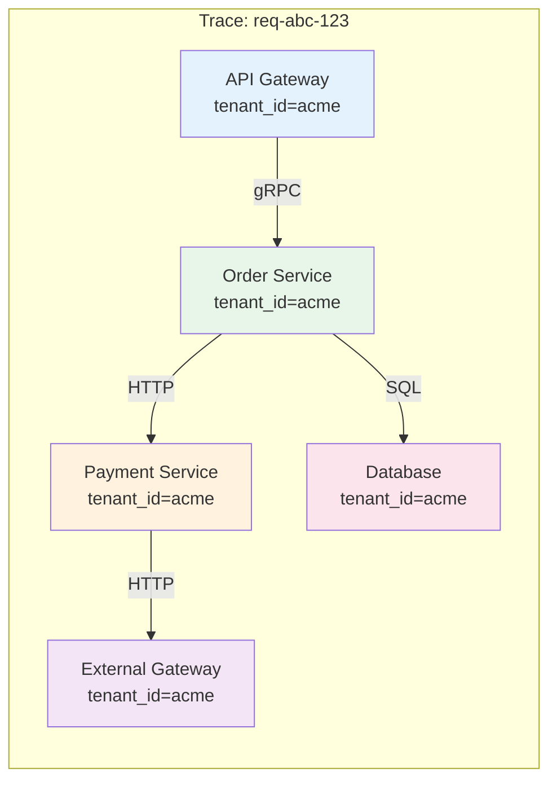

# Observability & Monitoring

Observability trong multi-tenant phải **segment mọi thứ theo tenant_id** — logs, metrics, traces. Không có tenant context = không debug được, không billing được, không detect được noisy neighbor.

```
┌─────────────────────────────────────────────────────────────────┐
│              TENANT-AWARE OBSERVABILITY                         │
│                                                                 │
│  Three Pillars — tất cả đều PHẢI có tenant_id                   │
│                                                                 │
│  ┌──────────┐    ┌──────────┐    ┌──────────┐                   │
│  │  LOGS    │    │ METRICS  │    │ TRACES   │                   │
│  │          │    │          │    │          │                   │
│  │ tenant_id│    │ tenant_id│    │ tenant_id│                   │
│  │ in every │    │ as label/│    │ in span  │                   │
│  │ log line │    │ dimension│    │ baggage  │                   │
│  └────┬─────┘    └────┬─────┘    └────┬─────┘                   │
│       │               │               │                         │
│       ▼               ▼               ▼                         │
│  ┌──────────────────────────────────────┐                       │
│  │      Unified Observability Platform  │                       │
│  │  (CloudWatch / Grafana / Datadog)    │                       │
│  │                                      │                       │
│  │  Filter by: tenant_id = "acme"       │                       │
│  │  → Logs + Metrics + Traces cho acme  │                       │
│  └──────────────────────────────────────┘                       │
└─────────────────────────────────────────────────────────────────┘
```

## Tenant-aware Logging

Mọi log line phải chứa **tenant_id** — đây là yêu cầu bắt buộc, không có ngoại lệ.

#### Structured Logging Format

```json
{
  "timestamp": "2025-03-28T08:32:15.123Z",
  "level": "INFO",
  "logger": "com.app.OrderService",
  "message": "Order created successfully",
  "tenant_id": "acme",
  "user_id": "user-456",
  "trace_id": "abc123def456",
  "span_id": "span-789",
  "request_id": "req-xyz-001",
  "service": "order-service",
  "environment": "production",
  "region": "ap-southeast-1",
  "context": {
    "order_id": "ORD-12345",
    "amount": 150.00,
    "currency": "USD"
  }
}
```

#### Implementation — MDC-based Tenant Logging

```java
/**
 * Filter: inject tenant_id vào MDC (Mapped Diagnostic Context)
 * → Tất cả logs trong request sẽ tự động có tenant_id
 */
@Component
@Order(Ordered.HIGHEST_PRECEDENCE + 1)
public class TenantLoggingFilter extends OncePerRequestFilter {

    @Override
    protected void doFilterInternal(HttpServletRequest req,
                                      HttpServletResponse resp,
                                      FilterChain chain) throws Exception {
        try {
            String tenantId = TenantContextHolder.getTenantId();
            String userId = TenantContextHolder.getUserId();

            // Set MDC — auto-included in every log line
            MDC.put("tenant_id", tenantId != null ? tenantId : "unknown");
            MDC.put("user_id", userId != null ? userId : "anonymous");
            MDC.put("request_id", generateRequestId());
            MDC.put("trace_id", getTraceId());

            chain.doFilter(req, resp);
        } finally {
            MDC.clear();
        }
    }

    private String generateRequestId() {
        return "req-" + UUID.randomUUID().toString().substring(0, 8);
    }
}
```

#### Logback Configuration — Structured JSON Output

```xml
<!-- logback-spring.xml -->
<configuration>
    <appender name="JSON_CONSOLE"
              class="ch.qos.logback.core.ConsoleAppender">
        <encoder class="net.logstash.logback.encoder.
                        LogstashEncoder">
            <fieldNames>
                <timestamp>timestamp</timestamp>
                <level>level</level>
                <logger>logger</logger>
                <message>message</message>
            </fieldNames>

            <!-- MDC fields auto-included -->
            <includeMdcKeyName>tenant_id</includeMdcKeyName>
            <includeMdcKeyName>user_id</includeMdcKeyName>
            <includeMdcKeyName>request_id</includeMdcKeyName>
            <includeMdcKeyName>trace_id</includeMdcKeyName>
        </encoder>
    </appender>

    <root level="INFO">
        <appender-ref ref="JSON_CONSOLE" />
    </root>
</configuration>
```

#### Log Isolation — Per-Tenant Log Streams

```
┌──────────────────────────────────────────────────────────────┐
│              LOG ROUTING PER TENANT                          │
│                                                              │
│  Application Logs                                            │
│       │                                                      │
│       ▼                                                      │
│  ┌──────────────────┐                                        │
│  │ Log Router       │                                        │
│  │ (Fluentd/Fluent  │                                        │
│  │  Bit/Vector)     │                                        │
│  └────┬─────────────┘                                        │
│       │                                                      │
│       ├──▶ /logs/platform/  (all tenants, platform ops)      │
│       ├──▶ /logs/acme/      (tenant acme, 30 days retain)    │
│       ├──▶ /logs/beta/      (tenant beta, 90 days retain)    │
│       └──▶ /logs/enterprise/(tenant ent, 365 days retain)    │
│                                                              │
│  Retention per tier:                                         │
│  ├── Free: 7 days                                            │
│  ├── Pro: 30 days                                            │
│  └── Enterprise: 365 days (+ S3 archive)                     │
└──────────────────────────────────────────────────────────────┘
```

## Tenant-aware Metrics

Metrics phải có **tenant_id** là dimension/label — cho phép filter, group by, và alert per tenant.

#### Metric Design Principles

```
┌──────────────────────────────────────────────────────────────────┐
│  METRIC NAMING CONVENTION                                        │
│                                                                  │
│  Format: {domain}_{entity}_{action}_{unit}                       │
│  Labels: tenant_id, service, endpoint, status                    │
│                                                                  │
│  Examples:                                                       │
│  ├── http_requests_total{tenant_id, endpoint, status}            │
│  ├── http_request_duration_seconds{tenant_id, endpoint}          │
│  ├── db_query_duration_seconds{tenant_id, operation}             │
│  ├── db_connections_active{tenant_id}                            │
│  ├── storage_usage_bytes{tenant_id}                              │
│  ├── api_calls_total{tenant_id, tier}                            │
│  └── tenant_active_users{tenant_id}                              │
│                                                                  │
│  ⚠️ Cardinality warning:                                         │
│  tenant_id × endpoint × status có thể = hàng ngàn time series    │
│  → Limit: max 10,000 active tenants × 50 endpoints = 500K        │
│  → Solution: rollup, pre-aggregation, hoặc tenant sampling       │
└──────────────────────────────────────────────────────────────────┘
```

#### Implementation — Micrometer Per-Tenant Metrics

```java
@Component
public class TenantMetricsService {

    private final MeterRegistry registry;

    /**
     * HTTP request metrics per tenant
     */
    public Timer.Sample startTimer() {
        return Timer.start(registry);
    }

    public void recordRequest(Timer.Sample sample,
                               String tenantId, String endpoint,
                               String method, int status) {
        sample.stop(Timer.builder("http.server.requests")
            .tag("tenant_id", tenantId)
            .tag("endpoint", endpoint)
            .tag("method", method)
            .tag("status", String.valueOf(status))
            .publishPercentiles(0.5, 0.95, 0.99)
            .register(registry));
    }

    /**
     * Business metrics per tenant
     */
    public void recordOrderCreated(String tenantId, double amount) {
        registry.counter("business.orders.created",
            "tenant_id", tenantId).increment();

        registry.summary("business.orders.amount",
            "tenant_id", tenantId).record(amount);
    }

    /**
     * Resource usage metrics per tenant
     */
    public void recordStorageUsage(String tenantId, long bytes) {
        registry.gauge("resource.storage.usage.bytes",
            Tags.of("tenant_id", tenantId),
            bytes);
    }

    public void recordActiveUsers(String tenantId, int count) {
        registry.gauge("resource.active.users",
            Tags.of("tenant_id", tenantId),
            count);
    }
}
```

#### Prometheus Queries — Per-Tenant Analysis

```promql
# Request rate per tenant (top 10)
topk(10,
  sum by (tenant_id) (
    rate(http_server_requests_total[5m])
  )
)

# P99 latency per tenant
histogram_quantile(0.99,
  sum by (tenant_id, le) (
    rate(http_server_requests_duration_seconds_bucket[5m])
  )
)

# Error rate per tenant
sum by (tenant_id) (
  rate(http_server_requests_total{status=~"5.."}[5m])
) / sum by (tenant_id) (
  rate(http_server_requests_total[5m])
)

# Storage usage per tenant (GB)
resource_storage_usage_bytes / 1e9

# DB connections per tenant vs limit
db_connections_active
  / on(tenant_id) db_connections_limit * 100
```

## Tenant-aware Tracing

Distributed tracing phải **propagate tenant_id** qua toàn bộ call chain — từ API Gateway đến database query.

#### Tracing Architecture



#### Implementation — OpenTelemetry with Tenant Context

```java
/**
 * OpenTelemetry SpanProcessor — inject tenant_id vào mọi span
 */
@Component
public class TenantSpanProcessor implements SpanProcessor {

    @Override
    public void onStart(Context parentContext,
                         ReadWriteSpan span) {
        String tenantId = TenantContextHolder.getTenantId();
        if (tenantId != null) {
            span.setAttribute("tenant.id", tenantId);
            span.setAttribute("tenant.tier",
                TenantContextHolder.getTier());
        }

        String userId = TenantContextHolder.getUserId();
        if (userId != null) {
            span.setAttribute("user.id", userId);
        }
    }

    @Override
    public boolean isStartRequired() { return true; }

    @Override
    public boolean isEndRequired() { return false; }

    @Override
    public void onEnd(ReadableSpan span) {}
}

/**
 * Baggage propagation — tenant_id follows the entire trace
 */
@Component
public class TenantBaggagePropagator {

    /**
     * Inject tenant_id into outgoing requests (gRPC, HTTP)
     */
    public void injectBaggage() {
        String tenantId = TenantContextHolder.getTenantId();
        if (tenantId != null) {
            Baggage.current().toBuilder()
                .put("tenant_id", tenantId)
                .build()
                .makeCurrent();
        }
    }

    /**
     * Extract tenant_id from incoming request baggage
     */
    public String extractTenantId() {
        return Baggage.current().getEntryValue("tenant_id");
    }
}
```

#### Trace Query — Filter by Tenant

```
# Jaeger / Tempo query examples

# All traces for tenant "acme" in last 1 hour
{ tenant.id = "acme" } | duration > 1s

# Slow traces per tenant (> 3 seconds)
{ tenant.id = "acme" && duration > 3s }

# Error traces per tenant
{ tenant.id = "acme" && status = error }

# Cross-service traces for specific order
{ tenant.id = "acme" && order_id = "ORD-12345" }
```

#### Trace Sampling — Per-Tenant Strategy

```java
/**
 * Intelligent sampling: sample more for premium tenants,
 * always sample errors and slow requests
 */
@Component
public class TenantTraceSampler implements Sampler {

    @Override
    public SamplingResult shouldSample(Context parentContext,
                                        String traceId,
                                        String name,
                                        SpanKind spanKind,
                                        Attributes attributes,
                                        List<LinkData> links) {

        String tenantId = attributes.get(
            AttributeKey.stringKey("tenant.id"));
        String tier = getTierForTenant(tenantId);

        double sampleRate = switch (tier) {
            case "enterprise" -> 1.0;   // 100% sampling
            case "pro"        -> 0.1;   // 10% sampling
            default           -> 0.01;  // 1% sampling (free)
        };

        // Always sample errors and slow requests
        if (isError(attributes) || isSlow(attributes)) {
            sampleRate = 1.0;
        }

        return Math.random() < sampleRate
            ? SamplingResult.create(SamplingDecision.RECORD_AND_SAMPLE)
            : SamplingResult.create(SamplingDecision.DROP);
    }
}

## Per-Tenant Dashboards & Alerting

#### Dashboard Architecture

```
┌──────────────────────────────────────────────────────────────────┐
│              DASHBOARD HIERARCHY                                 │
│                                                                  │
│  Level 1: Platform Overview (SRE/Platform team)                  │
│  ┌──────────────────────────────────────────────────────────┐    │
│  │  • Total tenants (active/suspended/trial)                │    │
│  │  • Platform health (CPU, memory, DB, cache)              │    │
│  │  • Top 10 tenants by resource usage                      │    │
│  │  • Noisy neighbor alerts                                 │    │
│  │  • Cross-tenant latency comparison                       │    │
│  └──────────────────────────────────────────────────────────┘    │
│                                                                  │
│  Level 2: Tenant Detail (Support team / Tenant admin)            │
│  ┌──────────────────────────────────────────────────────────┐    │
│  │  • Tenant-specific request rate, latency, errors         │    │
│  │  • Quota usage (API calls, storage, users)               │    │
│  │  • Feature usage analytics                               │    │
│  │  • Recent audit log entries                              │    │
│  └──────────────────────────────────────────────────────────┘    │
│                                                                  │
│  Level 3: Self-Service (Tenant admin — exposed via app)          │
│  ┌──────────────────────────────────────────────────────────┐    │
│  │  • API usage + remaining quota                           │    │
│  │  • Active users count                                    │    │
│  │  • Storage consumption                                   │    │
│  │  • Uptime / availability SLA                             │    │
│  └──────────────────────────────────────────────────────────┘    │
└──────────────────────────────────────────────────────────────────┘
```

#### Grafana Dashboard — Tenant Overview (JSON Model)

```json
{
  "dashboard": {
    "title": "Multi-Tenant Overview",
    "templating": {
      "list": [
        {
          "name": "tenant_id",
          "type": "query",
          "query": "label_values(http_server_requests_total, tenant_id)",
          "multi": true,
          "includeAll": true
        },
        {
          "name": "tier",
          "type": "custom",
          "options": ["free", "pro", "enterprise"],
          "multi": true
        }
      ]
    },
    "panels": [
      {
        "title": "Request Rate by Tenant",
        "type": "timeseries",
        "targets": [{
          "expr": "sum by (tenant_id) (rate(http_server_requests_total{tenant_id=~\"$tenant_id\"}[5m]))"
        }]
      },
      {
        "title": "P99 Latency by Tenant",
        "type": "timeseries",
        "targets": [{
          "expr": "histogram_quantile(0.99, sum by (tenant_id, le) (rate(http_server_requests_duration_seconds_bucket{tenant_id=~\"$tenant_id\"}[5m])))"
        }]
      },
      {
        "title": "Error Rate by Tenant",
        "type": "gauge",
        "targets": [{
          "expr": "sum by (tenant_id) (rate(http_server_requests_total{status=~\"5..\", tenant_id=~\"$tenant_id\"}[5m])) / sum by (tenant_id) (rate(http_server_requests_total{tenant_id=~\"$tenant_id\"}[5m])) * 100"
        }],
        "thresholds": [
          {"value": 0, "color": "green"},
          {"value": 1, "color": "yellow"},
          {"value": 5, "color": "red"}
        ]
      },
      {
        "title": "Quota Usage",
        "type": "bargauge",
        "targets": [{
          "expr": "tenant_quota_usage_percent{tenant_id=~\"$tenant_id\"}"
        }]
      }
    ]
  }
}
```

#### Alert Rules — Per-Tenant

```yaml
# prometheus-alerts.yml
groups:
  - name: tenant_alerts
    rules:
      # High error rate for specific tenant
      - alert: TenantHighErrorRate
        expr: |
          (sum by (tenant_id) (rate(http_server_requests_total{status=~"5.."}[5m]))
          / sum by (tenant_id) (rate(http_server_requests_total[5m])))
          > 0.05
        for: 5m
        labels:
          severity: warning
        annotations:
          summary: "Tenant {{ $labels.tenant_id }} error rate > 5%"
          description: "Error rate: {{ $value | humanizePercentage }}"

      # Quota approaching limit
      - alert: TenantQuotaNearLimit
        expr: tenant_quota_usage_percent > 80
        for: 10m
        labels:
          severity: info
        annotations:
          summary: "Tenant {{ $labels.tenant_id }} quota at {{ $value }}%"

      # Tenant latency SLA breach
      - alert: TenantLatencySLABreach
        expr: |
          histogram_quantile(0.99,
            sum by (tenant_id, le) (
              rate(http_server_requests_duration_seconds_bucket[5m])
            )) > 3.0
        for: 10m
        labels:
          severity: critical
        annotations:
          summary: "Tenant {{ $labels.tenant_id }} P99 latency > 3s (SLA breach)"

      # Noisy neighbor detection
      - alert: NoisyNeighborDetected
        expr: |
          (sum by (tenant_id) (rate(http_server_requests_total[5m]))
          / ignoring(tenant_id) sum(rate(http_server_requests_total[5m])))
          > 0.3
        for: 5m
        labels:
          severity: warning
        annotations:
          summary: "Tenant {{ $labels.tenant_id }} consuming > 30% total capacity"

      # Tenant becoming inactive (possible churn)
      - alert: TenantInactive
        expr: |
          sum by (tenant_id) (
            rate(http_server_requests_total[24h])) == 0
          and on(tenant_id) tenant_status == 1
        for: 72h
        labels:
          severity: info
        annotations:
          summary: "Tenant {{ $labels.tenant_id }} inactive for 72 hours"
```

#### Self-Service API — Tenant Metrics Exposure

```java
/**
 * API cho tenant admin xem metrics của tenant mình
 */
@RestController
@RequestMapping("/api/metrics")
public class TenantMetricsController {

    @GetMapping("/usage")
    @PreAuthorize("hasAuthority('METRICS_READ')")
    public TenantUsageResponse getUsage() {
        String tenantId = TenantContextHolder.getTenantId();

        return TenantUsageResponse.builder()
            .tenantId(tenantId)
            .period("current_month")
            .apiCalls(metricsService.getApiCallCount(tenantId))
            .apiCallsLimit(quotaService.getLimit(tenantId, "api_calls"))
            .storageUsedBytes(metricsService.getStorageUsage(tenantId))
            .storageLimitBytes(quotaService.getLimit(tenantId, "storage"))
            .activeUsers(metricsService.getActiveUsers(tenantId))
            .activeUsersLimit(quotaService.getLimit(tenantId, "users"))
            .uptimePercent(metricsService.getUptimePercent(tenantId))
            .avgLatencyMs(metricsService.getAvgLatency(tenantId))
            .build();
    }
}
```

## Cost Attribution per Tenant

Cost attribution theo dõi **chi phí thực tế** mà mỗi tenant tiêu thụ — dùng cho billing, profitability analysis, và capacity planning.

#### Cost Attribution Model

```
┌──────────────────────────────────────────────────────────────────┐
│              COST ATTRIBUTION MODEL                              │
│                                                                  │
│  Direct Costs (attributable 100% to tenant):                     │
│  ├── Dedicated DB instance (silo tenants)                        │
│  ├── Dedicated cache cluster                                     │
│  ├── Dedicated S3 bucket storage                                 │
│  ├── Dedicated compute pods                                      │
│  └── Per-tenant KMS key charges                                  │
│                                                                  │
│  Shared Costs (allocated by usage ratio):                        │
│  ├── Shared DB → allocated by row count or query time            │
│  ├── Shared cache → allocated by key count or memory usage       │
│  ├── Shared compute → allocated by CPU time or request count     │
│  ├── API Gateway → allocated by request count                    │
│  ├── Load balancer → allocated by bandwidth                      │
│  └── Monitoring → allocated equally or by tier                   │
│                                                                  │
│  Formula:                                                        │
│  tenant_cost = direct_costs + (shared_costs × usage_ratio)       │
│  usage_ratio = tenant_usage / total_usage                        │
│                                                                  │
│  Gross Margin = (revenue - tenant_cost) / revenue × 100          │
└──────────────────────────────────────────────────────────────────┘
```

#### Implementation — Cost Tracker

```java
@Service
public class TenantCostAttributionService {

    /**
     * Calculate monthly cost per tenant
     */
    public TenantCostReport calculateMonthlyCost(String tenantId,
                                                    YearMonth month) {
        TenantCostReport report = new TenantCostReport();
        report.setTenantId(tenantId);
        report.setMonth(month);

        // ① Direct costs (AWS Cost Explorer / tags)
        double directCosts = awsCostExplorer.getCostByTag(
            "tenant_id", tenantId, month);
        report.setDirectCosts(directCosts);

        // ② Shared costs allocation
        SharedCostAllocation shared = calculateSharedCosts(
            tenantId, month);
        report.setSharedCosts(shared);

        // ③ Total cost
        double totalCost = directCosts + shared.getTotal();
        report.setTotalCost(totalCost);

        // ④ Revenue (from billing system)
        double revenue = billingService.getMonthlyRevenue(
            tenantId, month);
        report.setRevenue(revenue);

        // ⑤ Gross margin
        report.setGrossMargin(
            (revenue - totalCost) / revenue * 100);

        return report;
    }

    private SharedCostAllocation calculateSharedCosts(
            String tenantId, YearMonth month) {

        // Get tenant's share of each resource
        double totalRequests = metricsService.getTotalRequests(month);
        double tenantRequests = metricsService
            .getTenantRequests(tenantId, month);
        double requestRatio = tenantRequests / totalRequests;

        double totalDbTime = metricsService.getTotalDbTime(month);
        double tenantDbTime = metricsService
            .getTenantDbTime(tenantId, month);
        double dbRatio = tenantDbTime / totalDbTime;

        double totalStorage = metricsService.getTotalStorage(month);
        double tenantStorage = metricsService
            .getTenantStorage(tenantId, month);
        double storageRatio = tenantStorage / totalStorage;

        // Get total shared costs from AWS
        double sharedComputeCost = awsCostExplorer
            .getSharedCost("compute", month);
        double sharedDbCost = awsCostExplorer
            .getSharedCost("database", month);
        double sharedStorageCost = awsCostExplorer
            .getSharedCost("storage", month);
        double sharedNetworkCost = awsCostExplorer
            .getSharedCost("network", month);

        return SharedCostAllocation.builder()
            .compute(sharedComputeCost * requestRatio)
            .database(sharedDbCost * dbRatio)
            .storage(sharedStorageCost * storageRatio)
            .network(sharedNetworkCost * requestRatio)
            .build();
    }
}
```

#### Cost Dashboard — Per-Tenant Profitability

```
┌──────────────────────────────────────────────────────────────────┐
│  TENANT PROFITABILITY DASHBOARD — March 2025                     │
│                                                                  │
│  Tenant     │ Tier  │ Revenue │  Cost  │ Margin │ Status         │
│  ─────────────────────────────────────────────────────────────── │
│  acme       │ Ent.  │ $5,000  │ $1,200 │  76%   │ 🟢 Healthy     │
│  beta-corp  │ Pro   │   $200  │    $85 │  57%   │ 🟢 Healthy     │
│  gamma-io   │ Pro   │   $200  │   $310 │ -55%   │ 🔴 Negative    │
│  delta-labs │ Free  │     $0  │    $15 │  N/A   │ 🟡 Trial       │
│  epsilon    │ Ent.  │ $3,000  │   $900 │  70%   │ 🟢 Healthy     │
│                                                                  │
│  Total Platform:                                                 │
│  ├── Revenue: $8,400                                             │
│  ├── Cost: $2,510                                                │
│  ├── Gross Margin: 70.1%                                         │
│  └── Unprofitable tenants: 1 (gamma-io)                          │
│                                                                  │
│  Action Items:                                                   │
│  • gamma-io: investigate high DB usage, suggest tier upgrade     │
│  • delta-labs: trial expires in 5 days, auto-convert to Free     │
└──────────────────────────────────────────────────────────────────┘
```

#### AWS Cost Allocation Tags

```hcl
# Terraform — tag all resources with tenant_id
resource "aws_db_instance" "tenant_db" {
  identifier = "db-${var.tenant_id}"
  # ... config ...

  tags = {
    tenant_id    = var.tenant_id
    tier         = var.tier
    service      = "order-service"
    cost_center  = "platform"
    environment  = "production"
  }
}

# Enable Cost Allocation Tags in AWS Billing
resource "aws_ce_cost_allocation_tag" "tenant_tag" {
  tag_key = "tenant_id"
  status  = "Active"
}
```

#### Tổng kết — Observability Checklist

```
✅ OBSERVABILITY & MONITORING CHECKLIST

Logging:
├── ✅ Structured JSON logs with tenant_id in every line
├── ✅ MDC-based auto-injection (TenantLoggingFilter)
├── ✅ Per-tenant log routing + retention (7/30/365 days)
└── ✅ Log isolation: tenant can only see own logs

Metrics:
├── ✅ tenant_id as dimension on all metrics
├── ✅ Micrometer: request rate, latency, business, resource
├── ✅ Prometheus queries: top tenants, P99, error rate
└── ✅ Cardinality management: rollup, sampling

Tracing:
├── ✅ OpenTelemetry: tenant_id in every span
├── ✅ Baggage propagation across services
├── ✅ Per-tenant sampling strategy (tier-based)
└── ✅ Trace query: filter by tenant + order_id

Dashboards:
├── ✅ Platform overview (SRE team)
├── ✅ Tenant detail (Support / Admin)
├── ✅ Self-service metrics API (Tenant admin)
└── ✅ Per-tenant alerting (error, quota, SLA, noisy neighbor)

Cost Attribution:
├── ✅ Direct costs: AWS tags per tenant
├── ✅ Shared costs: usage-ratio allocation
├── ✅ Profitability dashboard per tenant
├── ✅ AWS Cost Allocation Tags enabled
└── ✅ Action items for unprofitable tenants
```

---

---

## Đọc thêm

- [Noisy Neighbor Problem](./07-noisy-neighbor.md) — Detection và mitigation dựa trên metrics
- [Tenant Identity & Context Propagation](./04-tenant-identity.md) — Cách tenant context được propagate
- [Security & Compliance](./09-security-compliance.md) — Audit logging per tenant
