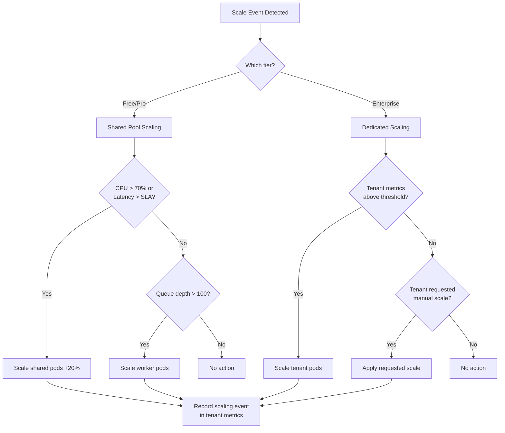

# Scaling & Performance

Scaling multi-tenant khác với single-tenant vì phải **giữ fair resource distribution** giữa các tenant khi scale. Không thể scale cho 1 tenant mà ảnh hưởng đến tenant khác.

```
┌──────────────────────────────────────────────────────────────────┐
│              MULTI-TENANT SCALING STRATEGY                       │
│                                                                  │
│  Scale WHAT?          Scale HOW?        Scale WHEN?              │
│  ┌─────────────┐     ┌──────────────┐  ┌──────────────────┐      │
│  │ Compute     │     │ Horizontal   │  │ CPU > 70%        │      │
│  │ Database    │     │ (add pods)   │  │ Memory > 80%     │      │
│  │ Cache       │     │              │  │ Queue depth > N  │      │
│  │ Queue       │     │ Vertical     │  │ Latency > SLA    │      │
│  │ Storage     │     │ (bigger pods)│  │ Tenant request   │      │
│  └─────────────┘     └──────────────┘  └──────────────────┘      │
│                                                                  │
│  Scale FOR WHOM?                                                 │
│  ├── Platform-wide: scale shared infrastructure                  │
│  ├── Per-tier: different scaling for Free/Pro/Enterprise         │
│  └── Per-tenant: dedicated scaling for Enterprise (silo)         │
└──────────────────────────────────────────────────────────────────┘
```

## Horizontal vs Vertical Scaling per Tenant

#### Scaling Strategies theo Tier

```
┌──────────────────────────────────────────────────────────────────┐
│              SCALING PER TIER                                    │
│                                                                  │
│  FREE TIER (Pool — shared everything):                           │
│  ┌───────────────────────────────────────────┐                   │
│  │  Compute: shared pods, NO dedicated scale │                   │
│  │  DB: shared instance, scale vertically    │                   │
│  │  Cache: shared Redis, scale cluster       │                   │
│  │  Strategy: scale platform when total load │                   │
│  │  increases → all free tenants benefit     │                   │
│  └───────────────────────────────────────────┘                   │
│                                                                  │
│  PRO TIER (Pool — priority scaling):                             │
│  ┌───────────────────────────────────────────┐                   │
│  │  Compute: shared pods with priority class │                   │
│  │  DB: shared instance, read replicas       │                   │
│  │  Cache: dedicated Redis DB number         │                   │
│  │  Strategy: HPA scales based on Pro-tier   │                   │
│  │  metrics, preempts Free resources         │                   │
│  └───────────────────────────────────────────┘                   │
│                                                                  │
│  ENTERPRISE TIER (Silo — independent scaling):                   │
│  ┌───────────────────────────────────────────┐                   │
│  │  Compute: dedicated namespace + pods      │                   │
│  │  DB: dedicated RDS, scale independently   │                   │
│  │  Cache: dedicated Redis cluster           │                   │
│  │  Strategy: per-tenant HPA + VPA           │                   │
│  │  tenant can request custom scaling        │                   │
│  └───────────────────────────────────────────┘                   │
└──────────────────────────────────────────────────────────────────┘
```

#### Kubernetes HPA — Tenant-aware Scaling

```yaml
# Shared pool HPA — scale based on aggregate tenant metrics
apiVersion: autoscaling/v2
kind: HorizontalPodAutoscaler
metadata:
  name: order-service-hpa
  namespace: shared-pool
spec:
  scaleTargetRef:
    apiVersion: apps/v1
    kind: Deployment
    name: order-service
  minReplicas: 3
  maxReplicas: 50
  metrics:
    # Scale on CPU
    - type: Resource
      resource:
        name: cpu
        target:
          type: Utilization
          averageUtilization: 70
    # Scale on custom metric: request rate
    - type: Pods
      pods:
        metric:
          name: http_requests_per_second
        target:
          type: AverageValue
          averageValue: "200"
    # Scale on queue depth
    - type: External
      external:
        metric:
          name: sqs_queue_depth
          selector:
            matchLabels:
              queue: order-processing
        target:
          type: Value
          value: "100"
  behavior:
    scaleUp:
      stabilizationWindowSeconds: 60
      policies:
        - type: Percent
          value: 50
          periodSeconds: 60
    scaleDown:
      stabilizationWindowSeconds: 300
      policies:
        - type: Percent
          value: 10
          periodSeconds: 120

---
# Enterprise tenant — dedicated HPA
apiVersion: autoscaling/v2
kind: HorizontalPodAutoscaler
metadata:
  name: order-service-hpa-acme
  namespace: tenant-acme  # dedicated namespace
spec:
  scaleTargetRef:
    apiVersion: apps/v1
    kind: Deployment
    name: order-service
  minReplicas: 2
  maxReplicas: 20
  metrics:
    - type: Resource
      resource:
        name: cpu
        target:
          type: Utilization
          averageUtilization: 60  # Lower threshold for premium
```

#### Pod Priority — Tier-based Preemption

```yaml
# Priority Classes
apiVersion: scheduling.k8s.io/v1
kind: PriorityClass
metadata:
  name: enterprise-priority
value: 1000
globalDefault: false
description: "Enterprise tenant pods — highest priority"

---
apiVersion: scheduling.k8s.io/v1
kind: PriorityClass
metadata:
  name: pro-priority
value: 500
description: "Pro tenant pods — medium priority"

---
apiVersion: scheduling.k8s.io/v1
kind: PriorityClass
metadata:
  name: free-priority
value: 100
description: "Free tenant pods — lowest priority (preemptible)"

---
# Enterprise deployment uses high priority
apiVersion: apps/v1
kind: Deployment
metadata:
  name: order-service
  namespace: tenant-acme
spec:
  template:
    spec:
      priorityClassName: enterprise-priority
      containers:
        - name: order-service
          resources:
            requests:
              cpu: "500m"
              memory: "512Mi"
            limits:
              cpu: "2000m"
              memory: "2Gi"
```

## Caching Strategies

Multi-tenant caching phải giải quyết 3 vấn đề: **isolation** (tenant A không đọc cache tenant B), **fairness** (1 tenant không chiếm hết cache), và **invalidation** (config change → clear đúng tenant).

#### Multi-Layer Cache Architecture

```
┌──────────────────────────────────────────────────────────────────┐
│              MULTI-LAYER CACHE                                   │
│                                                                  │
│  Layer 1: In-Process (Caffeine) — per pod                        │
│  ┌──────────────────────────────────────────────────────────┐    │
│  │  TTL: 30s–5min | Max: 1000 entries per tenant            │    │
│  │  Key: tenant:{tid}:{entity}:{id}                         │    │
│  │  Use: hot path data, avoid Redis roundtrip               │    │
│  └──────────────────────────────────────────────────────────┘    │
│                      ▼ miss                                      │
│  Layer 2: Distributed (Redis) — shared or dedicated              │
│  ┌──────────────────────────────────────────────────────────┐    │
│  │  TTL: 5min–1hr | Max: per-tenant memory quota            │    │
│  │  Key: tenant:{tid}:{service}:{entity}:{id}               │    │
│  │  Use: cross-pod shared state, sessions, configs          │    │
│  └──────────────────────────────────────────────────────────┘    │
│                      ▼ miss                                      │
│  Layer 3: Database                                               │
│  ┌──────────────────────────────────────────────────────────┐    │
│  │  Source of truth, always filtered by tenant_id           │    │
│  └──────────────────────────────────────────────────────────┘    │
└──────────────────────────────────────────────────────────────────┘
```

#### Implementation — Tenant-aware Caffeine Cache

```java
@Configuration
public class TenantCacheConfig {

    /**
     * Per-tenant Caffeine cache with size limits
     */
    @Bean
    public CacheManager tenantCacheManager() {
        CaffeineCacheManager manager = new CaffeineCacheManager();
        manager.setCaffeine(Caffeine.newBuilder()
            .maximumSize(10_000)       // Global max entries
            .expireAfterWrite(5, TimeUnit.MINUTES)
            .recordStats());           // Enable metrics
        return manager;
    }
}

/**
 * Tenant-scoped cache with per-tenant eviction
 */
@Service
public class TenantCacheService {

    private final RedisTemplate<String, Object> redis;

    /**
     * Get from cache — tenant-scoped key
     */
    public <T> Optional<T> get(String tenantId, String key,
                                 Class<T> type) {
        String cacheKey = buildKey(tenantId, key);
        Object value = redis.opsForValue().get(cacheKey);
        return Optional.ofNullable(type.cast(value));
    }

    /**
     * Put with TTL — respects per-tenant memory quota
     */
    public void put(String tenantId, String key,
                     Object value, Duration ttl) {
        // Check tenant cache quota
        long currentUsage = getCurrentCacheUsage(tenantId);
        long quota = getCacheQuota(tenantId);

        if (currentUsage >= quota) {
            // Evict least recently used entries for this tenant
            evictLRU(tenantId, 100);
        }

        String cacheKey = buildKey(tenantId, key);
        redis.opsForValue().set(cacheKey, value, ttl);

        // Track tenant cache usage
        redis.opsForSet().add("cache:keys:" + tenantId, cacheKey);
    }

    /**
     * Invalidate ALL cache for a specific tenant
     * (ví dụ: khi tenant change config, upgrade tier)
     */
    public void invalidateAll(String tenantId) {
        Set<Object> keys = redis.opsForSet()
            .members("cache:keys:" + tenantId);

        if (keys != null && !keys.isEmpty()) {
            redis.delete(keys.stream()
                .map(Object::toString)
                .collect(Collectors.toList()));
            redis.delete("cache:keys:" + tenantId);
        }

        log.info("Invalidated all cache for tenant: {} ({} keys)",
            tenantId, keys != null ? keys.size() : 0);
    }

    private String buildKey(String tenantId, String key) {
        return "tenant:" + tenantId + ":" + key;
    }

    private long getCacheQuota(String tenantId) {
        String tier = tenantService.getTier(tenantId);
        return switch (tier) {
            case "free"       -> 1_000;    // 1K keys
            case "pro"        -> 10_000;   // 10K keys
            case "enterprise" -> 100_000;  // 100K keys
            default           -> 1_000;
        };
    }
}
```

#### Cache Invalidation Strategy

| Event | Invalidation Scope | Method |
|-------|-------------------|--------|
| Entity update | Single key | Delete specific key |
| Tenant config change | All tenant cache | `invalidateAll(tenantId)` |
| Tier upgrade | All tenant cache | `invalidateAll(tenantId)` |
| Schema migration | All tenants, specific entity | Pattern delete `tenant:*:orders:*` |
| Deployment (new version) | All cache | Full flush |
| Feature flag toggle | Tenant feature cache | Delete feature keys |

## Connection Pooling

Database connections là **tài nguyên hữu hạn** — multi-tenant phải chia sẻ connection pool có kỷ luật.

#### Connection Pool Strategy per Tier

```
┌──────────────────────────────────────────────────────────────────┐
│              CONNECTION POOL ARCHITECTURE                        │
│                                                                  │
│  Pool Model (Free + Pro):                                        │
│  ┌─────────────────────────────────────────────────────────┐     │
│  │  Shared HikariCP Pool                                   │     │
│  │  ├── Max total: 100 connections                         │     │
│  │  ├── Per-tenant limit: 10 (Free), 30 (Pro)              │     │
│  │  ├── Timeout: 5s (Free), 10s (Pro)                      │     │
│  │  └── Semaphore enforced per tenant                      │     │
│  └─────────────────────────────────────────────────────────┘     │
│                                                                  │
│  Silo Model (Enterprise):                                        │
│  ┌─────────────────────────────────────────────────────────┐     │
│  │  Dedicated HikariCP Pool                                │     │
│  │  ├── Max: 50 connections (dedicated DB)                 │     │
│  │  ├── No sharing with other tenants                      │     │
│  │  ├── Timeout: 30s                                       │     │
│  │  └── Independent scaling                                │     │
│  └─────────────────────────────────────────────────────────┘     │
└──────────────────────────────────────────────────────────────────┘
```

#### Implementation — Per-Tenant Connection Limiter

```java
/**
 * Tenant-aware connection pool wrapper
 * Giới hạn số connection mà mỗi tenant có thể sử dụng
 */
@Component
public class TenantConnectionPool {

    private final HikariDataSource sharedPool;
    private final Map<String, HikariDataSource> dedicatedPools;

    // Semaphore per tenant to limit concurrent connections
    private final LoadingCache<String, Semaphore> tenantSemaphores;

    public TenantConnectionPool(HikariDataSource sharedPool) {
        this.sharedPool = sharedPool;
        this.dedicatedPools = new ConcurrentHashMap<>();
        this.tenantSemaphores = CacheBuilder.newBuilder()
            .build(CacheLoader.from(this::createSemaphore));
    }

    /**
     * Get connection — scoped and limited per tenant
     */
    public Connection getConnection(String tenantId) throws SQLException {
        String tier = tenantService.getTier(tenantId);

        if ("enterprise".equals(tier)) {
            // Silo: dedicated pool
            return getDedicatedPool(tenantId).getConnection();
        }

        // Pool: shared pool with per-tenant limit
        Semaphore semaphore = tenantSemaphores.get(tenantId);
        boolean acquired = semaphore.tryAcquire(
            getTimeout(tier), TimeUnit.SECONDS);

        if (!acquired) {
            throw new TenantConnectionLimitException(
                "Connection pool exhausted for tenant: " + tenantId +
                ". Max: " + getMaxConnections(tier));
        }

        try {
            Connection conn = sharedPool.getConnection();
            // Set tenant context on connection
            conn.createStatement().execute(
                "SET app.current_tenant = '" + tenantId + "'");
            return new TenantAwareConnection(conn, semaphore);
        } catch (SQLException e) {
            semaphore.release(); // Release on failure
            throw e;
        }
    }

    private Semaphore createSemaphore(String tenantId) {
        String tier = tenantService.getTier(tenantId);
        int maxConnections = getMaxConnections(tier);
        return new Semaphore(maxConnections);
    }

    private int getMaxConnections(String tier) {
        return switch (tier) {
            case "free"       -> 5;
            case "pro"        -> 15;
            case "enterprise" -> 50;
            default           -> 5;
        };
    }

    private long getTimeout(String tier) {
        return switch (tier) {
            case "free"       -> 3;   // seconds
            case "pro"        -> 10;
            case "enterprise" -> 30;
            default           -> 3;
        };
    }
}

/**
 * Connection wrapper — auto-release semaphore on close
 */
public class TenantAwareConnection implements Connection {
    private final Connection delegate;
    private final Semaphore semaphore;

    @Override
    public void close() throws SQLException {
        try {
            delegate.close();
        } finally {
            semaphore.release(); // Always release permit
        }
    }

    // Delegate all other methods to underlying connection...
}
```

#### HikariCP Configuration — Per Model

```yaml
# Shared pool (Free + Pro tenants)
spring:
  datasource:
    hikari:
      pool-name: shared-pool
      maximum-pool-size: 100
      minimum-idle: 20
      idle-timeout: 300000       # 5 minutes
      max-lifetime: 1800000      # 30 minutes
      connection-timeout: 10000  # 10 seconds
      leak-detection-threshold: 60000  # 60 seconds
      connection-test-query: SELECT 1

# Dedicated pool (Enterprise tenant — created dynamically)
tenant:
  dedicated-pool:
    maximum-pool-size: 50
    minimum-idle: 5
    idle-timeout: 600000
    max-lifetime: 3600000
    connection-timeout: 30000
```

| Metric | Free | Pro | Enterprise |
|--------|------|-----|-----------|
| **Max connections** | 5 | 15 | 50 (dedicated) |
| **Connection timeout** | 3s | 10s | 30s |
| **Query timeout** | 5s | 15s | 60s |
| **Idle timeout** | 1 min | 5 min | 10 min |
| **Pool type** | Shared | Shared | Dedicated |

## Tenant-aware Auto Scaling

Auto scaling phải **phản ứng thông minh** — scale shared infrastructure cho overall load, scale dedicated resources cho per-tenant load.

#### KEDA — Event-Driven Autoscaling per Tenant

```yaml
# KEDA ScaledObject — scale worker pods based on
# per-tenant SQS queue depth
apiVersion: keda.sh/v1alpha1
kind: ScaledObject
metadata:
  name: order-processor-scaler
  namespace: shared-pool
spec:
  scaleTargetRef:
    name: order-processor
  pollingInterval: 15
  cooldownPeriod: 60
  minReplicaCount: 2
  maxReplicaCount: 30
  triggers:
    # Scale on SQS queue depth
    - type: aws-sqs-queue
      metadata:
        queueURL: https://sqs.ap-southeast-1.amazonaws.com/123/orders
        queueLength: "20"
        awsRegion: ap-southeast-1
    # Scale on Prometheus metric: pending orders per tenant
    - type: prometheus
      metadata:
        serverAddress: http://prometheus:9090
        metricName: tenant_pending_orders
        query: |
          sum(tenant_pending_orders{namespace="shared-pool"})
        threshold: "50"

---
# Enterprise tenant — dedicated KEDA scaler
apiVersion: keda.sh/v1alpha1
kind: ScaledObject
metadata:
  name: order-processor-scaler-acme
  namespace: tenant-acme
spec:
  scaleTargetRef:
    name: order-processor
  minReplicaCount: 1
  maxReplicaCount: 10
  triggers:
    - type: prometheus
      metadata:
        serverAddress: http://prometheus:9090
        metricName: tenant_acme_pending_orders
        query: |
          tenant_pending_orders{tenant_id="acme"}
        threshold: "10"  # Lower threshold for premium
```

#### Scaling Decision Tree



#### Tổng kết — Scaling & Performance Checklist

```
✅ SCALING & PERFORMANCE CHECKLIST

Horizontal Scaling:
├── ✅ Tier-based HPA: shared (pool) + dedicated (silo)
├── ✅ Pod priority classes: Enterprise > Pro > Free
├── ✅ Preemption: Free pods evicted when resources scarce
└── ✅ Custom metrics scaling (request rate, queue depth)

Caching:
├── ✅ Multi-layer: Caffeine (L1) → Redis (L2) → DB (L3)
├── ✅ Tenant-scoped cache keys: tenant:{tid}:{entity}:{id}
├── ✅ Per-tenant cache quota (1K/10K/100K keys)
├── ✅ Invalidation strategy per event type
└── ✅ Cache isolation: no cross-tenant data leaks

Connection Pooling:
├── ✅ Shared pool with per-tenant semaphore limits
├── ✅ Dedicated pool for Enterprise tenants
├── ✅ Configurable timeout/max per tier
├── ✅ Auto-release on connection close
└── ✅ Leak detection enabled

Auto Scaling:
├── ✅ KEDA: event-driven scaling (SQS, Prometheus)
├── ✅ Per-tenant KEDA scalers for Enterprise
├── ✅ Scaling decision tree: tier-aware
└── ✅ Scale events recorded in tenant metrics
```

---

---

## Đọc thêm

- [Data Partitioning Strategies](./03-data-partitioning.md) — Database sharding patterns
- [Noisy Neighbor Problem](./07-noisy-neighbor.md) — Rate limiting, resource quotas
- [Compute & Infrastructure Isolation](./06-compute-isolation.md) — Kubernetes scaling per tier
