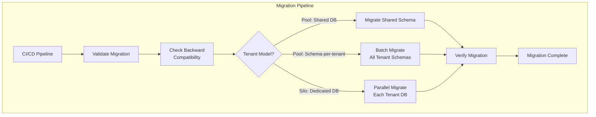
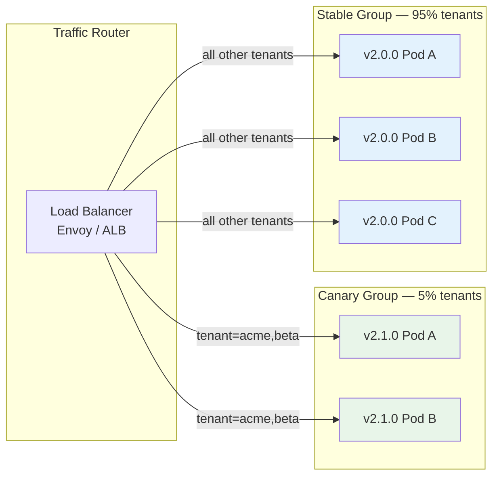
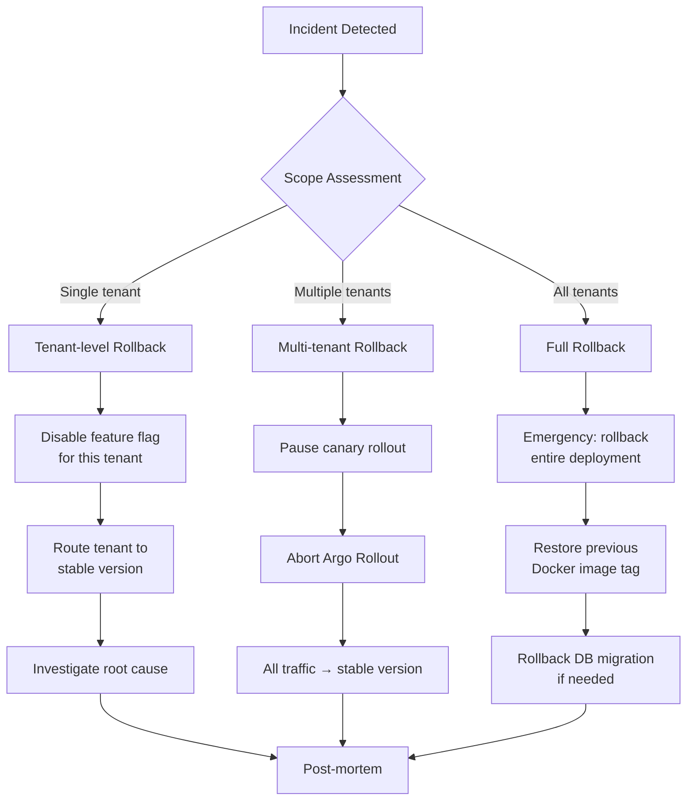

# CI/CD & Deployment

CI/CD cho multi-tenant phải đảm bảo **deployment an toàn** — một lỗi deploy có thể ảnh hưởng tất cả tenant. Strategy: **progressive rollout** — deploy từng nhóm tenant, không deploy tất cả cùng lúc.

```
┌──────────────────────────────────────────────────────────────────┐
│              MULTI-TENANT DEPLOYMENT STRATEGY                    │
│                                                                  │
│  ① Schema Migration    ② Feature Flags    ③ Canary Deploy      │
│  ┌──────────────┐     ┌──────────────┐   ┌──────────────┐        │
│  │ Flyway per   │     │ Toggle per   │   │ 5% tenants   │        │
│  │ tenant schema│     │ tenant/tier  │   │ → 25% → 100% │        │
│  │ + backward   │     │ + gradual    │   │ + auto rollbk│        │
│  │   compatible │     │   enable     │   │   on error   │        │
│  └──────────────┘     └──────────────┘   └──────────────┘        │
│                                                                  │
│  Key Principle:                                                  │
│  "Deploy code first, enable feature later"                       │
│  → Separate deployment from feature activation                   │
│  → Gives control over which tenants see new features             │
└──────────────────────────────────────────────────────────────────┘
```

## Schema Migration cho Multi-Tenant

Schema migration cho multi-tenant phải xử lý **hàng trăm schemas** đồng thời mà **không downtime**.

#### Migration Architecture



#### Flyway — Multi-Tenant Schema Migration

```java
@Service
public class MultiTenantMigrationService {

    private final TenantRepository tenantRepo;
    private final DataSourceProvider dataSourceProvider;

    /**
     * Run migrations for ALL tenants
     * Strategy: parallel execution with error isolation
     */
    public MigrationReport migrateAll() {
        List<Tenant> tenants = tenantRepo.findAllActive();
        List<MigrationResult> results = new CopyOnWriteArrayList<>();

        // Parallel migration (max 10 concurrent)
        ExecutorService executor = Executors.newFixedThreadPool(10);

        List<CompletableFuture<Void>> futures = tenants.stream()
            .map(tenant -> CompletableFuture.runAsync(() -> {
                try {
                    MigrationResult result = migrateTenant(tenant);
                    results.add(result);
                } catch (Exception e) {
                    log.error("Migration failed for tenant: {}",
                        tenant.getId(), e);
                    results.add(MigrationResult.failure(
                        tenant.getId(), e.getMessage()));
                }
            }, executor))
            .toList();

        // Wait for all migrations
        CompletableFuture.allOf(
            futures.toArray(new CompletableFuture[0])).join();

        executor.shutdown();

        return new MigrationReport(results);
    }

    /**
     * Migrate single tenant schema
     */
    private MigrationResult migrateTenant(Tenant tenant) {
        DataSource ds = dataSourceProvider.getDataSource(tenant);
        String schema = getSchema(tenant);

        Flyway flyway = Flyway.configure()
            .dataSource(ds)
            .schemas(schema)
            .locations("classpath:db/migration/tenant")
            .baselineOnMigrate(true)
            .outOfOrder(false)
            .validateOnMigrate(true)
            .table("flyway_schema_history_" + tenant.getId())
            .build();

        MigrateResult result = flyway.migrate();

        log.info("Migrated tenant '{}': {} migrations applied",
            tenant.getId(), result.migrationsExecuted);

        return MigrationResult.success(
            tenant.getId(), result.migrationsExecuted);
    }
}
```

#### Backward-Compatible Migration Rules

```
┌──────────────────────────────────────────────────────────────────┐
│  BACKWARD-COMPATIBLE MIGRATION RULES                             │
│                                                                  │
│  ✅ SAFE (backward compatible):                                  │
│  ├── ADD column (with default or nullable)                       │
│  ├── ADD index                                                   │
│  ├── ADD table                                                   │
│  ├── RENAME column (with alias/view for old code)                │
│  └── ADD constraint (as NOT VALID, then validate async)          │
│                                                                  │
│  ❌ UNSAFE (NOT backward compatible):                            │
│  ├── DROP column → old code still references it                  │
│  ├── DROP table → old code still queries it                      │
│  ├── RENAME column (without alias) → old code breaks             │
│  ├── Change column type → data conversion may fail               │
│  └── ADD NOT NULL without default → inserts fail                 │
│                                                                  │
│  Strategy for UNSAFE changes — 3-phase approach:                 │
│  Phase 1: Deploy code that handles both old + new schema         │
│  Phase 2: Run migration (add new, keep old)                      │
│  Phase 3: Deploy code that uses only new schema                  │
│  Phase 4: Cleanup migration — remove old column/table            │
└──────────────────────────────────────────────────────────────────┘
```

#### Migration CI Pipeline

```yaml
# .github/workflows/migration.yml
name: Schema Migration

on:
  push:
    paths:
      - 'src/main/resources/db/migration/**'

jobs:
  validate:
    runs-on: ubuntu-latest
    steps:
      - uses: actions/checkout@v4

      # Validate migration SQL syntax
      - name: Validate migrations
        run: |
          flyway -url=jdbc:postgresql://localhost/test \
                 -schemas=test_schema \
                 validate

      # Check backward compatibility
      - name: Check backward compatibility
        run: |
          # Ensure no DROP COLUMN, DROP TABLE in migration
          for file in src/main/resources/db/migration/tenant/*.sql; do
            if grep -iE "DROP\s+(COLUMN|TABLE)" "$file"; then
              echo "❌ UNSAFE: $file contains DROP statement"
              echo "Use 3-phase migration approach instead"
              exit 1
            fi
          done
          echo "✅ All migrations are backward compatible"

      # Dry-run against staging
      - name: Dry-run migration
        run: |
          flyway -url=$STAGING_DB_URL \
                 -schemas=migration_test \
                 -dryRunOutput=dryrun.sql \
                 migrate
```

## Feature Flags per Tenant

Feature flags cho phép **deploy code trước, enable feature sau** — kiểm soát từng tenant/tier thấy feature mới khi nào.

#### Feature Flag Architecture

```
┌──────────────────────────────────────────────────────────────────┐
│              FEATURE FLAG LIFECYCLE                              │
│                                                                  │
│  Step 1: Code deployed (feature behind flag)                     │
│  Step 2: Enable for internal testing tenant                      │
│  Step 3: Enable for beta tenants (5%)                            │
│  Step 4: Enable for Pro tier (25%)                               │
│  Step 5: Enable for ALL tenants (100%)                           │
│  Step 6: Remove flag, feature is permanent                       │
│                                                                  │
│  ┌─────┐  ┌─────────┐  ┌──────┐  ┌──────┐  ┌─────┐  ┌──────┐     │
│  │CODED│→ │INTERNAL │→ │ BETA │→ │ PRO  │→ │ ALL │→ │PERM. │     │
│  │     │  │ ONLY    │  │  5%  │  │ 25%  │  │100% │  │      │     │
│  └─────┘  └─────────┘  └──────┘  └──────┘  └─────┘  └──────┘     │
│                                                                  │
│  Duration per step: 1-7 days (depending on risk)                 │
└──────────────────────────────────────────────────────────────────┘
```

#### Implementation — Feature Flag Service

```java
@Service
public class FeatureFlagService {

    private final FeatureFlagRepository flagRepo;
    private final LoadingCache<String, Map<String, FeatureFlag>> cache;

    /**
     * Check if feature is enabled for tenant
     */
    public boolean isEnabled(String tenantId, String featureName) {
        FeatureFlag flag = getFlag(featureName);
        if (flag == null) return false;

        return switch (flag.getStrategy()) {
            case GLOBAL_ON  -> true;
            case GLOBAL_OFF -> false;
            case TENANT_LIST -> flag.getEnabledTenants()
                                    .contains(tenantId);
            case TIER_BASED  -> flag.getEnabledTiers()
                                    .contains(getTier(tenantId));
            case PERCENTAGE  -> isInPercentage(tenantId,
                                    flag.getPercentage());
            case GRADUAL     -> isInGradualRollout(tenantId, flag);
        };
    }

    /**
     * Percentage-based rollout — deterministic per tenant
     */
    private boolean isInPercentage(String tenantId, int percentage) {
        // Deterministic hash → same tenant always gets same result
        int hash = Math.abs(tenantId.hashCode() % 100);
        return hash < percentage;
    }

    /**
     * Gradual rollout — increase percentage over time
     */
    private boolean isInGradualRollout(String tenantId,
                                         FeatureFlag flag) {
        Instant now = Instant.now();
        Duration elapsed = Duration.between(
            flag.getRolloutStartedAt(), now);
        Duration total = flag.getRolloutDuration();

        // Calculate current percentage based on elapsed time
        double progress = Math.min(1.0,
            (double) elapsed.toMillis() / total.toMillis());
        int currentPercentage = (int) (progress * 100);

        return isInPercentage(tenantId, currentPercentage);
    }
}

/**
 * Feature flag definition
 */
@Data @Builder
public class FeatureFlag {
    private String name;
    private String description;
    private RolloutStrategy strategy;
    private Set<String> enabledTenants;
    private Set<String> enabledTiers;
    private int percentage;
    private Instant rolloutStartedAt;
    private Duration rolloutDuration;
    private boolean killSwitch;  // emergency disable
}

// Usage in code
@Service
public class OrderService {

    public Order createOrder(CreateOrderRequest request) {
        String tenantId = TenantContextHolder.getTenantId();

        Order order = processOrder(request);

        // New feature behind flag
        if (featureFlags.isEnabled(tenantId, "async_notifications")) {
            notificationService.sendAsync(order);
        } else {
            notificationService.sendSync(order); // old behavior
        }

        return order;
    }
}
```

#### Feature Flag Admin API

```java
@RestController
@RequestMapping("/admin/features")
@PreAuthorize("hasRole('PLATFORM_ADMIN')")
public class FeatureFlagAdminController {

    /**
     * Enable feature for specific tenants
     */
    @PostMapping("/{name}/enable")
    public FeatureFlag enableForTenants(
            @PathVariable String name,
            @RequestBody EnableRequest request) {
        return flagService.enableForTenants(
            name, request.getTenantIds());
    }

    /**
     * Start gradual rollout
     */
    @PostMapping("/{name}/rollout")
    public FeatureFlag startRollout(
            @PathVariable String name,
            @RequestBody RolloutRequest request) {
        return flagService.startGradualRollout(
            name,
            request.getStartPercentage(),
            request.getDuration());
    }

    /**
     * Emergency kill switch
     */
    @PostMapping("/{name}/kill")
    public FeatureFlag killSwitch(@PathVariable String name) {
        log.warn("KILL SWITCH activated for feature: {}", name);
        return flagService.disableAll(name);
    }
}

## Canary Deployment per Tenant

Canary deployment trong multi-tenant cho phép **deploy phiên bản mới cho 1 nhóm tenant trước**, monitor, rồi mới mở rộng.

#### Canary Strategy — Tenant-based Traffic Routing



#### Argo Rollouts — Tenant-based Canary

```yaml
apiVersion: argoproj.io/v1alpha1
kind: Rollout
metadata:
  name: order-service
  namespace: shared-pool
spec:
  replicas: 10
  strategy:
    canary:
      # Step 1: Route canary tenants to new version
      canaryService: order-service-canary
      stableService: order-service-stable
      trafficRouting:
        istio:
          virtualService:
            name: order-service-vs
            routes:
              - primary
      steps:
        # Phase 1: Internal testing (2 tenants)
        - setCanaryScale:
            replicas: 2
        - setHeaderRoute:
            name: canary-tenants
            match:
              - headerName: X-Tenant-ID
                headerValue:
                  exact: "internal-test"
        - pause:
            duration: 1h

        # Phase 2: Beta tenants (5%)
        - setWeight: 5
        - pause:
            duration: 6h

        # Phase 3: Analysis gate — auto check metrics
        - analysis:
            templates:
              - templateName: canary-analysis
            args:
              - name: service
                value: order-service

        # Phase 4: Pro tenants (25%)
        - setWeight: 25
        - pause:
            duration: 12h

        # Phase 5: Analysis gate again
        - analysis:
            templates:
              - templateName: canary-analysis

        # Phase 6: All tenants (100%)
        - setWeight: 100

---
# Auto analysis — compare canary vs stable metrics
apiVersion: argoproj.io/v1alpha1
kind: AnalysisTemplate
metadata:
  name: canary-analysis
spec:
  metrics:
    # Error rate must be < 1%
    - name: error-rate
      interval: 2m
      failureLimit: 3
      provider:
        prometheus:
          address: http://prometheus:9090
          query: |
            sum(rate(http_server_requests_total{
              status=~"5..",
              rollouts_pod_template_hash="{{args.canary-hash}}"
            }[5m])) /
            sum(rate(http_server_requests_total{
              rollouts_pod_template_hash="{{args.canary-hash}}"
            }[5m]))
      successCondition: result[0] < 0.01

    # P99 latency must be < 3 seconds
    - name: latency-p99
      interval: 2m
      failureLimit: 3
      provider:
        prometheus:
          address: http://prometheus:9090
          query: |
            histogram_quantile(0.99,
              sum by (le) (rate(http_server_requests_duration_seconds_bucket{
                rollouts_pod_template_hash="{{args.canary-hash}}"
              }[5m])))
      successCondition: result[0] < 3.0
```

#### Istio VirtualService — Tenant-based Routing

```yaml
apiVersion: networking.istio.io/v1
kind: VirtualService
metadata:
  name: order-service-vs
spec:
  hosts:
    - order-service
  http:
    # Route canary tenants to new version
    - match:
        - headers:
            x-tenant-id:
              regex: "^(internal-test|beta-.*)$"
      route:
        - destination:
            host: order-service-canary
          weight: 100

    # All other tenants → stable version
    - route:
        - destination:
            host: order-service-stable
          weight: 95
        - destination:
            host: order-service-canary
          weight: 5  # 5% random tenants
```

## Rollback Strategies

Rollback trong multi-tenant phải **nhanh và chính xác** — chỉ rollback affected tenant, không ảnh hưởng tenant khác.

#### Rollback Decision Tree



#### Implementation — Multi-Level Rollback

```java
@Service
public class RollbackService {

    /**
     * Level 1: Feature-level rollback (safest, fastest)
     * Disable feature flag → old behavior immediately
     */
    public void rollbackFeature(String featureName,
                                  @Nullable String tenantId) {
        if (tenantId != null) {
            // Rollback for single tenant
            featureFlagService.disableForTenant(featureName, tenantId);
            log.warn("Feature '{}' disabled for tenant '{}'",
                featureName, tenantId);
        } else {
            // Rollback for all tenants (kill switch)
            featureFlagService.disableAll(featureName);
            log.warn("KILL SWITCH: Feature '{}' disabled globally",
                featureName);
        }

        // Clear cache to apply immediately
        cacheService.invalidateFeatureFlags();
    }

    /**
     * Level 2: Canary rollback
     * Abort Argo Rollout → revert to stable version
     */
    public void rollbackCanary(String serviceName) {
        // Abort Argo Rollout
        kubeClient.argoRollouts()
            .inNamespace("shared-pool")
            .withName(serviceName)
            .abort();

        log.warn("Canary rollback: {} reverted to stable",
            serviceName);

        // Record incident
        incidentService.create(IncidentRequest.builder()
            .severity(Severity.HIGH)
            .title("Canary rollback: " + serviceName)
            .description("Auto rollback triggered by analysis failure")
            .build());
    }

    /**
     * Level 3: Full deployment rollback
     * Revert to previous version
     */
    public void rollbackDeployment(String serviceName,
                                     String previousVersion) {
        // Update deployment image
        kubeClient.apps().deployments()
            .inNamespace("shared-pool")
            .withName(serviceName)
            .edit(d -> {
                d.getSpec().getTemplate().getSpec()
                    .getContainers().get(0)
                    .setImage("registry/" + serviceName
                        + ":" + previousVersion);
                return d;
            });

        // Wait for rollout
        kubeClient.apps().deployments()
            .inNamespace("shared-pool")
            .withName(serviceName)
            .waitUntilReady(5, TimeUnit.MINUTES);

        log.warn("FULL ROLLBACK: {} reverted to version {}",
            serviceName, previousVersion);
    }

    /**
     * Level 4: Database migration rollback (most dangerous)
     * Only if migration was backward-compatible
     */
    public void rollbackMigration(String tenantId,
                                    String targetVersion) {
        Flyway flyway = createFlyway(tenantId);

        // Undo migration (Flyway Teams feature)
        flyway.undo();

        log.warn("DB migration rollback for tenant '{}' to v{}",
            tenantId, targetVersion);
    }
}
```

#### Automated Rollback Triggers

```yaml
# prometheus-alerts.yml
groups:
  - name: deployment_rollback
    rules:
      # Auto rollback if error rate spikes after deployment
      - alert: AutoRollbackTrigger
        expr: |
          (
            sum(rate(http_server_requests_total{status=~"5.."}[5m]))
            / sum(rate(http_server_requests_total[5m]))
          ) > 0.05
          and
          changes(kube_deployment_status_observed_generation[10m]) > 0
        for: 3m
        labels:
          severity: critical
          action: auto_rollback
        annotations:
          summary: "Error rate > 5% after deployment — auto rollback"
          runbook: "https://wiki/runbooks/auto-rollback"

      # Alert if canary performs worse than stable
      - alert: CanaryDegraded
        expr: |
          (
            histogram_quantile(0.99,
              sum by (le) (rate(http_server_requests_duration_seconds_bucket{
                version="canary"}[5m])))
            /
            histogram_quantile(0.99,
              sum by (le) (rate(http_server_requests_duration_seconds_bucket{
                version="stable"}[5m])))
          ) > 1.5
        for: 5m
        labels:
          severity: warning
        annotations:
          summary: "Canary P99 latency 50% worse than stable"
```

#### Tổng kết — CI/CD & Deployment Checklist

```
✅ CI/CD & DEPLOYMENT CHECKLIST

Schema Migration:
├── ✅ Flyway per-tenant parallel migration
├── ✅ Backward-compatible migration rules
├── ✅ 3-phase approach for unsafe changes
├── ✅ CI validation: syntax + compatibility + dry-run
└── ✅ Error isolation: one tenant failure ≠ all fail

Feature Flags:
├── ✅ Per-tenant, per-tier, percentage-based strategies
├── ✅ Gradual rollout with time-based progression
├── ✅ Kill switch for emergency disable
├── ✅ Admin API for enable/rollout/kill
└── ✅ Deterministic hash for consistent rollout

Canary Deployment:
├── ✅ Tenant-based traffic routing (Istio VirtualService)
├── ✅ Argo Rollouts with progressive steps
├── ✅ Auto analysis gates (error rate, latency)
├── ✅ 5-phase rollout: internal → beta → 25% → 100%
└── ✅ Auto pause/rollback on metric degradation

Rollback:
├── ✅ Level 1: Feature flag disable (instant)
├── ✅ Level 2: Canary abort (seconds)
├── ✅ Level 3: Full deployment rollback (minutes)
├── ✅ Level 4: DB migration undo (manual, careful)
└── ✅ Automated rollback triggers (Prometheus alerts)
```

---

---

## Đọc thêm

- [Data Partitioning Strategies](./03-data-partitioning.md) — Schema migration per model
- [Tenant Lifecycle](./08-tenant-lifecycle.md) — Automated provisioning trong pipeline
- [Best Practices](./13-best-practices.md) — Tổng hợp best practices và anti-patterns
