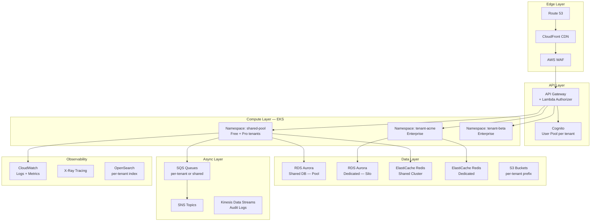

# Triển khai trên Cloud (AWS / Azure / GCP)

Mỗi cloud provider có các managed service riêng hỗ trợ multi-tenancy. Section này tập trung vào **mapping từ pattern → service** và best practice cho từng cloud.

```
┌─────────────────────────────────────────────────────────────────────┐
│              CLOUD PROVIDER COMPARISON                              │
│                                                                     │
│  Pattern          │ AWS              │ Azure           │ GCP        │
│  ─────────────────┼──────────────────┼─────────────────┼────────    │
│  Compute          │ EKS / ECS        │ AKS             │ GKE        │
│  API Gateway      │ API Gateway      │ API Mgmt        │ Apigee     │
│  Database (pool)  │ RDS (shared)     │ Azure SQL       │ Cloud SQL  │
│  Database (silo)  │ RDS (dedicated)  │ SQL Elastic Pool│ AlloyDB    │
│  Cache            │ ElastiCache      │ Azure Cache     │ Memorystore│
│  Queue            │ SQS / SNS        │ Service Bus     │ Pub/Sub    │
│  Identity         │ Cognito          │ Azure AD B2C    │ Identity   │
│  Secrets          │ Secrets Manager  │ Key Vault       │ Secret Mgr │
│  Encryption       │ KMS              │ Key Vault       │ Cloud KMS  │
│  Monitoring       │ CloudWatch       │ Monitor         │ Cloud Mon  │
│  Storage          │ S3               │ Blob Storage    │ GCS        │
│  CDN              │ CloudFront       │ Front Door      │ Cloud CDN  │
│  Service Mesh     │ App Mesh         │ Linkerd on AKS  │ Anthos     │
└─────────────────────────────────────────────────────────────────────┘
```

## AWS Multi-Tenant Patterns

AWS là cloud phổ biến nhất cho SaaS multi-tenant — có **SaaS Lens** trong Well-Architected Framework.

#### AWS Reference Architecture



#### Terraform — AWS Multi-Tenant Infrastructure

```hcl
# modules/tenant/main.tf
# Module tạo infrastructure cho 1 tenant

variable "tenant_id" { type = string }
variable "tier"      { type = string }  # free, pro, enterprise

# ── Cognito User Pool per Tenant ──
resource "aws_cognito_user_pool" "tenant" {
  name = "tenant-${var.tenant_id}"

  password_policy {
    minimum_length    = 12
    require_lowercase = true
    require_numbers   = true
    require_symbols   = true
  }

  schema {
    name                = "tenant_id"
    attribute_data_type = "String"
    mutable             = false
    string_attribute_constraints {
      max_length = 50
    }
  }

  tags = local.tags
}

# ── Database — conditional on tier ──
resource "aws_rds_cluster" "tenant_db" {
  count = var.tier == "enterprise" ? 1 : 0

  cluster_identifier = "db-${var.tenant_id}"
  engine             = "aurora-postgresql"
  engine_version     = "15.4"
  master_username    = "admin"
  master_password    = random_password.db.result

  db_subnet_group_name   = var.db_subnet_group
  vpc_security_group_ids = [var.db_security_group]

  deletion_protection = true
  storage_encrypted   = true
  kms_key_id          = aws_kms_key.tenant.arn

  tags = local.tags
}

# ── KMS Key per Tenant (Enterprise) ──
resource "aws_kms_key" "tenant" {
  count = var.tier == "enterprise" ? 1 : 0

  description = "CMK for tenant ${var.tenant_id}"
  key_usage   = "ENCRYPT_DECRYPT"

  policy = jsonencode({
    Version = "2012-10-17"
    Statement = [
      {
        Sid    = "AllowTenantAdmin"
        Effect = "Allow"
        Principal = { AWS = var.tenant_admin_role_arn }
        Action    = ["kms:Encrypt", "kms:Decrypt",
                     "kms:GenerateDataKey"]
        Resource  = "*"
      }
    ]
  })

  tags = local.tags
}

# ── S3 Bucket — per tenant prefix or dedicated ──
resource "aws_s3_bucket" "tenant" {
  count  = var.tier == "enterprise" ? 1 : 0
  bucket = "saas-${var.tenant_id}-data"

  tags = local.tags
}

# ── EKS Namespace (Enterprise) ──
resource "kubernetes_namespace" "tenant" {
  count = var.tier == "enterprise" ? 1 : 0

  metadata {
    name = "tenant-${var.tenant_id}"
    labels = {
      tenant_id = var.tenant_id
      tier      = var.tier
    }
  }
}

# ── Resource Quota per namespace ──
resource "kubernetes_resource_quota" "tenant" {
  count = var.tier == "enterprise" ? 1 : 0

  metadata {
    name      = "tenant-quota"
    namespace = kubernetes_namespace.tenant[0].metadata[0].name
  }

  spec {
    hard = {
      "requests.cpu"    = "4"
      "requests.memory" = "8Gi"
      "limits.cpu"      = "8"
      "limits.memory"   = "16Gi"
      "pods"            = "50"
    }
  }
}

locals {
  tags = {
    tenant_id   = var.tenant_id
    tier        = var.tier
    managed_by  = "terraform"
    environment = var.environment
  }
}
```

#### AWS SaaS Lens — Key Recommendations

| Pillar | Recommendation | Implementation |
|--------|---------------|----------------|
| **Security** | Tenant isolation at every layer | RLS + IAM policies + VPC |
| **Reliability** | Blast radius containment | Silo for Enterprise, throttling for Pool |
| **Performance** | Noisy neighbor protection | Per-tenant quotas + rate limiting |
| **Cost** | Cost attribution per tenant | AWS Cost Allocation Tags |
| **Operations** | Tenant-aware observability | CloudWatch dimensions + X-Ray |

## Azure Multi-Tenant Patterns

Azure có hỗ trợ multi-tenancy tốt qua **Azure AD B2C** và **Elastic Pools**.

#### Azure Reference Architecture

```
┌──────────────────────────────────────────────────────────────────┐
│              AZURE MULTI-TENANT ARCHITECTURE                     │
│                                                                  │
│  ┌──────────────────────────────────────────────────┐            │
│  │  Front Door (CDN + WAF + Global LB)              │            │
│  └─────────────────────┬────────────────────────────┘            │
│                        ▼                                         │
│  ┌──────────────────────────────────────────────────┐            │
│  │  Azure API Management                            │            │
│  │  ├── Rate limiting per tenant (subscription key) │            │
│  │  ├── JWT validation → tenant_id extraction       │            │
│  │  └── Routing: /tenant-a/* → backend-a            │            │
│  └─────────────────────┬────────────────────────────┘            │
│                        ▼                                         │
│  ┌──────────────────────────────────────────────────┐            │
│  │  AKS (Azure Kubernetes Service)                  │            │
│  │  ├── Namespace: shared-pool                      │            │
│  │  ├── Namespace: tenant-acme (dedicated)          │            │
│  │  └── Pod Identity → Azure AD Managed Identity    │            │
│  └─────────────────────┬────────────────────────────┘            │
│                        ▼                                         │
│  ┌─────────────────┐ ┌────────────────┐ ┌───────────────┐        │
│  │ Azure SQL       │ │ Azure Cache    │ │ Blob Storage  │        │
│  │ Elastic Pool    │ │ for Redis      │ │ per-tenant    │        │
│  │ (shared)        │ │ (shared/silo)  │ │ container     │        │
│  │                 │ │                │ │               │        │
│  │ + Dedicated DB  │ │                │ │               │        │
│  │ (enterprise)    │ │                │ │               │        │
│  └─────────────────┘ └────────────────┘ └───────────────┘        │
│                                                                  │
│  Identity: Azure AD B2C (tenant per org)                         │
│  Secrets: Azure Key Vault (per-tenant keys)                      │
│  Monitoring: Azure Monitor + App Insights                        │
│  Messaging: Azure Service Bus (per-tenant queues)                │
└──────────────────────────────────────────────────────────────────┘
```

#### Azure SQL Elastic Pool — Cost-Efficient Multi-Tenancy

```json
// Azure Resource Manager (ARM) template snippet
{
  "type": "Microsoft.Sql/servers/elasticPools",
  "name": "[concat(variables('sqlServerName'), '/tenant-pool')]",
  "properties": {
    "edition": "Standard",
    "dtu": 400,
    "databaseDtuMin": 0,
    "databaseDtuMax": 100,
    "storageMB": 512000
  }
}

// Per-tenant database IN the elastic pool
{
  "type": "Microsoft.Sql/servers/databases",
  "name": "[concat(variables('sqlServerName'), '/', parameters('tenantId'))]",
  "properties": {
    "elasticPoolId": "[resourceId('Microsoft.Sql/servers/elasticPools', variables('sqlServerName'), 'tenant-pool')]",
    "collation": "SQL_Latin1_General_CP1_CI_AS"
  }
}
```

> **Elastic Pool** = mỗi tenant có riêng database nhưng **chia sẻ DTU resources** trong pool → cost-efficient hơn dedicated DB cho mỗi tenant.

#### Azure vs AWS Key Differences

| Aspect | AWS | Azure |
|--------|-----|-------|
| **DB Multi-tenant** | RDS + RLS / Schema-per-tenant | SQL Elastic Pool (DB-per-tenant, shared resources) |
| **Identity** | Cognito User Pool | Azure AD B2C (more enterprise-ready) |
| **API Gateway** | API Gateway + Lambda Auth | API Management (built-in subscription keys) |
| **Encryption** | KMS (per-tenant CMK) | Key Vault (per-tenant vault or key) |
| **Isolation** | IAM policies + VPC | RBAC + Azure Policy + VNet |

## GCP Multi-Tenant Patterns

GCP mạnh về **data analytics** và **Kubernetes (GKE)** — phù hợp cho data-intensive multi-tenant.

#### GCP Reference Architecture

```
┌──────────────────────────────────────────────────────────────────┐
│              GCP MULTI-TENANT ARCHITECTURE                       │
│                                                                  │
│  ┌──────────────────────────────────────────────────┐            │
│  │  Cloud CDN + Cloud Armor (WAF)                   │            │
│  └─────────────────────┬────────────────────────────┘            │
│                        ▼                                         │
│  ┌──────────────────────────────────────────────────┐            │
│  │  Apigee API Platform                             │            │
│  │  ├── Developer portal per tenant                 │            │
│  │  ├── API key / OAuth per tenant                  │            │
│  │  └── Analytics per tenant                        │            │
│  └─────────────────────┬────────────────────────────┘            │
│                        ▼                                         │
│  ┌──────────────────────────────────────────────────┐            │
│  │  GKE (Google Kubernetes Engine)                  │            │
│  │  ├── Namespace per tenant (Enterprise)           │            │
│  │  ├── Workload Identity → GCP IAM                 │            │
│  │  └── Config Connector for IaC                    │            │
│  └─────────────────────┬────────────────────────────┘            │
│                        ▼                                         │
│  ┌─────────────────┐ ┌────────────────┐ ┌───────────────┐        │
│  │ Cloud SQL /     │ │ Memorystore    │ │ Cloud Storage │        │
│  │ AlloyDB /       │ │ (Redis)        │ │ per-tenant    │        │
│  │ Spanner         │ │                │ │ bucket/prefix │        │
│  │ (shared/silo)   │ │                │ │               │        │
│  └─────────────────┘ └────────────────┘ └───────────────┘        │
│                                                                  │
│  ┌────────────────────────┐  ┌──────────────────────────┐        │
│  │ BigQuery               │  │ Pub/Sub                  │        │
│  │ ├── Dataset per tenant │  │ ├── Topic per tenant     │        │
│  │ └── Analytics / BI     │  │ └── Subscription per svc │        │
│  └────────────────────────┘  └──────────────────────────┘        │
│                                                                  │
│  Identity: Identity Platform (Firebase Auth)                     │
│  Secrets: Secret Manager (per-tenant secrets)                    │
│  Monitoring: Cloud Monitoring + Cloud Trace                      │
└──────────────────────────────────────────────────────────────────┘
```

#### GCP — Cloud Spanner for Global Multi-Tenant

```sql
-- Spanner: globally distributed with tenant-level isolation
-- Interleaved tables for co-located tenant data

CREATE TABLE Tenants (
  tenant_id   STRING(36) NOT NULL,
  name        STRING(256),
  tier        STRING(20),
  region      STRING(50),
  created_at  TIMESTAMP NOT NULL
    OPTIONS (allow_commit_timestamp = true),
) PRIMARY KEY (tenant_id);

-- Orders interleaved with Tenants → co-located on same node
CREATE TABLE Orders (
  tenant_id   STRING(36) NOT NULL,
  order_id    STRING(36) NOT NULL,
  amount      FLOAT64,
  status      STRING(20),
  created_at  TIMESTAMP NOT NULL
    OPTIONS (allow_commit_timestamp = true),
) PRIMARY KEY (tenant_id, order_id),
  INTERLEAVE IN PARENT Tenants ON DELETE CASCADE;

-- Row-level access via Spanner Fine-Grained Access Control
GRANT SELECT ON TABLE Orders
  TO ROLE tenant_reader
  WHERE tenant_id = @current_tenant;
```

> **Spanner Interleaving** = data cùng tenant nằm trên cùng node → queries nhanh, no cross-node joins.

#### Cloud Provider Selection Guide

| Criteria | Best Choice | Why |
|----------|------------|-----|
| **Most SaaS features** | AWS | SaaS Lens, Cognito, extensive docs |
| **Enterprise identity** | Azure | Azure AD B2C, Entra ID integration |
| **Global database** | GCP | Spanner (global consistency) |
| **Cost-efficient DB** | Azure | Elastic Pools (shared DTU) |
| **Kubernetes native** | GCP | GKE Autopilot, Config Connector |
| **Analytics per tenant** | GCP | BigQuery dataset per tenant |
| **Compliance (gov)** | AWS | GovCloud, most certifications |
| **Hybrid cloud** | Azure | Arc, on-prem AD integration |

---

---

## Đọc thêm

- [CI/CD & Deployment](./12-cicd-deployment.md) — Pipeline, canary deployment
- [Compute & Infrastructure Isolation](./06-compute-isolation.md) — Kubernetes, serverless isolation
- [Security & Compliance](./09-security-compliance.md) — Cloud-specific compliance
