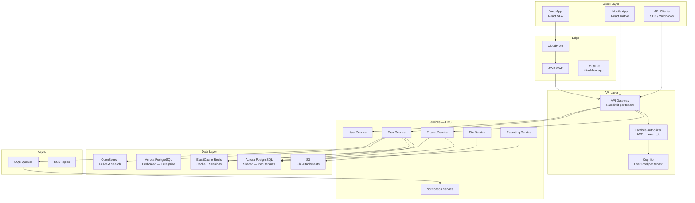

# Case Study: Thiết kế SaaS Multi-Tenant E2E

Thiết kế **TaskFlow** — một SaaS Project Management Platform (tương tự Jira/Asana) phục vụ hàng ngàn organization.

## Business Requirements

```
┌──────────────────────────────────────────────────────────────────┐
│  TASKFLOW — SaaS Project Management                              │
│                                                                  │
│  Target: 10,000 tenants, 500K users                              │
│  Tiers:                                                          │
│  ├── Free:       5 users, 3 projects, 1GB storage                │
│  ├── Pro ($29):  50 users, unlimited projects, 50GB              │
│  └── Enterprise: unlimited, custom domain, SSO, SLA 99.95%       │
│                                                                  │
│  Core Features:                                                  │
│  ├── Project boards (Kanban, Scrum)                              │
│  ├── Task management + assignments                               │
│  ├── Real-time collaboration (comments, mentions)                │
│  ├── File attachments                                            │
│  ├── Notifications (email, Slack, webhook)                       │
│  ├── Reporting & analytics per project                           │
│  └── REST API + Webhooks for integrations                        │
│                                                                  │
│  Compliance: GDPR (EU tenants), SOC2 (all)                       │
│  Regions: US (us-east-1), EU (eu-west-1), APAC (ap-southeast-1)  │
└──────────────────────────────────────────────────────────────────┘
```

## Architecture Decisions

| Decision | Choice | Rationale |
|----------|--------|-----------|
| **Tenant model** | Pool (Free/Pro) + Silo (Enterprise) | Cost-efficient for small, isolated for large |
| **DB strategy** | Shared DB + RLS (Pool), Dedicated Aurora (Silo) | Balance isolation vs cost |
| **Identity** | Cognito User Pool per tenant | Managed auth, custom domain support |
| **API Gateway** | AWS API Gateway + Lambda Authorizer | Rate limiting per tenant built-in |
| **Compute** | EKS (shared namespace + dedicated namespace) | K8s native scaling |
| **Cache** | ElastiCache Redis (shared cluster) | Multi-layer: Caffeine + Redis |
| **Messaging** | SQS + SNS | Per-tenant queue for Enterprise |
| **Storage** | S3 (per-tenant prefix, per-tenant bucket Enterprise) | Scalable, lifecycle policies |
| **Observability** | CloudWatch + X-Ray + Grafana | Tenant-aware dashboards |
| **CI/CD** | GitHub Actions + Argo Rollouts + ArgoCD | GitOps, canary deployment |

## System Architecture



## Database Schema Design

```sql
-- Shared database schema (Pool tenants — Free/Pro)
-- RLS enabled on ALL tables

CREATE TABLE tenants (
    id          UUID PRIMARY KEY DEFAULT gen_random_uuid(),
    name        VARCHAR(256) NOT NULL,
    slug        VARCHAR(100) UNIQUE NOT NULL,
    tier        VARCHAR(20) NOT NULL DEFAULT 'free',
    status      VARCHAR(20) NOT NULL DEFAULT 'active',
    region      VARCHAR(50) NOT NULL DEFAULT 'us-east-1',
    custom_domain VARCHAR(256),
    created_at  TIMESTAMPTZ NOT NULL DEFAULT NOW()
);

CREATE TABLE projects (
    id          UUID NOT NULL DEFAULT gen_random_uuid(),
    tenant_id   UUID NOT NULL REFERENCES tenants(id),
    name        VARCHAR(256) NOT NULL,
    description TEXT,
    board_type  VARCHAR(20) DEFAULT 'kanban',
    status      VARCHAR(20) DEFAULT 'active',
    created_at  TIMESTAMPTZ NOT NULL DEFAULT NOW(),
    PRIMARY KEY (tenant_id, id)
);

CREATE TABLE tasks (
    id          UUID NOT NULL DEFAULT gen_random_uuid(),
    tenant_id   UUID NOT NULL,
    project_id  UUID NOT NULL,
    title       VARCHAR(500) NOT NULL,
    description TEXT,
    status      VARCHAR(20) DEFAULT 'todo',
    priority    VARCHAR(10) DEFAULT 'medium',
    assignee_id UUID,
    due_date    DATE,
    created_at  TIMESTAMPTZ NOT NULL DEFAULT NOW(),
    PRIMARY KEY (tenant_id, id),
    FOREIGN KEY (tenant_id, project_id)
        REFERENCES projects(tenant_id, id)
);

-- RLS Policies
ALTER TABLE projects ENABLE ROW LEVEL SECURITY;
CREATE POLICY tenant_isolation ON projects
    USING (tenant_id = current_setting('app.current_tenant')::UUID);

ALTER TABLE tasks ENABLE ROW LEVEL SECURITY;
CREATE POLICY tenant_isolation ON tasks
    USING (tenant_id = current_setting('app.current_tenant')::UUID);

-- Indexes for performance
CREATE INDEX idx_tasks_tenant_project
    ON tasks(tenant_id, project_id, status);
CREATE INDEX idx_tasks_tenant_assignee
    ON tasks(tenant_id, assignee_id, status);
```

## Key Implementation Highlights

#### Request Flow — End to End

```
Client Request
  │
  ├─① CloudFront → WAF (IP filtering, rate limit)
  ├─② API Gateway → Lambda Authorizer
  │     └── Decode JWT → extract tenant_id, user_id
  │     └── Check rate limit: 100 req/s (Free), 1000 (Pro)
  ├─③ Service Pod → TenantContextFilter
  │     └── Set ThreadLocal: tenantId, userId, tier
  │     └── Set MDC: tenant_id (for logging)
  │     └── Set Hibernate Filter: tenant_id
  ├─④ Business Logic
  │     └── All queries auto-filtered by tenant_id
  │     └── All cache keys prefixed with tenant_id
  ├─⑤ Database → RLS enforcement
  │     └── SET app.current_tenant = '{tenant_id}'
  │     └── RLS policy auto-filters rows
  ├─⑥ Response → clear TenantContext
  │     └── ThreadLocal.clear()
  │     └── MDC.clear()
  └─⑦ Observability
        └── Log: JSON with tenant_id
        └── Metric: http_requests{tenant_id=...}
        └── Trace: span attribute tenant.id
```

## Lessons Learned

| # | Lesson | Impact |
|---|--------|--------|
| 1 | **RLS + Hibernate Filter = bắt buộc** | Tránh 100% data leak bug ở query level |
| 2 | **Rate limiting phải ở API Gateway** | Tránh noisy neighbor kill toàn platform |
| 3 | **Per-tenant cache quota cần sớm** | 1 tenant đã flood Redis trước khi implement |
| 4 | **Feature flags > gradual deploy** | Rollback tính bằng giây thay vì phút |
| 5 | **Cost attribution từ ngày đầu** | Phát hiện 3 tenants lỗ sau 2 tháng |
| 6 | **Async provisioning là bắt buộc** | Sync provisioning timeout khi tạo Aurora |
| 7 | **ThreadLocal clear PHẢI test** | 1 lần quên clear → tenant A thấy data tenant B |
| 8 | **Silo cho Enterprise nên plan sớm** | Migration Pool → Silo mất 2 sprint |

---

# Tài liệu tham khảo

- [AWS SaaS Lens — Multi-Tenant Architecture](https://docs.aws.amazon.com/wellarchitected/latest/saas-lens/saas-lens.html)
- [Azure Architecture — Multi-Tenant Solutions](https://learn.microsoft.com/en-us/azure/architecture/guide/multitenant/overview)
- [Microsoft — Tenancy Models for SaaS](https://learn.microsoft.com/en-us/azure/sql-database/saas-tenancy-app-design-patterns)
- [AWS — SaaS Tenant Isolation Strategies](https://docs.aws.amazon.com/whitepapers/latest/saas-tenant-isolation-strategies/saas-tenant-isolation-strategies.html)
- [Martin Fowler — Multi-Tenancy](https://martinfowler.com/articles/multi-tenancy.html)

---

> 🔗 **Liên kết**: [Microservice Overview](/basics/01-microservice-overview/) · [Data Management](/data-management/09-data-management/) · [Security](/security/15-security/) · [Design Patterns](/patterns/17-design-patterns/) · [AWS Security](/aws/23-aws-security/)

---

## Đọc thêm

- [Tổng quan Multi-Tenancy](./01-overview.md) — Kiến thức nền tảng
- [Best Practices & Anti-Patterns](./14-best-practices.md) — Tổng hợp rules và patterns
- [Tenant Isolation Models](./02-isolation-models.md) — Decision matrix cho isolation
